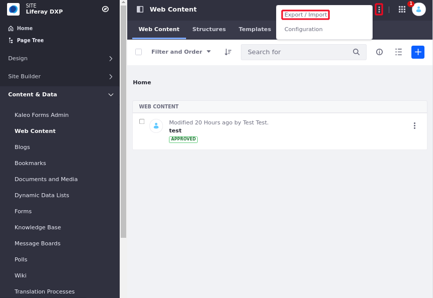
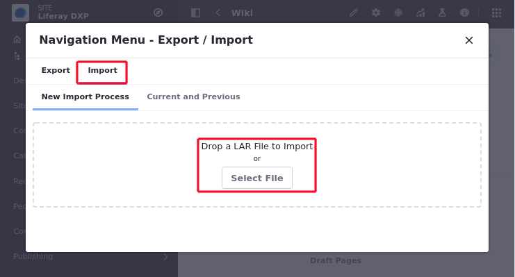

# Exporting/Importing Widget Data

You may need to export data from a specific widget instance, without regard to content on the rest of the Site. Many widgets can export or import their data individually:

- Blogs
- Bookmarks
- Dynamic Data Lists
- Forms
- Knowledge Base
- Message Boards
- Web Content
- Wiki
- And more

Exporting widget data produces a `.lar` file that you can save and import into another widget of the same type.

```{important}
Be careful not to confuse widget-specific `.lar` files with Site-specific `.lar` files. See [Exporting/Importing Site Pages and Content](../../../../sites/exporting-importing-site-pages-and-content.md) for more information on importing/exporting Site page data.
```

There are two ways to export/import widget content: 

1. Use the widget's administrative area. 
1. Visit the widget on its page. 

Both export/import menus work the same, but the administrative area may contain data different from its widget counterpart (e.g., Web Content Admin in Liferay DXP Menu and Web Content Display widget do not offer same content for export/import), so be wary of your selection.

To export or import data from the widget's administrative area,

1.  Go to the widget's designated area in the Liferay DXP Menu. For example, if you plan to export Web Content data, go to *Content and Data* &rarr; *Web Content*.

1.  Click *Options* () from the top right of the page and select *Export/Import*.

1.  Select the *Export* or *Import* tab to begin configuring the respective process.

    

To export or import data from a widget,

1.  Ensure the widget you're exporting/importing from is available on a page. You can add widgets from the *Add* () &rarr; *Widgets* menu.

1.  Select the widget's *Options* icon () and select *Export/Import*.

1.  Select the *Export* or *Import* tab to begin configuring the respective process.

    

Now that you know how to navigate to the *Export/Import* menus, you can explore the export process.

## Exporting Widget Data

To export widget data, create a new export process by selecting the *New Export Process* tab (default). You have several export options to configure.

First, you can choose to export your widget's configuration settings. For some widgets, the configuration export may include content. For example, a Web Content Display widget that shows a web content article also exports the article when exported, even though no content is selected. This applies when publishing a Web Content Display widget too; the configured article is published with the widget.

Second, you can select a Date Range of content that you want to export. Content added to your widget within your specified date range is included in the `.lar` file. The following date range choices are available:

**All:** Publishes all content regardless of its creation or last modification date.

**Date Range:** Publishes content based on a specified date range. You can set a start and end date/time window. The content created or modified within that window of time is published.

**Last...:** Publishes content based on a set amount of time since the current time. For example, you can set the date range to the past 48 hours, starting from the current time.

By checking the *Content* box, you can choose specific content to export. Options appear for choosing specific kinds of metadata to include. For example, if you have a wiki page with referenced content that you don't want, check the *Wiki Pages* checkbox and uncheck the *Referenced Content* checkbox. Another option is the selection of content types. Two familiar content types in your Liferay instance are Comments and Ratings. If you want to include these entities in your `.lar` file, select *Change* and choose them from the checklist. For more information on managing content types, see [Managing Content Types in Staging](../../../../publishing-tools/staging/managing-data-and-content-types-in-staging.md).

Third, you can choose to export individual deletions. This exports delete operations performed for content types to the LAR file.

Finally, you can choose whether to include permissions for your exported content. The permissions assigned for the exported widget window are included if you enable the *Export Permissions* selector.

After you've exported your widget's data, switch to the *Current and Previous* tab to view ongoing export processes and the history of past exports. You can also download the exported `.lar` file from this tab.

## Importing Widget Data

To import widget data, you can select the LAR using your file picker or by dragging and dropping the file between the dotted lines.



Your LAR file is uploaded and displayed for review. Click *Continue*.

Now that you've uploaded and confirmed your LAR file, a similar screen to what you'd be offered during export appears. Here are options and descriptions for each section:

### Deletions

**Delete Application Data Before Importing:** When checked, all data created by the application is deleted before the import process. Be careful: other applications may reference this data. This process cannot be undone. If you are unsure, please do an export first.

**Replicate Individual Deletions:** When checked, the delete operations performed for content types are replicated in the target site.

### Permissions

**Import Permissions:** When checked, the permissions assigned for the exported entries are included.

### Update Data

**Mirror:** All data and content inside the imported LAR is newly created the first time while maintaining a reference to the source. Subsequent imports from the same source updates entries instead of creating new entries.

**Mirror with overwriting:** Same as the mirror strategy, but if a document or an image with the same name is found, it is overwritten.

**Copy as New:** All data and content inside the imported LAR is created as new entries within the current site every time the LAR is imported.

### Authorship of the Content

**Use the Original Author:** Keep authorship of imported content whenever possible. Use the current user as author if the original one is not found.

**Use the Current User as Author:** Assign the current user as the author of all imported content.

Once you've selected the appropriate options, select *Import*, and your widget's data is imported and ready for use.

## Related Topics

- [Communication Between Widgets](./communication-between-widgets.md)
- [Exporting/Importing Site Pages and Content](../../../../sites/exporting-importing-site-pages-and-content.md)
