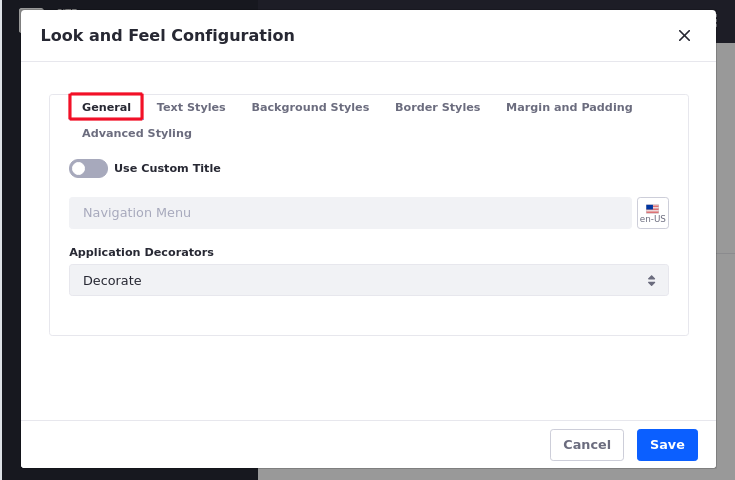
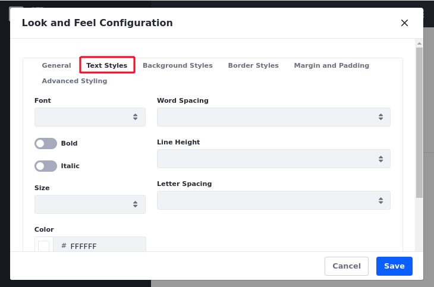
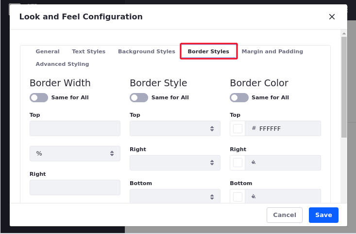
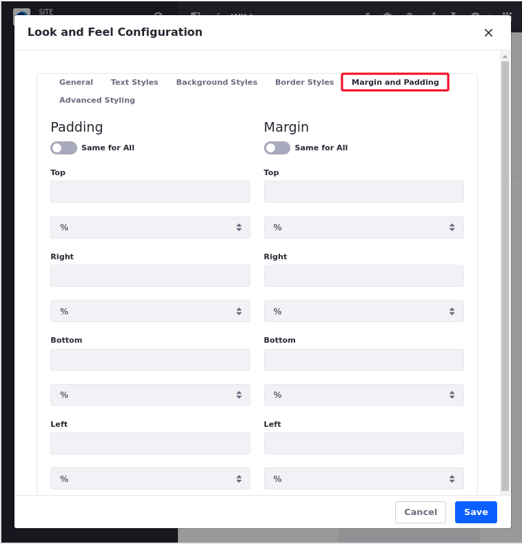
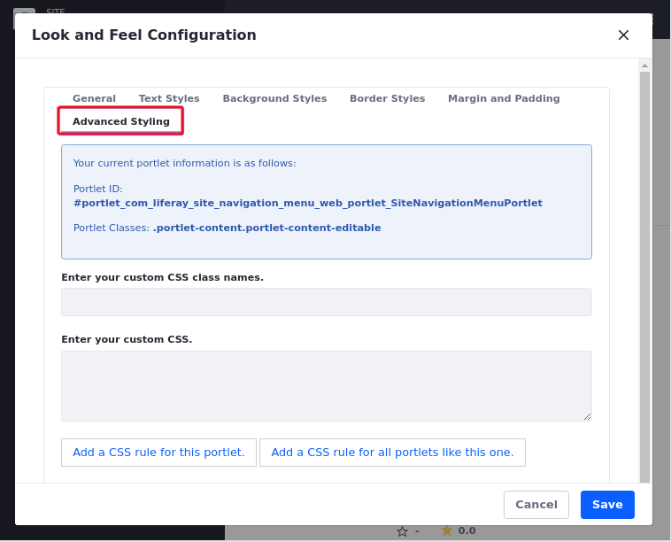

# Configuring Widget Look and Feel

1.  Click *Options* () in the top right corner of the widget.

1.  Select *Look and Feel Configuration*.

    *Look and Feel Configuration* has six tabs:
    - General
    - Text Styles
    - Background Styles
    - Border Styles
    - Margin and Padding
    - Advanced Styling

1. After making customizations, click *Save* and refresh your page to apply your changes.

```{note}
Look and Feel configuration options are not available for widgets on Content Pages for Display Pages Templates.
```

## General Settings

On the General tab are the following options:

**Use Custom Title** enables changes to your widget's title. The value in the title box appears on widget's decorator. The title is localizable, so you can provide translations of the title for different languages.

**Application Decorators** gives you the choice between three decorators: *Barebone*, *Borderless*, and *Decorate*. The Decorate application decorator is the default.

```{important}
Be careful about turning widget borders off; some themes assume widget borders are turned on and may not display correctly with them turned off.
```



## Text Styles

*Text Styles* configure the format of the text that appears in the widget:

**Font:** Choose various fonts. You can set the text to bold, italics, or both.

**Size:** Set the font size anywhere from 0.1 em to 12 em. 1 em is the default.

**Color:** Set to any six digit hex color code. Click the text box to open the color palette.

**Alignment:** Set to *Left*, *Center*, *Right*, or *Justified*.

**Text Decoration:** Set to *Underline*, *Overline*, or *Strikethrough*. The default text decoration is *None*.



**Word Spacing:** Set from -1 em to 0.95 em. 0 em is the default.

**Line Spacing:** Set from 0 em to 12 em. 0 em is the default.

**Letter Spacing:** Set from -10 px to 50 px. 0 px is the default.

## Background Styles

The Background Styles tab specifies the widget's background color. When you select the text space, you're given a color palette to choose your background color or you can enter any six digit hex color code manually.


## Border Styles

The Border Styles tab configures your widget's border width, style, and color. For each of these attributes, leave the *Same for All* selector enabled to apply the same settings to top, right, bottom, and left borders.



For border width, you can specify any % value, em value, or px value. For border style, you can select Dashed, Double, Dotted, Groove, Hidden, Inset, Outset, Ridge, or Solid. For border color, you can enter any six digit hex color code, just like for the text color and background color. You can also use the color palette.

## Margin and Padding

The Margin and Padding tab specifies margin and padding lengths for the edges of your widget. Just like for border styles, leave the *Same for All* selector enabled to apply the same settings to each side (top, right, bottom, and left) of the widget.



For both padding and margin, you can specify any % value, em value, or px value.

## Advanced Styling

The Advanced Styling tab displays current information about your widget, including your widget's Liferay ID and CSS classes.



You can also enter custom CSS class names for your widget and custom CSS code. Clicking the *Add a CSS rule for just this portlet* or *Add a CSS rule for all portlets like this one* links adds the CSS code shells into your custom CSS text box.

## Additional Information

- [Exporting/Importing Widget Data](../configuring-widgets/exporting-importing-widget-data.md)
