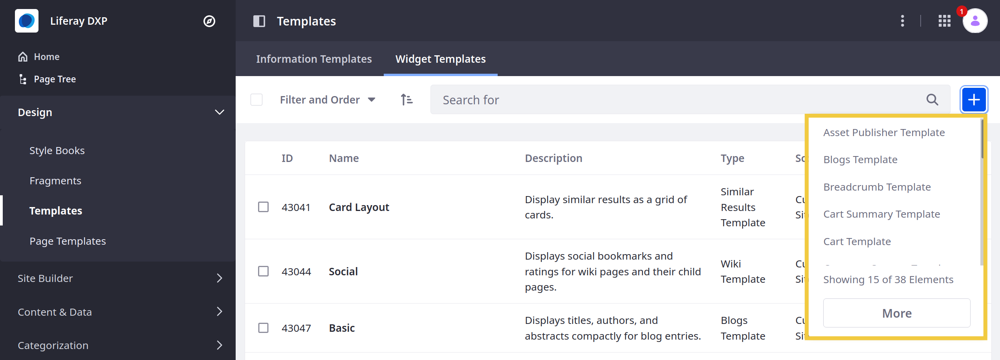

# Creating a Widget Template

Widget Templates use [FreeMarker](https://freemarker.apache.org/) to determine how widgets are rendered in site pages. Each template is designed for a specific widget type and can be selected while configuring the widget in a page.

```{note}
For Liferay DXP/Portal 7.4+, widget templates only support FreeMarker. Velocity is no longer supported.
```

Follow these steps to create a Widget Template:

1. Navigate to the desired site where you want to create the widget template.

1. Open the *Site Menu* (  ) and go to *Design* &rarr; *Templates* &rarr; *Widget Templates*.

   ```{note}
   In the Global Site, you can view sample widget templates. These sample templates differ from the default templates already configured in the apps.
   ```

1. Click *Add* (  ) and select the type of template to create.

   

1. Enter a *name* for the template.

1. Design your template in the editor.

   In the *Elements* side panel (  ), you can select from available widget fields, variables, and utilities. Some elements are common to all widgets, while others are specific to the selected widget type.

   

1. (Optional) In the Details side panel (), enter a *description* and select an *image* for the template.

1. Click *Save*.

## The Template Editor

On the right side of the template editor is a palette of common variables used for making templates. This is a great reference when creating your template. To place one of the variables into the template editor, position your text cursor where you want it placed, and click the variable name.

Each variable also has a tooltip which displays a detailed description. Because there are multiple kinds of widget templates, there are also different variables for each widget template. Thus, each template has a different set of variables only applicable for that specific template.


You can also use the autocomplete feature to add variables to your template. It can be invoked by typing *${* which opens a drop-down menu of available variables. By clicking one of the variables the editor inserts the variable into the editor.

You can also embed same-type templates into other templates. For example, suppose you have an existing Wiki widget template and want to create another Wiki widget template. Instead of starting from scratch, you can import the existing Wiki widget template into your new one and build from it. In other words, you can use widget templates as generic templates to reuse code imported by Velocity or FreeMarker templates in the system.

## Calling Headless APIs in the Template Editor

You can call Liferay's [Headless](../../../../../headless-delivery/using-liferay-as-a-headless-platform.md) API services directly in the template editor. Use the `restClient` object with the relative URL of an API endpoint to inject Headless resources into your templates. 

```{note}
You can only call GET endpoints with the `restClient` object.
```

For example, you can use `restClient` to retrieve a site's blog postings and then print out their headlines with the following FreeMarker script:

```
<#assign 
	blogPostings = restClient.get("/headless-delivery/v1.0/sites/{siteId}/blog-postings").items
/>

<#list blogPostings as blogPosting>
	<h1>${blogPosting.headline}</h1>
</#list>
```

You can filter, sort, search, and paginate your API responses the same way you would with a standard cURL request. For example:

```
<#assign 
	blogPostings = restClient.get("/headless-delivery/v1.0/sites/{siteId}/blog-postingssort=dateCreated:asc&filter=creatorId+eq+20126").items
/>

<#list blogPostings as blogPosting>
	<h1>${blogPosting.headline}</h1>
</#list>
```

See [API Query Parameters](../../../../../headless-delivery/consuming-apis/api-query-parameters.md) for more information on filtering APIs.

Use the [API Explorer](../../../../../headless-delivery/consuming-apis/consuming-rest-services.md) to find API endpoints and schemas for Headless resources.

## Configuring Widget Templates

After you've saved your widget template, you can manage it through its Actions button (). This provides several options:

- *Edit*: modify the widget template's setup properties.
- *Permissions*: manage the permissions *Update*, *Permissions*, *Delete*, and *View* for the widget template.
- *Copy*: creates a copy of the widget template.
- *Delete*: deletes the widget template.

Additionally, your widget template generates a static URL and a WebDAV URL. These values access the XML source of your template. You can find these URLs by clicking the widget template from the menu and expanding the *Details* section. With the WebDAV URL, Site administrators can add, browse, edit, and delete widget templates on a remote server. If you want to learn more about what the WebDAV URL can do, see [WebDAV access](../../../../../content-authoring-and-management/documents-and-media/publishing-and-sharing/accessing-documents-with-webdav.md).

```{note}
Embedding widgets into widget templates, although possible, is not recommended because this could cause conflicts with other widgets or unexpected behavior (e.g., embedding a widget that aggregates data to the breadcrumb). If embedding a widget into a widget template is your only option, make sure it does not interfere with other widgets.
```

Next, configure the widget to use the new widget template:

1. Go to the *Configuration* page for the widget you want to modify and open its *Display Settings*.

1. Under *Display Template*, select your widget template from the drop-down menu.

Also, you can manage Site-specific display templates for your app: do this by clicking the *Manage Display Templates for [SPECIFIC_SITE]* link next to the *Display Template* drop-down menu. A window appears with a list of your configured templates only available for your Site with options to add new templates or edit existing templates.


## Related Topics

- [Widget Template Example](./using-a-widget-template-example.md)
