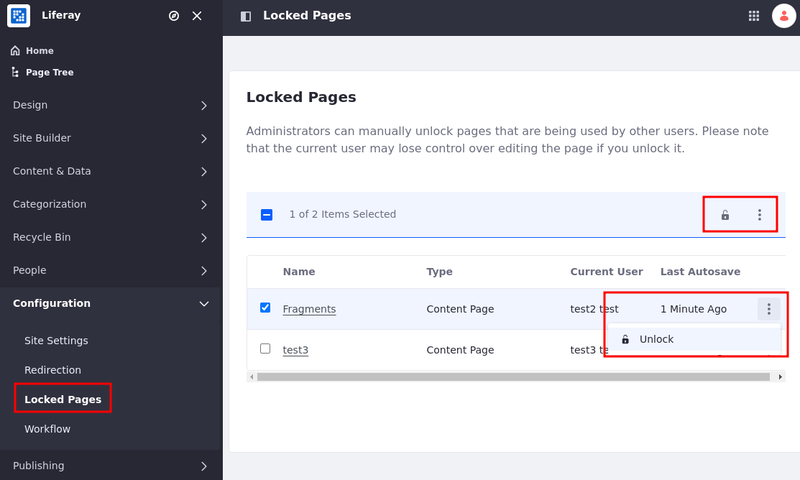

# Configuring Locked Pages

```{important}
This feature is currently behind a release feature flag. Read [Release Feature Flags](../../../system-administration/configuring-liferay/feature-flags.md#release-feature-flags) for more information.
```

Liferay locks pages whenever a user starts editing them to avoid conflicts when multiple users try to edit the same page.

This feature works with [content](../using-content-pages.md), [master](../defining-headers-and-footers/master-page-templates.md), [utility](../adding-pages/using-utility-pages.md), and [collection pages](../../../content-authoring-and-management/collections-and-collection-pages.md), along with [page](../adding-pages/creating-a-page-template.md) and [display page templates](../../displaying-content/using-display-page-templates.md).

## Locking the Page

Whenever a user starts editing a page and adds new content to it, the page locks and other users are unable to access it while it is not unlocked.

If users are trying to access a locked page, they are redirected to a generic error page. This error page shows a Go Back or a Go To [Previous Page Name] depending on whether the previous page exists.

```{note}
Users can only discard drafts of unlocked pages.
```


Not every event locks the page. When working with a page based on a master page and/or with a stylebook applied to it, you can edit them without locking the page. Additionally, even if a page is locked, you can still edit the related master page and/or the applied stylebook.

This means that, even if a page is locked, it can still be affected by other events. For example, fragments can be propagated even if the page is locked which can affect their behavior on the page. Similarly, importing a template that affects the locked page updates the page.

## Unlocking the Page

The page can be unlocked automatically after some events or a period of time or it can be unlocked manually.

### Automatically Unlocking the Page

Certain events can unlock the page automatically. For example, when the user changes from edit mode to view mode, when the user logs out, or when the user closes the tab with the page.

Additionally, if the user leaves the page open in Edit mode for a long time without making changes, the system automatically unlocks the page.

This time can be configured:

1. Open the *Global Menu* (  ) and Navigate to *Control Panel* &rarr; *Instance Settings* under Configuration.

1. Under Content and Data, select *Pages*

1. Under Virtual Instance Scope, select *Locked Pages*

1. Toggle *Allow Automatic Unlocking Process* on.

    If you want to disable the feature, turn the feature off.

1. Set a *Time Without Autosave* in minutes.

```{warning}
The Time Without Autosave may not be accurate as the system checks for locked pages every 15 minutes.
```


### Manually Unlocking the Page

If you need to edit a locked page urgently, you can manually unlock it if you are a Site Administrator or a Super Administrator.

As a user with any of those roles, you can access a page with a list of locked pages and unlock them.

```{tip}
In this list you can also see the type of the page, the user currently editing the page and the time since the last autosave.
```

1. Open the *Site Menu* (  ) and go to *Configuration* &rarr; *Locked Pages*.

1. Click *Actions* (  ) next to the locked page you want to unlock &rarr; *Unlock*.

    You can select multiple pages and bulk unlock them by clicking on the Lock ( ) icon or the Actions button next to it &rarr; Unlock.

The page is unlocked. All the autosaved alterations are kept and you can now edit the page.



## Related Topics

[Adding Elements to Content Pages](../using-content-pages/adding-elements-to-content-pages.md)

[Adding Widgets to a Page](../using-widget-pages/adding-widgets-to-a-page.md)