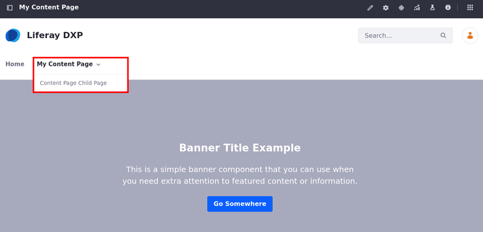

# Understanding Pages

Pages display content and applications to users of a site.

## Page Sets

When private pages are enabled, the site's pages are organized into two [page sets](../page-settings/configuring-page-sets.md): public pages and private pages.

```{note}
For Liferay 7.4 U22+ and GA22+, private pages are disabled by default for new installations. See [Enabling Private Pages](#enabling-private-pages) if you want to enable them.
```

Public and private pages differ in the following ways:

| Behavior                                   | Public Pages | Private Pages |
| :----------------------------------------- | :----------- |-------------- |
| Visible to unauthenticated users           |   &#10004;   |               |
| Viewing requires login and site membership |              |    &#10004;   |
| Distinct URL pattern                       |   &#10004;   |    &#10004;   |

Public pages use the `[web-address]/`**web**`/[site-name]` URL pattern, while private pages use `[web-address]/`**group**`/[site-name]`.

## Page Types

There are several page types available when you [add a page](../adding-pages/adding-a-page-to-a-site.md). The default page type is a content page. You can also create a page based on a [page template](../adding-pages/creating-a-page-template.md). Page types and page templates are described in more detail below.


```{tip}
The currently viewed page's type appears at the top of the page to help you determine the administration options you have and where you need to go to configure the page.
```

### Content Pages

With content pages, users can build professional pages that can be easily managed and have their content edited in-line. Content pages are primarily built using [page fragments](../page-fragments-and-widgets/using-fragments.md) and widgets.


Using content pages allows access to additional powerful features and benefits:

* [Personalized and adaptive site experiences](../../personalizing-site-experience.md)
* [A/B testing](../../optimizing-sites/ab-testing/ab-testing.md)
* Approachable content and site building experience

To learn more about content pages, see the [Using Content Pages](../using-content-pages.md). To start building one, see [Adding Elements to Content Pages](../using-content-pages/adding-elements-to-content-pages.md).

### Widget Pages

<!-- Should there be an article that covers layouts and layout templates? -->

<!-- LRDOCS-12350 will cover layouts and layout templates-->

A widget page has a set layout for displaying widgets (applications). Widgets can display content or add interactive and dynamic functionality to the page. See [Adding Widgets to a Page](../using-widget-pages/adding-widgets-to-a-page.md) for more information.


### Content Pages and Widget Pages Compared

This table compares some of the distinctions between a content page and a widget page:

| Feature                         |  Content Pages | Widget Pages |
| :------------------------------ | :------------- |------------- |
| Ability to Add Widgets          |    &#10004;    |   &#10004;   |
| Personalized Site Experiences   |    &#10004;    |              |
| Access to A/B Testing           |    &#10004;    |              |
| Easy Layout and Content Editing |    &#10004;    |              |
| Advanced Custom Layouts         |                |   &#10004;   |
| User-Customizable Columns       |                |   &#10004;   |
| Staging Page Variations         |                |   &#10004;   |

### Other Page Types

There are several other available page types - each satisfies particular use cases. See [Other Page Types](../understanding-pages/other-page-types.md) for more information.

## Global Page Templates

When adding a page, you can also choose a page template. Page templates are pre-set pages with applications already deployed to the page. By default, only Global Templates are available, but additional collections you create also appear as an option.

| Global Page Template | Description                                                                                                                                                                                                |
| :------------------- | :--------------------------------------------------------------------------------------------------------------------------------------------------------------------------------------------------------- |
| Search               | Creates a widget page with the following widgets: Search Bar, Suggestions, Site Facet, Type Facet, Tag Facet, Category Facet, Folder Facet, User Facet, Modified Facet, Search Results and Search Options. |

See [Creating a Page Template](../adding-pages/creating-a-page-template.md) to learn more about page templates.

## Child Pages and Page Hierarchy

Pages can also be created in a hierarchical fashion by creating child pages. Child pages can be useful if you have multiple pages that can be organized into categories.



```{tip}
You can navigate among pages of a site hierarchy with the Site Map application. A site administrator can configure a root page and a display depth. The display depth of the Site Map application determines how many levels of nested pages to display.
```

## Enabling Private Pages

{bdg-secondary}`For Liferay 7.4 U22+ and GA22+`

By default, new Liferay installations include a release feature flag that prevents users from creating private pages. Follow these steps to enable private pages for your Liferay system:

1. Open the *Global Menu* (  ), go to the *Control Panel* tab, and click *System Settings*.

1. Go to *Release Feature Flags*.

1. In the Disabled Features dropdown menu, select *Disable Private Pages*.

   

1. Click *Save*.

   If you ever want to disable private pages again, deselect *Disable Private Pages* and click *Update*.

## Related Information

* [Adding a Page](../adding-pages/adding-a-page-to-a-site.md)
* [Configuring Individual Pages](../page-settings/configuring-individual-pages.md)
* [Enabling User Personalization of Widget Pages](../using-widget-pages/enabling-user-personalization-of-widget-pages.md)
