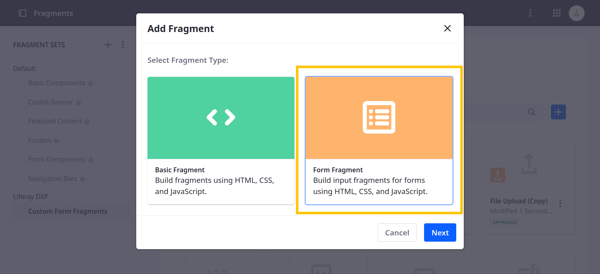

# Creating Form Fragments

{bdg-secondary}`Available Liferay 7.4 U45+/GA45+`

Liferay provides [Form Component fragments](../../creating-pages/page-fragments-and-widgets/using-fragments/default-fragments-reference.md) for building forms in content pages. You can map these fragments to custom  field to create engaging displays for If needed, you can create additional form fragments to achieve _.

Follow these steps to create form fragments via the Liferay UI:

1. Open the *Site Menu* (  ), expand *Design*, and go to *Fragments*.

1. Click the *Plus* button (  ) to create a *Fragment Set* for organizing your form fragments.  

1. Click the *Add* button (  ), select the *Form Fragment* type, and click *Next*.

   

1. Enter a *name*

1. Select the *field types* you want the fragment to support.

   If you select CAPTCHA, you cannot select other field types. Otherwise, you can select any combination of fields.

   

1. Click *Add*. This creates a draft fragment and redirects you to the fragment edit page.

1. In the *Code* tab, add *HTML*, *CSS*, and *JavaScript* for your fragment.

   

1. (Optional) In the *Configuration* tab, use JSON to configure the fragment and add options to it.

   

1. Click *Publish*.

You can now use your form fragment to build forms in content pages. See [Using Fragments to Build Forms](../../../building-applications/objects/using-fragments-to-build-forms.md) for more information.

If you are using the Fragments Toolkit, you can select the fragment type when running `yarn run add-fragment`.


To specify which field types the fragment supports, you must add the `fieldTypes` property to `typeOptions` in the `fragment.json`. Enter the desired field types as an array, for example:

```json
{
   "cacheable": false,
   "fragmentEntryKey": "numeric-input",
   "icon": "number",
   "type": "input",
   "typeOptions": {
      "fieldTypes": [
         "number",
         "text"
      ]
   }
}
```

The rest of fragment creation follows the same process as creating a basic fragment. See [Using the Fragments Toolkit](./using-the-fragments-toolkit.md) for more information about creating and deploying basic fragments.

## Using the `input` Variable with Form Fragments

Form fragments include the `input` variable for use with each fragment's JavaScript and FreeMarker code. This variable includes predefined properties that you can use to map the fragment to configurations in object fields.

## Input Variable Properties Reference
<!-- TASK: Clarify with SME, Do these properties and attributes 'determine' or 'indicate'? -->
| Property | Type | Description |
| :--- | :--- | :--- |
| `type` | `string` | Determines the type of field mapped to the input. |
| `name` | `string` | Determines the name of the input. |
| `required` | `boolean` | Determines whether the input is required. |
| `value` | `string` | Determines the initial value of the input. <!--TASK: Clarify with SME, "Might be present if users have tried to submit a form and it failed"--> |
| `label` | `string` | Determines the input's label. |
| `showLabel` | `string` | Determines whether the label is visible to users. |
| `errorMessage` | `string` | Lists backend errors when a form is submitted.<!--TASK: Clarify with SME--> |
| `helpText` | `string` | Determines a message for helping users fill out the form field. If undefined, this field is empty. |
| `showHelpText` | `boolean` | Determines whether the help text is visible to users. |
| `attributes` | `object` | Adds options to the fragment for specific input types. |

### Attributes for `file` Input

| Property | Type | Description |
| :--- | :--- | :--- |
| `allowedFileExtensions` | `string` | Adds display text for allowed file types. |
| `maxFileSize` | `number` | Sets the maximum upload size in megabytes. |
| `selectFromDocumentLibrary` | `boolean` | Determines whether users can select files from the document library. When enabled, this field provides a document library file descriptor to the fragment's input. <!--TASK: Clarify with SME--> |
| `selectFromDocumentLibraryURL` | `string` or `undefined` | If `selectFromDocumentLibrary` is true, this property contains the URL that renders the corresponding `ItemSelector`. |

### Attributes for `number` Input
<!--TASK: Clarify with SME, What does `number | undefined` mean?-->
| Property | Type | Description |
| :--- | :--- | :--- |
| `dataType` | `integer` or `decimal` | Determines whether to allow integer or decimal numbers. |
| `max` | `number` or `undefined` | Sets the maximum number allowed. |
| `min` | `number` or `undefined` | Sets the minimum number allowed. |
| `step` | `string` or `undefined` | Sets the maximum precision allowed for decimals. |

### Attributes for `relationship` Input
<!--TASK: Clarify with SME, Could you explain these attributes a bit more?-->
| Property | Type | Description |
| :--- | :--- | :--- |
| `relationshipLabelFieldName` | `string` | Determines the name of the field used as the label for each option. |
| `relationshipValueFieldName` | `string` | Determines the name of the field used as a value for each option. |
| `relationshipURL` | `string` | Determines the URL used to fetch options from the API. The API response uses Liferay's headless list format, including pagination. You can pass additional parameters to query the response. |

### Attributes for `select` Input

| Property | Type | Description |
| :--- | :--- | :--- |
| `options` | `Array<{label: string, value: string}>` | Determines the list of available options. |

## Additional Information

* [Developing Page Fragments](../developing-page-fragments.md)
* [Using Fragments to Build Forms](../../../building-applications/objects/using-fragments-to-build-forms.md)
