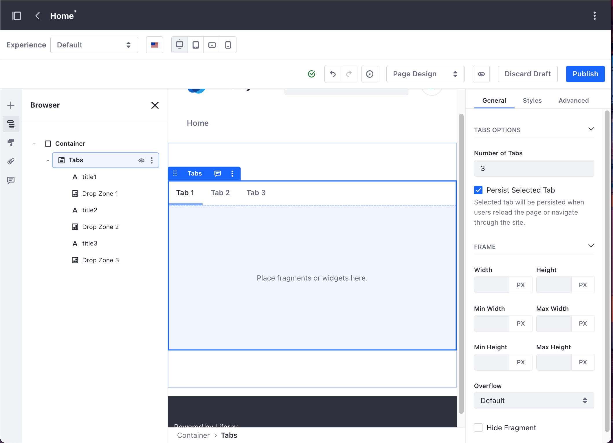

# Defining Fragment Drop Zones

Drop zones are integral to building your Content Pages. With them, you can create unique Page layouts and dynamic displays by defining areas within Fragments where Users can drag and drop other Fragments and widgets.

Follow these steps to define a drop zone:

1. Go to *Site Administration* &rarr; *Design* &rarr; *Fragments*.

1. Under Fragment Sets, select the Set with the Fragment you want to edit.

1. Click the Fragment's *Actions* () button and select *Edit* to open the [Fragments Editor](./using-the-fragments-editor.md).

1. In the HTML code area, add the `<lfr-drop-zone></lfr-drop-zone>` label to define a drop zone within a Fragment.

   ```{important}
   Drop zones cannot be added to editable elements within a fragment.
   ```

The following code excerpt shows how to use this label to define drop zones within a Tabs Fragment:

   ```html
      <div class="tab-panel">
         [#list 0..configuration.numberOfTabs-1 as i]
         <div aria-labelledby="tab${i+1}-${fragmentEntryLinkNamespace}" class="d-none tab-panel-item" data-fragment-namespace="${fragmentEntryLinkNamespace}" id="tabPanel${i+1}-${fragmentEntryLinkNamespace}" role="tabpanel" tabindex="0">
            <lfr-drop-zone data-lfr-drop-zone-id="${i+1}" data-lfr-priority="${i+1}"></lfr-drop-zone>
         </div>
         [/#list]
      </div>
   ```

This image shows the result in the Content Page editor sidebar:



Once defined, you can drag and drop any Fragment or widget into the drop zone.

## Fragment Drop Zone IDs

To ensure that fragments remain in their designated drop zones, drop zone IDs can be added using the `data-lfr-drop-zone-id` attribute. When drop zones are reordered or new drop zones are inserted between existing ones, using drop zone IDs ensures that fragments are kept in the original drop zone they were added to.

If a drop zone that has a unique ID is deleted and then propagated, the dropzone and its content will be removed from the page. If a dropzone with the same ID is added back into the fragment, it will only retrieve the content of the dropzone in drafts that have not been published after the initial propagation. In published drafts, the dropzone will be considered a new dropzone.

It is not mandatory to include drop zone IDs. Drop zones without an ID will continue to function as they did before and will be displayed in the order they are specified. If a fragment did not have IDs set in its drop zones, but new IDs are assigned to all of the drop zones, saved, and then propagated, the fragment should be propagated as before and, beginning with the initial propagation, the IDs should be retained.

## Additional Information

- [Developing Fragments](./developing-fragments-intro.md)
- [Using the Fragments Editor](./using-the-fragments-editor.md)
- [Using the Fragments Toolkit](./using-the-fragments-toolkit.md)
- [Setting the Order of Elements in a Fragment](./setting-the-order-of-elements-in-a-fragment.md)
