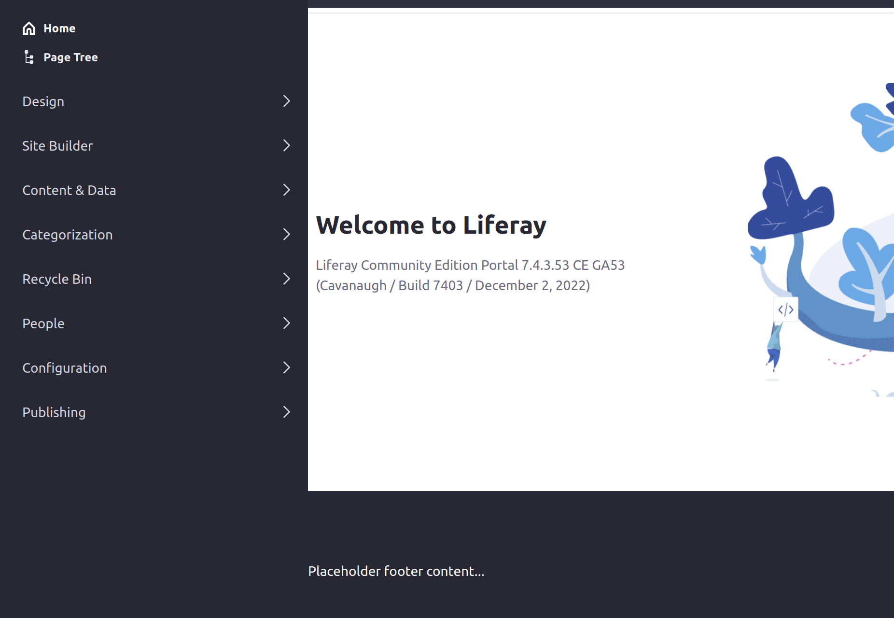

# Using Custom Fields in Page Fragments

If you've added [custom fields](../../../system-administration/configuring-liferay/adding-custom-fields.md) to Liferay's users or pages, you can access them in fragments. To get the value of a page custom field, use

```html
layout.getExpandoBridge().getAttribute("ATTRIBUTE_NAME")
```

Replace `layout` with `user` to retrieve user custom fields.

The example below uses a page custom field to alter the page behavior.

After [adding a `showFooter` custom field to pages](../../../system-administration/configuring-liferay/adding-custom-fields.md), [add or edit a page fragment](./using-the-fragments-editor.md) by opening the fragments editor from Site Menu &rarr; Fragments.

This example HTML uses the custom field `showFooter` to show or hide the placeholder `footer` element on a page:

```html
[#assign showFooter = layout.getExpandoBridge().getAttribute("showFooter")]

[#if showFooter]
    <footer class="bg-dark pb-8 pt-6 section-footer text-white">
        Placeholder footer content...
    </footer>
[/#if]
```

Toggling a page's `showFooter` value to true or false shows or hides the footer, respectively:



To access custom fields for users, use `user.getExpandoBridge().getAttribute("ATTRIBUTE_NAME")`. Guest users may not have a value for the custom field. In this case, attempting to retrieve a custom field value for a guest user causes an error when viewing the page. Make sure to consider guest user access when developing fragments with user custom fields.
<!-- Can we show a quick snippet that checks whether the user in the session is authenticated before retrieving the use custom field value? -->

## Additional Information

* [Adding Custom Fields to Users](../../../system-administration/configuring-liferay/adding-custom-fields.md)

* [Using the Fragments Editor](./using-the-fragments-editor.md)
