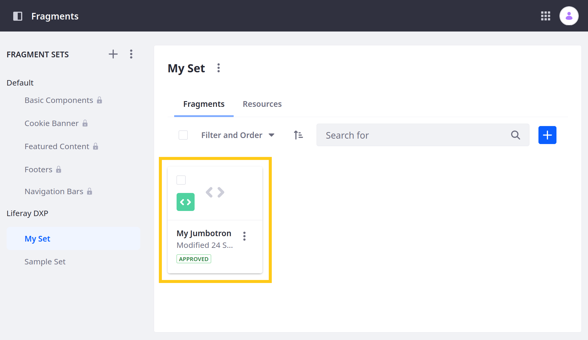
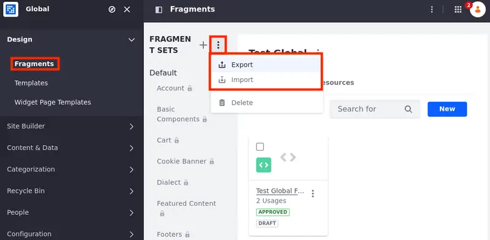
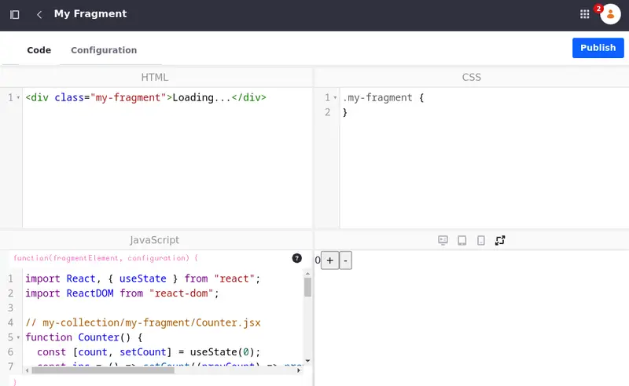

---
taxonomy-category-names:
- Development and Tooling
- Fragments
- Liferay Self-Hosted
- Liferay PaaS
uuid: 8d257002-3c90-4810-82a1-17ae741c33c4
---
# Using the Fragments Toolkit

!!! note
   The Fragments Toolkit is deprecated as of Liferay 2024.Q1+/Portal 7.4 GA107+. See [Alternatives for the Fragments Toolkit](#alternatives-to-the-fragments-toolkit) for more information.

The Fragments Toolkit helps you develop and manage Fragments locally, using your favorite tools. Here you'll use the toolkit to generate a Fragments Project with sample Fragments, deploy it, and add your own Fragments Set to it.

```{note}
For Liferay DXP 7.4+, Fragment Collections are called Fragment Sets in the Liferay UI.
```

## Setting Up the Toolkit

The toolkit requires this software:

* [NPM](https://www.npmjs.com/)
* [NodeJS](https://nodejs.org/)
* [Yeoman](https://yeoman.io/)
* [Yarn](https://classic.yarnpkg.com/)

NPM and Yarn are package managers that you'll use to install the toolkit and modules it depends on.

1. Start with installing an NPM and Node.js via a [Node.js LTS](https://nodejs.org/en/download/).

1. Download and unzip the example JavaScript project ZIP file.

    ```bash
    curl https://resources.learn.liferay.com/dxp/latest/en/site-building/developer-guide/developing-page-fragments/liferay-x2y6.zip -O
    ```

    ```bash
    unzip liferay-x2y6.zip
    ```

1. Set up the Fragments Toolkit and its dependencies using the `setup_tutorial.sh` script.

    ```bash
    cd liferay-x2y6
    ```

    ```bash
    ./setup_tutorial.sh
    ```

    ```{note}
    The `setup_tutorial.sh` script provides commands for setting up Yeoman, Yarn, and the toolkit. The script is available in the example project's ZIP file.
    ```

Resolve all unmet requirements reported by the script and rerun the script until it reports that your environment is ready.

## Create a Fragments Project

The Fragments Toolkit's `yo liferay-fragments` command launches an interface for generating a Fragments Project.

```{warning}
Don't nest Fragments projects. Make sure to create new Fragments projects in their own location, outside of any existing Fragments projects.
```

If you're in the `liferay-x2y6` project folder, exit it (e.g., `cd ..`).

Here's how to generate a Fragments Project:

1. Launch the project generator by executing the `yo liferay-fragments` command:

    ```bash
    yo liferay-fragments
    ```

1. Name your project. For this example, accept the default project name by clicking enter.

    ```bash
    ? Project name (Sample Liferay Fragments)
    ```

1. Indicate whether to add sample content. For this example, enter `Yes`.

    ```bash
    ? Add sample content? Yes
    Creating directory
       force .yo-rc.json
      create src/.gitkeep
      create .editorconfig
      create .gitignore
      create liferay-npm-bundler.config.js
      create package.json
      create README.md
    Adding sample content...
    Warning: some of these fragments are not compatible all
    portal versions, please check the generator documentation before using them:
    https://www.npmjs.com/package/generator-liferay-fragments#creating-new-fragments
    Running yarn...
    Done!
    You're ready to create fragments.
      create src/sample-collection/collection.json
      create src/sample-collection/sample-fragment/index.html
      create src/sample-collection/sample-fragment/main.js
      create src/sample-collection/sample-fragment/styles.css
      create src/sample-collection/sample-fragment/fragment.json
      create src/sample-collection/sample-fragment/configuration.json
      create src/sample-collection/sample-fragment-with-new-editables/index.html
      create src/sample-collection/sample-fragment-with-new-editables/main.js
      create src/sample-collection/sample-fragment-with-new-editables/styles.css
      create src/sample-collection/sample-fragment-with-new-editables/fragment.json
      create src/sample-collection/sample-fragment-with-new-editables/configuration.json
      create src/sample-collection/sample-fragment-with-react/index.html
      create src/sample-collection/sample-fragment-with-react/main.js
      create src/sample-collection/sample-fragment-with-react/styles.css
      create src/sample-collection/sample-fragment-with-react/fragment.json
      create src/sample-collection/sample-fragment-with-react/configuration.json
    ```

Congratulations on generating your Fragments Project!

The generator creates each project in a folder derived from the project name. For example, since you named the project `Sample Liferay Fragments`, the generator created a project folder called `sample-liferay-fragments`.

## Import the Sample Fragment Set

```{include} /_snippets/run-liferay-portal.md
```

Then, follow these steps to import the sample Fragment Set to Liferay:

1. Import the Fragment Set to your Liferay instance by invoking the `yarn run import` command in the project's root folder (e.g., `sample-liferay-fragments`). Alternatively, you can [import the Fragment Set manually](../../creating-pages/page-fragments-and-widgets/using-fragments/managing-fragments.md).

    ```bash
    cd sample-liferay-fragments
    ```

    ```bash
    yarn run import
    ```

1. Answer the prompts.

    ```bash
    $ yo liferay-fragments:import
    ? Liferay host & port http://localhost:8080
    ? Username test@liferay.com
    ? Password [hidden]
    Checking connection...
    Connection successful

    ? Company ID liferay.com
    ? Group ID Liferay DXP
    Building project...
    Importing project...
    Project imported
        force .yo-rc.json
        force ../../.yo-rc-global.json
    Done in 21.43s.
    ```

1. Verify the Fragment Set is available. Open the *Site Menu* () and go to *Design* &rarr; *Fragments*. The Set should appear in the list.

    

    ```{note}
    For Liferay DXP 7.1 and 7.2, instead navigate to *Site* → *Site Builder* → *Page Fragments* under the Product Menu to get to the *Fragments* page.
    ```

Great! You successfully deployed a Fragment Set.

## Fragment Set Structure

Each Fragment Set uses this structure:

* `collection.json`: a text file that describes the Fragment Set.

    ```json
    {
        "description": "Optional description",
        "name": "Fragment Set Name"
    }
    ```

* `language.properties` (optional): language keys defined for the Fragment Set.

* `[fragment-name]/`: a folder containing all of the files for a Fragment.

    * `configuration.json`(optional): a JSON file that defines the Fragment's configuration. See [Adding Configuration Options to Fragments](./adding-configuration-options-to-fragments.md) for more information.

    * `fragment.json`: a JSON file that describes the Fragment. See [Modifying fragment.json](#modifying-fragmentjson) for more information.

* `resources/` (optional): a folder containing any additional images or files the Fragments need. See [Including Default Resources in Fragments](./including-default-resources-with-fragments.md) for more information.

You can use the Fragments Toolkit to create projects quickly with this structure.

### Modifying fragment.json

`fragment.json` contains fragment attributes that can be modified to enhance the functionality and usability of fragments.

| Key                    | Description                                                                                                                       |
|------------------------|-----------------------------------------------------------------------------------------------------------------------------------|
| `cssPath`              | Specifies .css, .scss, or .sass files.                                                                                            |
| `configurationPath`    | Specifies the configuration source for the fragment.                                                                              |
| `htmlPath`             | Specifies the HTML source for the fragment.                                                                                       |
| `jsPath`               | Specifies the JavaScript source for the fragment.                                                                                 |
| `name`                 | The name of the fragment.                                                                                                         |
| `type`                 | Specifies a component or React fragment.                                                                                          |
| `icon`                 | Adds a clay icon to imported fragments. See the [Clay Icon List](https://clayui.com/docs/components/icon.html) for available icons. |
| `sass {loadPaths:[]}}` | Specifies external dependencies.                                                                                                  |

 ```json
        {
            "cssPath": "styles.css",
            "configurationPath": "configuration.json",
            "htmlPath": "index.html",
            "jsPath": "main.js",
            "name": "Fragment name",
            "type": "[component|react]",
            "icon": "adjust"

            // This configuration is optional and can be removed
            "sass": {
                "loadPaths": [
                    "../../../node_modules"
                ]
            }
        }
```

## Add a Fragment Set to the Project

Use the `add-collection` command to add a Fragment Set to your project.

1. Navigate to your project's root folder and run this command.

    ```bash
    yarn run add-collection
    ```

1. When prompted, enter a name and description for the Fragment Set.

    ```bash
    > yo liferay-fragments:collection
    ? Collection name (required) My Set
    ? Collection description (optional) This is my new Fragment Set.
    create src/my-set/collection.json
    ```

1. Verify your new Fragment Set was created successfully in the project's `src` folder. It should only include a `collection.json` file:

    ```json
    {
        "description": "This is my new Fragment Set.",
        "name": "My Set"
    }
    ```

## Create a New Fragment

Use the `add-fragment` command to add a new Fragment to the Set.

1. Navigate to your project's root folder and run this command.

    ```bash
    yarn run add-fragment
    ```

    The CLI starts the process:

    ```bash
    > yo liferay-fragments:fragment
    ```

1. Name your Fragment.

    ```bash
    ? Fragment name (required) My Jumbotron
    ```

1. Choose whether to use React or another JavaScript framework. React requires Liferay 7.3+. For this tutorial, please decline using React.

    ```bash
    ? Use React (or other JS framework)? No
    ```

1. Use the new editable element syntax for Liferay 7.3+.

    ```bash
    ? Use new data-lfr editable syntax? Yes
    ```

    ```{note}
    If you accepted using React in your fragment, the toolkit assumes you're on Liferay 7.3+ and configures the new editable element syntax.
    ```

    ```{note}
    Please see [Fragment-Specific Tags](../reference/fragments/fragment-specific-tags-reference.md) for more information on Liferay's editable data syntax.
    ```

1. Select the Fragment Set you just created (`My Set`).

    ```bash
    ? Choose a collection
        My Set
        Sample Set
        + New Collection
    ```

    ```{note}
    The `fragment.json` defines the paths to the Fragment's CSS, HTML, and JavaScript. If you change any of these file names, update their paths in the `fragment.json`.
    ```

Here is the Fragment's `index.html`:

```html
<div class="my-jumbotron">
    <h1 data-lfr-editable-id="title" data-lfr-editable-type="text">
        My Jumbotron
    </h1>
</div>
```

The Fragment HTML uses the new `data-lfr` editable syntax.

## Edit Your Fragment

Modify any part of your Fragment.

* HTML (`index.html`)
* CSS (`styles.css`)
* JavaScript (`main.js`)
* Fragment Attributes (`fragment.json`)
* [Configuration options](./adding-configuration-options-to-fragments.md) (`configuration.json`).


For example, you can build off of the above HTML and use [Clay](https://clayui.com/)'s [Bootstrap](https://getbootstrap.com/)-based components to create Fragment with an attention-getting headline and description, as demonstrated in this `index.html`:

```html
<div class="component-my-jumbotron">
    <div class="jumbotron">
        <h1
            class="display-4"
            data-lfr-editable-id="01-title"
            data-lfr-editable-type="rich-text"
        >
            Editable Jumbotron Headline
        </h1>

        <p
            class="lead"
            data-lfr-editable-id="02-lead"
            data-lfr-editable-type="rich-text"
        >
            Edit this text to call extra attention to featured content or information.
        </p>

        <hr />

        <p
            data-lfr-editable-id="03-text"
            data-lfr-editable-type="rich-text"
        >
            Edit this text to provide more information.
        </p>

        <a
            class="btn btn-primary btn-lg"
            data-lfr-editable-id="04-label"
            data-lfr-editable-type="link"
            href="#"
        >
            Editable Link
        </a>
    </div>
</div>
```

```{note}
If you are using Liferay 7.2 or below, remove the `data-lfr-editable-[id|type]` attributes and wrap the content elements in `lfr-editable` elements as described in [Fragment-Specific Tags](../reference/fragments/fragment-specific-tags-reference.md).
```

The first `div` element's `class="component-my-jumbotron"` attribute attempts to uniquely identify this Fragment on a page.

```{tip}
In your Fragment's HTML file, use the main wrapper element (the `<div>` in the example above) to uniquely identify the Fragment so it doesn't conflict with other components on a page.
```

Next the `<div class="jumbotron"/>` element wraps the content, applying [Bootstrap](https://getbootstrap.com/)'s jumbotron component. This component makes the content stand out. Here are the content elements:

* `<h1 class="display-4" ...>Editable Jumbotron ...` creates the Fragment's heading. It uses [Bootstrap](https://getbootstrap.com/)'s `display-4` size style. The `data-lfr-editable-` attributes make the heading text [editable](../reference/fragments/fragment-specific-tags-reference.md). The `data-lfr-editable-id="03-text"` attribute identifies the element and the `data-lfr-editable-type="rich-text"` attribute declares the content type.
* `<p class="lead" ...>Edit this text ...` is the lead body text distinguished by Clay's [`lead`](https://clayui.com/docs/css/content/typography.html#css-lead) style component. The `data-lfr-editable-` attributes make the paragraph editable.
* The `<hr/>` and next `<p ...` elements produce a horizontal rule and another editable paragraph, respectively.
* `<a class="btn btn-primary btn-lg" ...` specifies a modifiable link. The `btn-primary` class styles it as a main button and `btn-lg` makes it large. The `href="#"` attribute takes the user to the top of the page when the link is clicked. The `data-lfr-editable-type="link"` attribute makes the link [editable](../reference/fragments/fragment-specific-tags-reference.md).

You can also include resources in your Fragments. See [Including Default Resources in Fragments](./including-default-resources-with-fragments.md) for more information.

```{note}
The Fragment and configuration object are passed in as arguments in JavaScript and are available as `fragmentElement` and `configuration` parameters, respectively.
```

## Import Your New Fragment

You can import your new Fragment as you did the original example Fragment:

1. Run the import command and provide your credentials:

    ```bash
    yarn run import
    ```

1. Verify the Fragment Set is available. Open the *Site Menu* () and go to *Design* &rarr; *Fragments*. The Set should appear in the list.



Great! Now you know how to use the Fragments Toolkit to create and manage Fragments. See the [Fragments Toolkit Command Reference](../reference/fragments/fragments-toolkit-command-reference.md) for more toolkit command information.

## Alternatives to the Fragments Toolkit

As mentioned before, the Fragments Toolkit is deprecated as of Liferay 2024.Q1+/Portal 7.4 GA107+.

If you need to develop and manage your fragments, there are some alternatives you can use instead:

- **Export/Import**: If you need to export/import fragments, you can use the [Export/Import](https://learn.liferay.com/web/guest/w/dxp/site-building/creating-pages/page-fragments-and-widgets/using-fragments/managing-fragments#managing-fragment-sets) fragment option in your Fragments app to Export/Import fragments in .zip format.

    

- **Use the Global Site**: Alternatively, create your fragments in your global site and those fragments are available in other sites you create.

    

- **Create a Basic Custom Element**: If you need to develop and manage react components, you can create a basic [custom element](../../../building-applications/client-extensions/front-end-client-extensions/tutorials/creating-a-basic-custom-element.md), [host the application files in documents and media](../../../building-applications/client-extensions/front-end-client-extensions/tutorials/creating-a-basic-custom-element.md#hosting-the-application-files), and [register the application as a client extension](../../../building-applications/client-extensions/front-end-client-extensions/tutorials/creating-a-basic-custom-element.md#registering-the-application-with-liferay). This way, you transform your React component into a widget and you can use it in your pages.

    

- {bdg-secondary}`Available: Liferay DXP 2023.Q4+/Portal 7.4 GA105+` **Create a React Fragment**: Instantiate a React component in a fragment using static JS imports. See the example code below and its comments.

    

    ```javascript
    // Import statements. Clay Components, React, and ReactDOM are already included in Liferay's importMap. If you want to import a React component that is not included in Liferay's importaMap, you can add it by creating an importMap ClientExtension (https://github.com/liferay/liferay-portal/blob/master/workspaces/liferay-sample-workspace/client-extensions/liferay-sample-etc-frontend-3/client-extension.yaml#L16).
    import React, { useState } from "react";
    import ReactDOM from "react-dom";

    // my-collection/my-fragment/Counter.jsx
    // A simple Counter component to increase or decrease a given variable (count).
    function Counter() {
    const [count, setCount] = useState(0);
    const increase = () => setCount((previousCount) => previousCount + 1);
    const decrease = () => setCount((previousCount) => previousCount - 1);

    // Rendering an output element that displays the current count, along with two buttons for increasing/decreasing the count.
    return React.createElement(
        React.Fragment,
        null,
        React.createElement("output", null, count),
        React.createElement("button", { onClick: increase, type: "button" }, "+"),
        React.createElement("button", { onClick: decrease, type: "button" }, "-")
    );
    }

    // my-collection/my-fragment/index.jsx
    // Another functional React component. It renders an instance of the Counter component.
    function MyFragment(props) {
    console.log("MyFragment props", props);
    return React.createElement(Counter, null);
    }

    // Cleanup process: Unmounts any existing React component associated with the specified DOM element (fragmentElement) before rendering a new component.
    ReactDOM.unmountComponentAtNode(fragmentElement);
    // Renders an instance of MyFragment with a configuration prop into the specified DOM element (fragmentElement) using ReactDOM.render.
    ReactDOM.render(
    React.createElement(MyFragment, { configuration }),
    fragmentElement
    );
    // Cleanup process: Listens for the beforeNavigate event using Liferay.once and, when triggered, unmounts the React component associated with fragmentElement to clean up before navigating to another page.
    // Liferay.once(event, callback); function is used to add an event listener that is executed only once when the specified event occurs.
    Liferay.once("beforeNavigate", () =>
    ReactDOM.unmountComponentAtNode(fragmentElement)
    );
    ```

- **Use a bundler to build your fragments**: If you want to use JSX or multiple files, you need to bundle the files before importing them.

    Pay attention that the default behavior of bundlers is to merge all content in a single JS file (including React, ReactDOM, and all dependencies). So, you must use methods to select which libraries are not included in the final bundle, as the import relies on [importMaps](https://developer.mozilla.org/en-US/docs/Web/HTML/Element/script/type/importmap).

    Some examples of bundlers are [esbuild](https://esbuild.github.io/api/#external), [webpack](https://webpack.js.org/configuration/externals/), and [vite-plugin-externals](https://github.com/crcong/vite-plugin-externals).

- **Use CSS whenever possible**: Consider using standard CSS instead of SASS unless you need SASS-only features.

    [Nesting](https://developer.mozilla.org/en-US/docs/Web/CSS/CSS_nesting) is now available in CSS too.

## Related Information

- [Creating a Contributed Fragment Set](./creating-a-contributed-fragment-set.md)
- [Using the Fragments Editor](./using-the-fragments-editor.md)
- [Fragments Toolkit Command Reference](../reference/fragments/fragments-toolkit-command-reference.md)
