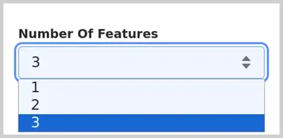
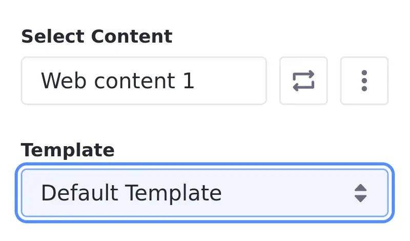
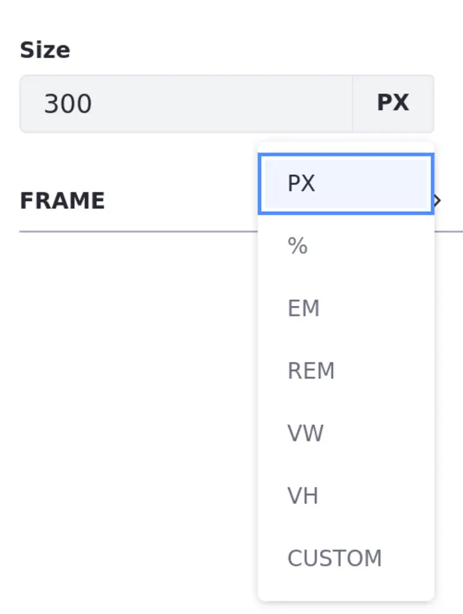
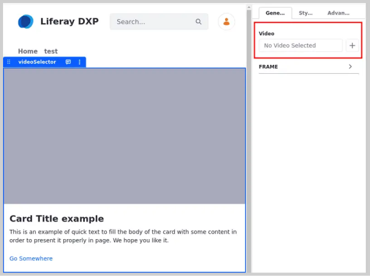
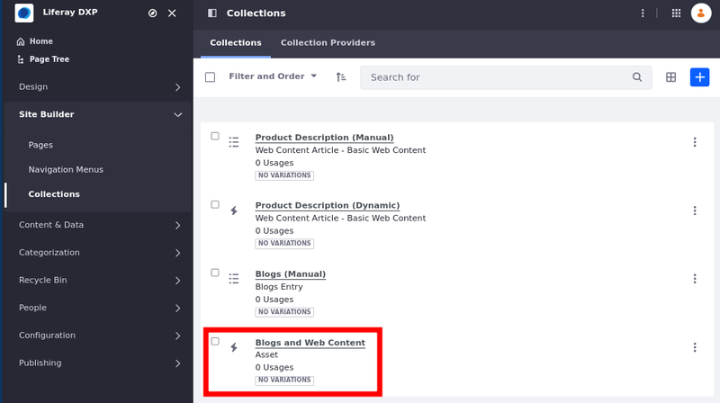

# Fragment Configuration Types Reference

This reference lists the available configuration types for fragments. See [Adding Configuration Options to Fragments](../../developing-page-fragments/adding-configuration-options-to-fragments.md) for more information on how to make a fragment configurable.

These are the configurable fragment types available to implement:

- `text`
- `select`
- `checkbox`
- `colorPicker` (Available Liferay 7.4+)
- `length` (Available Liferay 7.4+ U44/GA44)
- `itemSelector`
- `url` (Available Liferay 7.4+)
- `videoSelector` (Available Liferay 7.4+)
- `collectionSelector`
- `colorPalette`

```{note}
Configuration values inserted into the FreeMarker context honor the defined `dataType` value specified in the JSON file. For example, if the `dataType` is String, `configuration.[name-value]?is_string` is `true`.
```

## Text Configuration

This JSON configuration creates an input text field you can implement for cases where you must enter a text option manually:

```json
{
    "fieldSets": [
        {
            "fields": [
                {
                    "name": "buttonText",
                    "label": "Button Text",
                    "description": "button-text",
                    "type": "text",
                    "typeOptions": {
                        "placeholder": "Placeholder"
                    },
                    "dataType": "string",
                    "defaultValue": "Go Somewhere"
                }
            ]
        }
    ]
}
```


## Select Configuration

This JSON configuration creates a selector you can implement for cases where you must select a predefined option:

```json
{
    "fieldSets": [
        {
            "fields": [
                {
                    "name": "numberOfFeatures",
                    "label": "Number Of Features",
                    "description": "number-of-features",
                    "type": "select",
                    "dataType": "int",
                    "typeOptions": {
                        "validValues": [
                            {"value": "1"},
                            {"value": "2"},
                            {"value": "3"}
                        ]
                    },
                    "defaultValue": "3"
                }
            ]
        }
    ]
}
```



## Checkbox Configuration

This JSON configuration creates a checkbox you can implement for cases where a boolean value selection is necessary:

```json
{
    "fieldSets": [
        {
            "fields": [
                {
                    "name": "hideBody",
                    "label": "Hide Body",
                    "description": "hide-body",
                    "type": "checkbox",
                    "defaultValue": false
                }
            ]
        }
    ]
}
```


## Color Picker Configuration

{bdg-secondary}`Available Liferay 7.4+`

The color picker JSON configuration creates a flexible color selector where any color can be selected. You can use any of these methods to select a color:

* Click the color on the left side to open a color picker to choose a color.

* Enter a color's hex code into the text box.

* Click the *Value from Stylebook* button to open a menu of pre-defined colors to choose defined in your currently used [style book](../../../site-appearance/style-books/using-a-style-book-to-standardize-site-appearance.md). This links the field's value to the selected token, until you press the button again to unlink it. Unlinking the token value converts the chosen color to its equivalent hex code value again.

* If the color picker has no default value defined, click the *Default* drop-down menu to select any color from your currently used style book. This works the same as the Value from Stylebook button when you select a value.



```{note}
If the theme you are using has no [token definitions for style books](../../../site-appearance/style-books/developer-guide/style-book-token-definitions.md), color picker configurations on the page are replaced with [color palette](#color-palette-configuration) configurations.
```

This JSON configuration creates a color picker field called `headingColor`:

```json
{
    "fieldSets": [
        {
            "fields": [
                {
                    "name": "headingColor",
                    "label": "Heading Color",
                    "description": "heading-color",
                    "type": "colorPicker",
                    "defaultValue": "#FF0000"
                }
            ]
        }
    ]
}
```

The `colorPicker` type stores an object holding the chosen color value with the configured name. You can reference this object in your fragment's HTML like this:

```html
<div class="fragment_69">
    <h1 style="color: ${configuration.headingColor}">
        This text's color is configurable.
    </h1>
</div>
```

When the fragment is rendered, the token `${configuration.OBJECT_NAME}` is replaced with the chosen color. The type of value that it becomes depends on how the color is chosen:

* If you chose a color directly, it is replaced with the corresponding hex code value.
* If you chose a color from the current style book, it's replaced with a CSS variable for the linked token (for example, `var(--danger)`).
* If the current theme does not have any token definitions to use (so a [color palette](#color-palette-configuration) is used instead), it is replaced with a CSS color (for example, `rgb(255, 0, 0)`).

## Length Configuration

{bdg-secondary}`Available Liferay 7.4 U44 and GA44+`

The `length` configuration type creates a field where you can enter a number and choose predefined units or specify your own units for settings like width, margins, and padding.

This JSON sample shows a field using the `length` configuration type. It includes properties defining the name, label, and default value.

```json
{
    "fieldSets": [
        {
            "fields": [
                {
                    "defaultValue": "300px",
                    "label": "size",
                    "name": "size",
                    "type": "length"
                }
            ]
        }
    ]
}
```

In the user interface, you can choose from the available units or specify a custom unit.



## Item Selector Configuration

{bdg-secondary}`Available Liferay 7.3+`

This configuration creates a selector for selecting one existing piece of content (a document, web content article, blog entry, category, product, or knowledge base article by default) to include in the fragment.

```json
{
    "fieldSets": [
        {
            "fields": [
                {
                    "label": "select-content",
                    "name": "itemSelector1",
                    "type": "itemSelector",
                    "typeOptions": {
                        "enableSelectTemplate": true
                    }
                }
            ]
        }
    ]
}
```


You can provide a more advanced configuration that lets authors select only a specific type of content. The configuration below specifies that only web content articles can be selected. The optional `itemSubtype` property specifies that the selected web content article must use the structure `article-structure-key-15` to be selected:

```json
{
    "fieldSets": [
        {
            "fields": [
                {
                    "label": "select-content",
                    "name": "itemSelector1",
                    "type": "itemSelector",
                    "typeOptions": {
                        "itemType": "com.liferay.journal.model.JournalArticle",
                        "itemSubtype": "article-structure-key-15"
                    }
                }
            ]
        }
    ]
}
```

This example specifies that only a document with the `image/png` MIME type (`.png` file) can be selected:

```json
{
  "fieldSets": [
    {
      "fields": [
        {
          "label": "select-content",
          "name": "itemSelector1",
          "type": "itemSelector",
          "typeOptions": {
            "itemType": "com.liferay.portal.kernel.repository.model.FileEntry",
            "mimeTypes": [
              "image/png"
            ]
          }
        }
      ]
    }
  ]
}
```

This example specifies that only blog entries can be selected:

```json
{
    "fieldSets": [
        {
            "fields": [
                {
                    "label": "select-content",
                    "name": "itemSelector1",
                    "type": "itemSelector",
                    "typeOptions": {
                        "itemType": "com.liferay.blogs.model.BlogsEntry"
                    }
                }
            ]
        }
    ]
}
```

You can then render the content in your fragment with this HTML snippet for the blog entry:

```html
<div class="fragment_name">
  [#if configuration.itemSelector1.content??]
       ${configuration.itemSelector1.content}
  [/#if]
</div>
```

If you need access to specific portions of the content, you can also access the Java object in your fragment using the `name` attribute and the `Object` suffix (`itemSelector1Object`, in this case). The example below renders the title, description, and content body of the blog entry.

```html
<div class="fragment_name">
  [#if configuration.itemSelector1.content??]
      ${itemSelector1Object.getTitle()}
      ${itemSelector1Object.getDescription()}
      ${itemSelector1Object.getContent()}
  [/#if]
</div>
```

```{note}
Placing a fragment with an item selector configuration into a collection display widget automatically maps the collection item as the selected content.
```

## URL Configuration

This configuration adds a field specifically for a URL to use in your fragment's markup:

```json
{
    "fieldSets": [
        {
            "fields": [
                {
                    "label": "My URL",
                    "name": "myURL",
                    "type": "url"
                }
            ]
        }
    ]
}
```

When you set a fragment with this configuration, you can choose from a drop-down menu to enter a URL manually (`URL`) or to select another page from the same site and use its complete URL (`Page`).

Here is an example of fragment HTML that uses the URL configuration in the above JSON to create a hyperlink:

```html
<div class="fragment_1">
    <a href=${configuration.myURL}>Click this link!</a>
</div>
```

## Video Selector

{bdg-secondary}`Available Liferay 7.4+`

Using the `videoSelector` type, you can create a video selector to incorporate an [external video](../../../creating-pages/page-fragments-and-widgets/using-fragments/default-fragments-reference.md) fragment in another fragment.

```json
{
    "fieldSets": [
        {
            "fields": [
                {
                    "label": "My Video Selector",
                    "name": "myVideoConfig",
                    "type": "videoSelector"
                }
            ]
        }
    ]
}
```

This is useful when you want a fragment that has an embedded video by default. The following JSON configuration sample shows how to incorporate a external video selector in a card fragment:

```json
{
"fieldSets": [
    {
        "fields": [
            {
                "label": "Video",
                "name": "video",
                "type": "videoSelector"
            }
        ]
    },
    {
        "configurationRole": "style",
        "fields": [
            {
                "dataType": "string",
                "defaultValue": "w-100",
                "label": "image-size",
                "name": "imageSize",
                "type": "select",
                "typeOptions": {
                    "validValues": [
                        {
                            "label": "fit",
                            "value": "w-100"
                        },
                        {
                            "label": "original-size",
                            "value": "w-0"
                        }
                    ]
                }
            }
        ]
    }
]
}
```



```{note}
The `videoSelector` type is compatible with the [external video](../../../creating-pages/page-fragments-and-widgets/using-fragments/default-fragments-reference.md#external-video) fragment, but not with the [video URL](../../../creating-pages/page-fragments-and-widgets/using-fragments/default-fragments-reference.md) fragment.
```

## Collection Selector

{bdg-secondary}`Available Liferay 7.3+`

Using the `collectionSelector` configuration type, you can develop a fragment that includes a [collection](../../../../content-authoring-and-management/collections-and-collection-pages/about-collections-and-collection-pages.md) or [collection provider](../../../../content-authoring-and-management/collections-and-collection-pages/collection-providers.md). You can use the `collectionSelector` with both manual and dynamic collections.

```{note}
Developers can use collection providers to create specific collections with more advanced criteria. To learn more, read the information about [Creating an Information List Provider](https://help.liferay.com/hc/en-us/articles/360029067271-Creating-an-Information-List-Provider) in the [Info Framework](https://help.liferay.com/hc/en-us/articles/360029067251-Introduction-to-The-Info-Framework) developer documentation.
```

The following JSON configuration shows how to use the `collectionSelector`:

```json
{
    "fieldSets": [
        {
        "label": "Collection",
        "fields": [
            {
                "name": "collection",
                "type": "collectionSelector"
            }
        ]
        }
    ]
}
```

You can use this fragment configuration with the following HTML code sample to list the collection items. The `collectionObjectList` represents the collection selected in the [content page editor](../../../creating-pages/using-content-pages/content-page-editor-ui-reference.md).

To reference this collection in the HTML, use the collection `name` in the JSON configuration and the `ObjectList` suffix. In the previous JSON code excerpt, the collection `name` is `collection` so the HTML references the collection using `collectionObjectList`.

```html
<div class="fragment_310">
    <h1>
        List of Items:
    </h1>
    <ul>
        [#if collectionObjectList??]
        [#list collectionObjectList as item]
        <li>${item.title}</li>
        [/#list]
        [/#if]
    </ul>
</div>
```


### Filtering the Collection Selector

You can filter the collection selector using `itemType` in the `collectionSelector` configuration. For example, if you have different collections including web content and blogs, you can restrict the collection selector to show only blog collections. This JSON sample illustrates this configuration:

```json
{
    "fieldSets": [
        {
            "label": "Collection",
            "fields": [
                {
                    "name": "collection",
                    "type": "collectionSelector",
                    "typeOptions": {
                        "itemType": "com.liferay.blogs.model.BlogsEntry"
                    }
                }
            ]
        }
    ]
}
```

Using this sample configuration, collections including both web content and blogs are filtered out of the collection selector because the collection type is asset.



```{tip}
In addition to the `itemType`, you can specify the `itemSubtype` in the configuration.
```

### Defining a Maximum Number of Returned Collection Items

By default, all items in the collection are returned if you do not define a limit to the maximum number of items. You can set this limit using `numberOfItems` in your JSON configuration.

```json
{
    "fieldSets": [
        {
            "label": "Collection",
            "fields": [
                {
                    "name": "collection",
                    "type": "collectionSelector",
                    "typeOptions": {
                        "numberOfItems": 3
                    }
                }
            ]
        }
    ]
}
```

## Color Palette Configuration

The color palette JSON configuration creates a color selector you can implement for cases where you must select a color. Unlike the [color picker configuration](#color-picker-configuration), it only provides options based on the theme colors configured in the currently used [style book](../../../site-appearance/style-books/using-a-style-book-to-standardize-site-appearance.md)'s color system.

This configuration creates a color palette field called `textColor`:

```json
{
    "fieldSets": [
        {
            "fields": [
                {
                    "name": "textColor",
                    "label": "Text color",
                    "type": "colorPalette",
                    "dataType": "object",
                    "defaultValue": {
                        "color": "white"
                    }
                }
            ]
        }
    ]
}
```

The `colorPalette` type stores an object with the  value: `color`.

For example, if you implement the snippet above, you can use it in FreeMarker:

```html
<h3 class="text-${configuration.textColor.color}">Example</h3>
```

If you were to choose the color white, the `h3` tag heading would have the class `text-white`.


## Related Topics

- [Developing Fragments](../../developing-page-fragments/developing-fragments-intro.md)
- [Fragment Specific Tags Reference](./fragment-specific-tags-reference.md)
- [Page Fragment Editor Interface Reference](./page-fragment-editor-interface-reference.md)
- [Using a Style Book to Standardize Site Appearance](../../../site-appearance/style-books/using-a-style-book-to-standardize-site-appearance.md)
