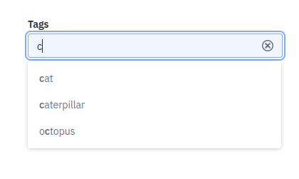

# Filtering Collections on a Page

To improve the experience for Users viewing Collections on your Site, you can add Page Fragments to filter content in those Collections. For example, you can add a Fragment that can be used to search for and filter displayed Collections content using keywords.

There are two Page Fragments you can add to your pages to help Users filter content in displayed Collections: the [Collection Filter Fragment](#using-the-collection-filter-fragment) and the [Applied Filters Fragment](#using-the-applied-filters-fragment).

## Using the Collection Filter Fragment

The Collection Filter Fragment is used to filter the content displayed in a chosen Collection on the page. Users can search for keywords, or select categories and tags to filter the Collection associated with the filter Fragment.

Follow these steps to add and configure a Collection Filter Fragment to a page (that is already displaying a Collection in a [Collection Display Fragment](./displaying-collections.md#configuring-a-collection-display-fragment)):

1. While editing the page, add a Collection Filter Fragment anywhere on the page.

1. In the Fragment's *General* configuration, select the desired Collection. The Collection must be displayed in Collection Display Fragments on the page for it to have an effect.

    

    The *Filter* drop-down menu appears when you have selected a compatible Collection.

1. Use the Filter menu to choose *Keywords*, *Category*, or *tags* filters.

    ```{note}
    If modules have been deployed that add custom Collection filters (by implementing the [`FragmentCollectionFilter`](https://github.com/liferay/liferay-portal/blob/master/modules/apps/fragment/fragment-collection-filter-api/src/main/java/com/liferay/fragment/collection/filter/FragmentCollectionFilter.java) and [`InfoFilter`](https://github.com/liferay/liferay-portal/blob/master/modules/apps/info/info-api/src/main/java/com/liferay/info/filter/InfoFilter.java) interfaces), you can also choose these filters from the list.
    ```

The Collection Filter fragment's behavior changes depending on whether you configured the Keywords, Category, or Tags filter type.

### Filtering by Keyword

 When Keywords is selected, the Collection Filter fragment appears as a search bar, where users can filter the displayed content of collections by entering keywords.


### Filtering by Category

When Category is selected, the Source input field can be used to configure which categories users can select.


1. Click *Select This Level* when you have selected the vocabulary or parent category containing the desired categories.

2. Publish the page.

After configuring the Category filter, the Collection Filter fragment displays a menu of categories. Users can select one or more categories to filter the collection's displayed content.


### Filtering by Tags

When Tags is selected, users can type in the provided field and see a drop-down showing existing tags that can be selected.



## Using the Applied Filters Fragment

The Applied Filters Fragment is used to see a list of filters applied with the [Collection Filter Fragment](#using-the-collection-filter-fragment).

Follow these steps to add an Applied Filters Fragment to a page (that already has a configured Collection Filter Fragment):

1. While editing the page, add an Applied Filter Fragment anywhere on the page.

1. In the Applied Filter Fragment's *General* configuration, select the desired Collection. The same Collection must be both displayed on the page and configured with a [Collection Filter Fragment](#using-the-collection-filter-fragment).

1. Publish the page.

Now, when the User filters content with the Collection Filter Fragment, the Applied Filters Fragment shows a list of the filters currently applying to the configured Collection. Users can also click the *X* button on each filter listed to remove the filter.


## Additional Information

* [Displaying Collections](./displaying-collections.md)
