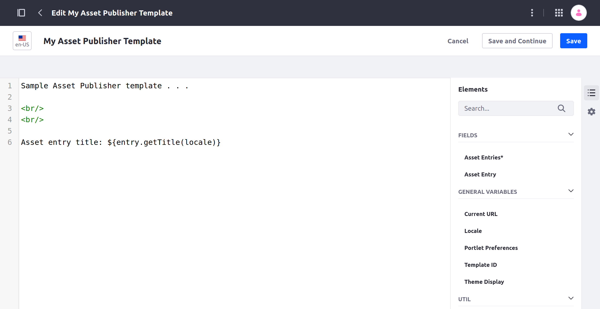

# Styling Widgets with Widget Templates

Widget templates are used to customize the appearance and functionality of out-of-the-box widgets, such as the *Asset Publisher* and *Media Gallery* widgets.

## Creating a Widget Template

1. From the Site Menu , click *Design* &rarr; *Templates*.

1. Select the *Widget Templates* tab at the top of the page.

    

1. Click the *Add* () button, then select which widget to create a widget template for (e.g., Asset Publisher).

    

1. Add a name for your widget template.

1. Enter the desired content for your widget template. You can click any of the entries in the menu on the right side of the screen to insert a field, variable, or utility into the editor (or start typing a field name starting with `${` to see suggestions as you type).

1. Click *Save* to complete the template.

This creates a new widget template, which you can apply to the corresponding type of widget on a page.

## Applying a Widget Template

1. Click the Actions () icon on the appropriate widget, then click *Configuration.*

1. Find the Display Template drop-down menu, and select the name of the desired template.

    

    ```{note}
    This drop-down menu is on the default tab, Setup, for most widgets. For the Asset Publisher widget, this setting is found under the Display Settings tab.
    ```

1. Click *Save.*

    

The widget has been modified to use a custom appearance. By using more advanced widget template scripts, you can further enhance the capabilities of your widgets.
