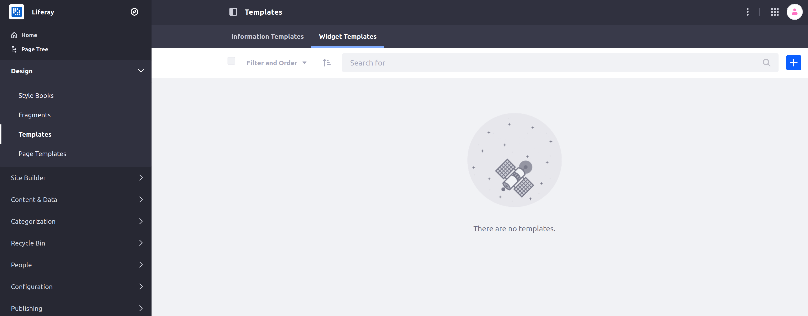
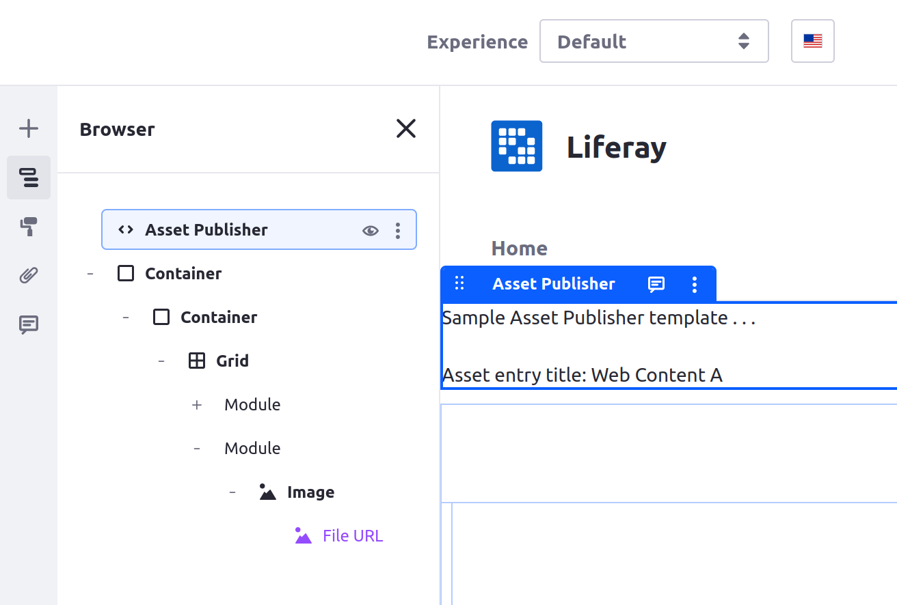

# Styling Widgets with Widget Templates

You can use widget templates to customize the appearance and functionality of out-of-the-box widgets, such as the *Asset Publisher* and *Media Gallery* widgets.

## Creating a Widget Template

1. From the *Site Menu* , click *Design* &rarr; *Templates*.

1. Go to the *Widget Templates* tab.

   

1. Click *Add* () and select a widget for the template (e.g., Asset Publisher).

   

1. Add a name for your widget template.

1. Enter your FreeMarker script into the template editor. You can use the Elements side panel (  ) to add fields, variables, and utilities to your template. Alternatively, you can type `${` to see field suggestions.

   ```{note}
   For Liferay DXP/Portal 7.4+, widget templates only support FreeMarker. Velocity is no longer supported.
   ```

1. Click *Save*.

This creates a new widget template, which you can apply to the corresponding type of widget on a page.

## Applying a Widget Template

1. Click the *Actions* button () for the appropriate widget, then click *Configuration.*

1. Find the Display Template drop-down menu and select the desired template.

   

   ```{note}
   This drop-down menu is on the default tab, Setup, for most widgets. For the Asset Publisher widget, this setting is under the Display Settings tab.
   ```

1. Click *Save*.

   

The widget now uses the custom template. By using more advanced widget template scripts, you can further enhance the capabilities of your widgets.

## Additional Information

* [Creating a Widget Template](../../creating-pages/using-widget-pages/styling-widgets/creating-a-widget-template.md)
* [Configuring Widget Look and Feel](../../creating-pages/using-widget-pages/styling-widgets/configuring-widget-look-and-feel.md)
