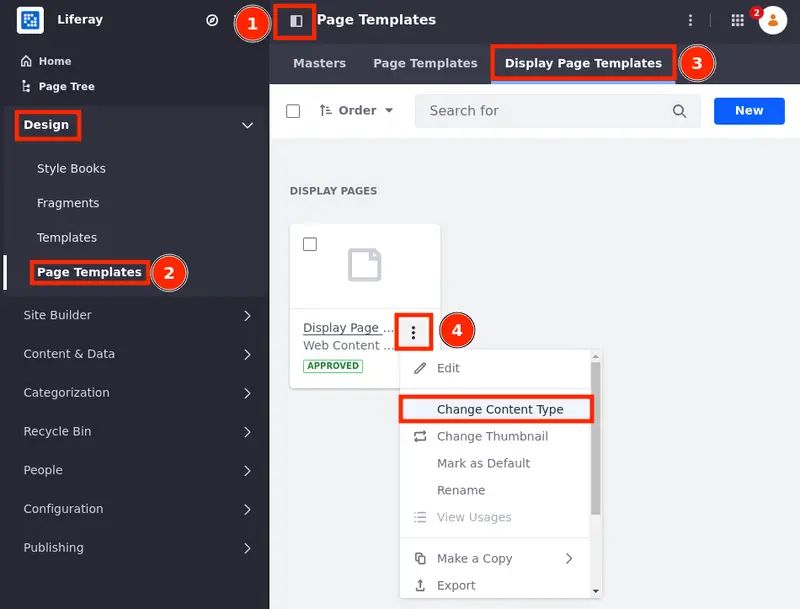
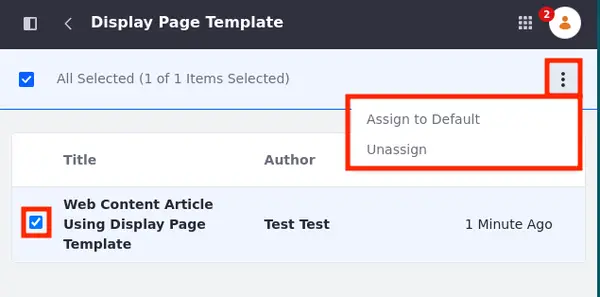

---
taxonomy-category-names:
- Sites
- Display Page Templates
- Liferay Self-Hosted
- Liferay PaaS
- Liferay SaaS
uuid: 203429af-623b-4ad7-b5b1-0ffd147c7e06
---
# Creating and Managing Display Page Templates

{bdg-secondary}`Liferay DXP/Portal 7.3+`

Display page templates define structures for displaying content at a dedicated friendly URL. These templates currently support the following content types:

- [Blog Entries](../../../content-authoring-and-management/blogs/getting-started-with-blogs.md)
- [Categories](../../../content-authoring-and-management/tags-and-categories/defining-categories-and-vocabularies-for-content.md) {bdg-secondary}`Liferay DXP/Portal 7.4+`
- [Custom Objects](../../../liferay-development/objects/displaying-object-entries.md) {bdg-secondary}`Liferay DXP/Portal 7.4+`
- [Documents](../../../content-authoring-and-management/documents-and-media/publishing-and-sharing/publishing-documents.md)
- [Web Content Articles](../../../content-authoring-and-management/web-content/web-content-articles/adding-a-basic-web-content-article.md)

See [Using Display Page Templates](../using-display-page-templates.md) to learn more.

## Creating a Display Page Template

1. Open the *Site Menu* () and click *Design* &rarr; *Page Templates*.

1. Click the *Display Page Templates* tab and click *New*.

   {bdg-secondary}`Liferay DXP 2024.Q2+` You can also create folders to organize your display page templates. Click *New* &rarr; *Folder* &rarr;  enter a *Name* and, optionally, a *Description* for the folder. Click *Create*. See [Using Folders](../../../content-authoring-and-management/documents-and-media/uploading-and-managing/using-folders.md) to learn more about folders.

1. Enter a *Name* for your template and select a *Content Type* and *Subtype*, if applicable. Then click *Save*.

   

1. Design the template using the same interface and page elements as [content pages](../../creating-pages/using-content-pages/content-page-editor-ui-reference.md).

1. Once you've added page elements, you can [map](../../creating-pages/page-fragments-and-widgets/using-fragments/configuring-fragments/fragment-sub-elements-reference.md#mapping-settings) them to content structure fields (e.g., title, description) by double-clicking on an editable field. Mapped fields are outlined in purple.

   !!! tip
       You can use mapped fields when configuring SEO and Open Graph settings for a display page template. See [Configuring SEO and Open Graph](./configuring-seo-and-open-graph.md) for more information.

   

1. Before publishing, you can preview your editable fields mappings with existing content using the [preview function](#previewing-the-display-page-template-content-mappings) (available 7.4+).

1. When finished, click *Publish* to save your work.

You can now use the template to [display your content](./publishing-content-with-display-pages.md).

### Setting a Friendly URL for the Display Page Template

{bdg-secondary}`Liferay 2023.Q4+/GA102+`

You can set a friendly URL for your display page template. The friendly URL is used when the display page template is not marked as default or when it is manually selected for use.

For example, when you link a button in a content page to a mapped URL, you can select an object connected to a display page template as the item and select the display page template as the field. In this case, the friendly URL is used for the selected display page template.

To set a friendly URL for your display page template,

1. While editing your display page template, click *Options* () at the top right corner of the page.

1. Select *Configure*.

   You can access the display page template configuration through the Page Templates app. Open the Page Templates app. In the Display Page Templates tab, click *Actions* () for the display page template you want to configure and choose *Configure*.

1. Under the General section, define your friendly URL.

1. Click *Save*

### Mapping Links to Different Display Page Templates

If a content type (e.g., custom object, web content article, or blogs entry) more than one display page template, you can map links to any available template for that content type.

For example, you can create different display page templates for an object, each corresponding to a step in a mapped form (e.g., submission, editing, and approval). Then, you can choose which display page template to use for each stage, enabling the creation of multi-step forms.

This gives you more freedom when dealing with objects and [forms mapped from objects](../../../liferay-development/objects/using-fragments-to-build-forms.md) with multiple steps.

### Previewing the Display Page Template Content Mappings

{bdg-secondary}`Liferay DXP/Portal 7.4+`

While editing, Liferay provides two ways to preview display page templates with content items.

From the Application Menu, you can click the *Preview With* drop-down menu and choose a content item. If no item appears, click *Select Other Item* and browse for the desired content. This dynamically populates the template with content data according to your field mapping.

Alternatively, from the display page template editor, click the *Options* menu() button at the top right corner and choose *Preview in a New Tab*.

## Viewing Display Page Template Usage

{bdg-secondary}`Liferay DXP/Portal 7.4+`

You can manage the different display page templates using the *Actions* menu (). From here, the *View Usages* option provides a list of content that uses a specific display page template other than the default template. This option is not available for default templates.

Before you delete a display page template that is in use, you have two ways to unassign the display page template from the content:

- Assign to Default: Your content is unassigned from the current display page template and assigned to the default display page template for the content type and subtype (if applicable.)
- Unassign: Your content is not assigned to any display page template.

Follow these steps to view your display page template usage and unassign your content:

1. Open the *Site Menu* () and go to *Design* &rarr; *Page Templates*.

1. Click the *Display Page Templates* tab.

1. Click the display page template's *Actions* menu () and select *View Usages*.

1. Select one or more elements from the list of content using the display page template.

1. Click the *Actions* menu () in the top-right corner and select *Assign to Default* or *Unassign*.

1. Click *OK*.

If you assign your content to a new display page template, make sure the content appears as expected. To preview and display your content, see [Publishing Content with Display Pages](./publishing-content-with-display-pages.md).

## Duplicating a Display Page Template

{bdg-secondary}`Liferay 7.4 2023.Q4+/GA102+`

You can duplicate a published display page template. The copy is linked to the original content type, and its mappings are the same as the original page.

1. Open the *Site Menu* () (1) and navigate to *Design* &rarr; *Page Templates* (2).

1. Select the *Display Page Templates* tab (3), click *Actions* () for the display page template you want to alter, and choose *Make a Copy* (4).

   If the display page template was never published, the Make a Copy option is disabled.

1. In the sub-menu, choose *Display Page* or *Display Page With Permissions*.

   The copy is named `Original Name + Copy + Duplicate Number` and is created as a draft so the user can review it before publishing.

!!! important
    You can only make a copy of display page templates if they were published at some point. If a published template becomes a draft again, you can copy the last published version of the display page template.

## Changing the Content Type of Display Page Templates

{bdg-secondary}`Liferay 7.4 2023.Q4+/GA102+`

!!! warning
    Changing the content type/subtype of a display page template may cause some of its elements to lose their previous mapping.

    The mapped elements in a display page template are highlighted in purple in the Browser menu on the left. The unmapped elements are not highlighted in purple.

To change the content type linked to a display page template,

1. Open the *Site Menu* () (1) and navigate to *Design* &rarr; *Page Templates* (2).

1. Select the *Display Page Templates* tab (3), click *Actions* () for the display page template you want to alter, and choose *Change Content Type* (4).

   

1. Choose the new content type for your display page template, the new content type and its subtype, or just the new subtype and click *Save*.

   If the content type has a subtype, you must select a subtype before saving the new content type.

### Changing the Content Type of Assigned Display Page Templates

You cannot change the content type of a display page template if it's assigned to an asset (e.g. web content article).

If you try changing the content type, a *Display Page In Use* message appears. You can click *View Display Page Usages* to see the assets using the display page template. You can then select assets, click *Actions* (), and select *Assign to Default* or *Unassign*.

Assign to Default assigns the asset to the default display page template, while Unassign removes the display page template and assigns the asset to None instead.

The picture below shows the display page settings for a web content article with the display page template assigned to it (1), after using the Assign to Default option (2) and after using the Unassign option (3).

## Related Topics

- [Publishing Content with Display Pages](./publishing-content-with-display-pages.md)
- [Configuring SEO and Open Graph](./configuring-seo-and-open-graph.md)
- [Using Content Pages](../../creating-pages/using-content-pages.md)
- [Adding Elements to Content Pages](../../creating-pages/using-content-pages/adding-elements-to-content-pages.md)
