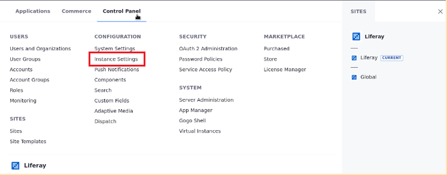
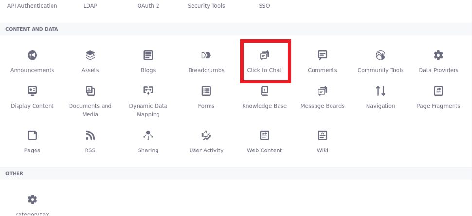
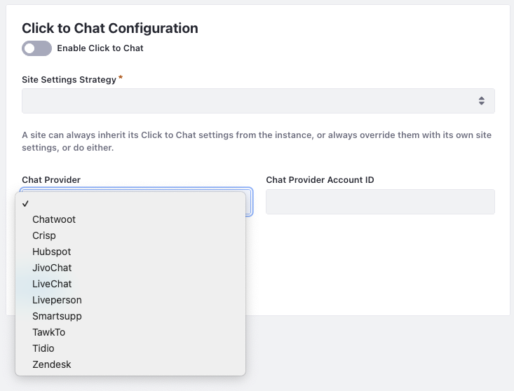

---
taxonomy-category-names:
- Personalization
- Live Chat
- Liferay Self-Hosted
- Liferay PaaS
- Liferay SaaS
uuid: eaf9a214-8e50-4e0e-a818-e96a21098e2e
---

# Enabling Automated Live Chat Systems

{bdg-secondary}`Liferay 7.4+`

Liferay now offers integration with a number of live support chat platforms. Enabling this integration adds a chat window to sites on your Liferay instance and can be used to enable improved support and site experience for your users.

## Enabling Click To Chat

To enable Click To Chat go to *Instance Settings*.

1. Go to the *Global Menu* () &rarr; *Control Panel* &rarr; *Instance Settings*.

    

1. Under the *Content and Data* section, click *Click To Chat*.

    

1. To enable Click to Chat for your instance, switch the *Enable Click to Chat* toggle.

    

1. Once enabled, you must select a [Site Settings](../site-settings.md) Strategy. Your Site Settings strategy determines how Click to Chat is enabled across sites that exist on a given [Liferay instance](../../system-administration/configuring-liferay/virtual-instances/understanding-virtual-instances.md).

    

   **Always Inherit**: Click To Chat is enabled for all sites on the instance and ignores configurations made in Site Settings.

   **Always Override**: Configuration for Click to Chat configured in Site Settings always takes priority over configurations made in Instance Settings.

   **Inherit or Override**: Sites inherit configuration from Instance Settings, unless configured otherwise in the site's Site Settings.

1. Select your chat provider and input the [Account ID or token](#getting-the-chat-provider-account-id-or-token) given to you by your Chat Provider.

    

1. (Optional) Click the *Guest Users Allowed* toggle to configure whether you want guest users (unauthenticated users) to have access to the Click to Chat feature for your sites.

1. Click *Save*.

Click To Chat integration with your live chat provider is now configured.

## Getting The Chat Provider Account ID or Token

After [Enabling Click To Chat](#enabling-click-to-chat) and choosing you provider, you must connect to them by following a two-step process:

1. Find your Account ID.

1. Copy and paste it into the *Chat Provider Account ID* field.

   !!! note
       Unlike *Zendesk Web Widgets Classic*, *Zendesk Web Widgets* requires an Key ID and a Secret Key.

You can grab keys from these supported providers:

- [Chatwoot](https://www.chatwoot.com/docs/product/channels/api/create-channel), in the *"Create a contact"* section.

- [Crisp](https://help.crisp.chat/en/article/where-can-i-find-my-website-id-1ylqx1s/), in the *"How to find the WebsiteID?"* section.

- [Hubspot](https://knowledge.hubspot.com/integrations/use-hubspots-integration-with-netsuite), in the *"Locate your NetSuite Account ID, Access Token ID and Access Token Secret"* section.

- Intercom: You can find your account ID by looking at the URL. Your account ID is between `/apps` and `/home` in the URL. If the URL is `https://app.intercom.com/a/apps/abcdefg1/home`, after `/apps` the sequence of letters and numbers is your ID. In this example, Intercom's Account ID is `abcdefg1`.

- [Jivochat](https://www.jivochat.com/help/installation/find-code.html), in the *"How to find the HTML code to install on your website"* section.

- [LivePerson](https://knowledge.liveperson.com/troubleshooting-find-your-account-number.html), in the *"Find your account number"* section.

- [Smartsupp](https://docs.smartsupp.com/chat-box/configuration/#sub-domains-integration), in the *"Configuration"* section.

- [Tawk.to](https://help.tawk.to/article/direct-chat-link), in the *"Here’s how to find the Direct Chat Link:"* section.

- [Tidio](https://help.tidio.com/hc/en-us/articles/5389680306844-Install-Tidio-on-Site123), in the *"Installation"* section.

- [Zendesk Web Widgets Classic](https://developer.zendesk.com/documentation/classic-web-widget-sdks/web-widget/quickstart-tutorials/web-widget-javascript-apis/), in the *"Adding the Web Widget (Classic) on your web page"* section. The Account ID is the portion of the snippet after `...snippet.js?key=`. 

- Zendesk Web Widgets: You get your Account ID in the same way you get it in the Classic version. You can find the [Key ID and Secret key](https://developer.zendesk.com/documentation/zendesk-web-widget-sdks/sdks/web/enabling_auth_visitors/#generating-a-signing-key) in the *"Generating a signing key"* section.
