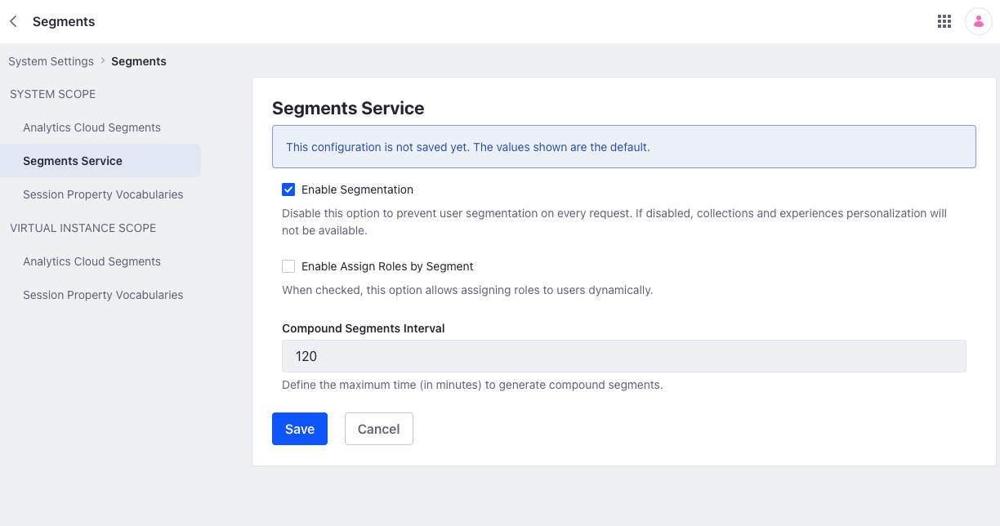

# Segments Admin Settings

{bdg-secondary}`Liferay DXP/Portal 7.3+`

You can configure Segments behavior at the system or instance level. With these settings, you can enable/disable segmentation, set the interval for syncing Analytics Cloud segments with Liferay DXP, create session-based segment properties, and more.

To access segment settings,

1. Open the *Global Menu* , click the *Control Panel* tab, and go to *System Settings* or *Instance Settings*.

   ```{note}
   Beginning with Liferay DXP 7.4 U38+/GA38+, you can configure segment settings at the instance level.
   ```

1. Click *Segments* under Content and Data.

See [Understanding Configuration Scope](../../../system-administration/configuring-liferay/understanding-configuration-scope.md) to learn how system and instance scopes work.

## Analytics Cloud Segments


[Analytics Cloud segments](https://learn.liferay.com/analytics-cloud/latest/en/people/segments/segments.html) aggregate individuals based on common attributes and behavior. You can integrate this data with Liferay DXP's segments to deliver content of interest to both known and anonymous users.

You can access these settings under *Analytics Cloud Segments*:

**Anonymous User Segments Cache Expiration Time**: Set a time limit (in seconds) for how long the anonymous segment cache is stored. When the time expires, the cache is cleared.

**Interest Terms Cache Expiration Time**: Set a time limit (in seconds) for how long the interest terms cache is stored. When the time expires, the cache is cleared. See [Understanding Interests](https://learn.liferay.com/analytics-cloud/latest/en/people/individuals/understanding-interests.html) for more information.

**Update Interval**: Set the interval (in minutes) for receiving updates from Analytics Cloud segments. This setting appears only under system settings.

## Session Property Vocabularies

With *Session Property Vocabularies*, you can create [session-based Segment properties](../../../site-building/personalizing-site-experience/segmentation/segments-editor-ui-reference.md#session-properties) using predefined values. This helps when you want users to select properties from a list of predefined values, because it defines segments while eliminating manual entry errors. See [Session Property Vocabularies](../../../content-authoring-and-management/tags-and-categories/session-property-vocabularies.md) for more information.

## Segments Service



You can access these settings under *Segments Service*:

**Enable Segmentation**: Enable or disable segmentation. While disabled, Liferay does not display personalized variations of collections and experiences to end users.

**Enable Assign Roles by Segment**: Enable or disable assigning roles to users dynamically using global segments. While enabled, you can assign roles automatically to groups of changing individuals. See [Assigning Roles to User Segments](../../../users-and-permissions/roles-and-permissions/assigning-roles-to-user-segments.md) for more information.

**Compound Segments Interval**: Set the interval (in minutes) for checking and refreshing compound segments based on their rules. This setting appears only under system settings.

```{note}
Please be aware of [Configuration Scope](../../../system-administration/configuring-liferay/understanding-configuration-scope.md). Settings disabled at the system level cannot be enabled at the instance level, but settings enabled at the system level can be disabled at the instance level.
```

## Related Topics

* [Analytics Cloud Segments](https://learn.liferay.com/analytics-cloud/latest/en/people/segments/segments.html)
* [Session Property Vocabularies](../../../content-authoring-and-management/tags-and-categories/session-property-vocabularies.md)
