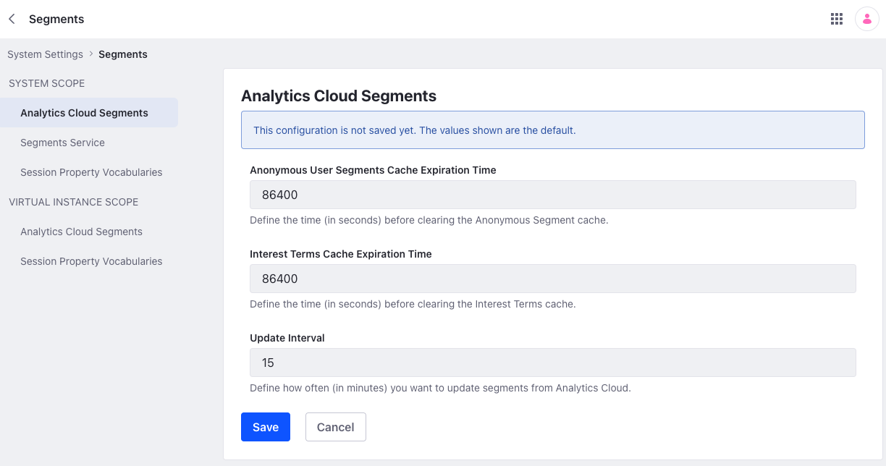

# Segments Admin Settings

{bdg-secondary}`Available Liferay DXP/Portal 7.3+`

You can configure *Segments* behavior at the system or instance level. These settings can be used for the following:

* Set the interval to sync Analytics Cloud segments with Liferay DXP.

* Set the expiration intervals for interest terms cache and anonymous user cache for Analytics Cloud segments.

* Create segment-based session properties based on vocabularies

* Enable/disable segmentation

* Enable/disable dynamic segment-based assignment of users to roles

* Set the interval to update compound segments.

To access segment settings,

1. Open the *Global Menu* , click the *Control Panel* tab, and go to *System Settings* or *Instance Settings*.

   ```{note}
   Beginning with Liferay DXP 7.4 U38+/GA38+, you can configure segment settings at the instance level.
   ```

1. Click *Segments* in the *Content and Data* section.

See [Understanding Configuration Scope](../../../system-administration/configuring-liferay/understanding-configuration-scope.md) to learn how system and instance scopes work.

## Analytics Cloud Segments



[Analytics Cloud segments](https://learn.liferay.com/analytics-cloud/latest/en/people/segments/segments.html) aggregate individuals based on common attributes and behavior. You can integrate this data with Liferay DXP's segments to deliver content of interest to both known and anonymous users.

These Liferay DXP settings are available for Analytics Cloud segments:

**Anonymous User Segments Cache Expiration Time**: Set a time limit (in seconds) for how long the anonymous segment cache is stored. When the time expires, the cache is cleared.

**Interest Terms Cache Expiration Time**: Set a time limit (in seconds) for how long the interest terms cache is stored. When the time expires, the cache is cleared. See [Understanding Interests](https://learn.liferay.com/analytics-cloud/latest/en/workspace-data/definitions/managing-interest-topics.html#understanding-interests) for more information.

**Update Interval**: Set the interval (in minutes) for receiving updates from Analytics Cloud segments. This setting is only available under system settings.

## Session Property Vocabularies

With a *Session Property Vocabulary*, you can create [session-based Segment properties](../../../site-building/personalizing-site-experience/segmentation/segments-editor-ui-reference.md#session-properties) using predefined values. This option is useful when you want the user to select them from a list of predefined values. This fulfils the task of defining segments and eliminates manual entry errors. See [Session Property Vocabularies](../../../content-authoring-and-management/tags-and-categories/session-property-vocabularies.md) for more information.

## Segments Service


You can use segments service settings to enable/disable segmentation, the dynamic segment-based assignment of users to roles, and configure the interval to update compound segments.

These Liferay DXP settings are available for segments service:

**Enable Segmentation**: Enable or disable segmentation. While disabled, personalized variations of collections and experiences are not displayed to the end user.

**Enable Assign Roles by Segment**: Enable or disable the ability to assign roles to users dynamically using global segments. While enabled, you can assign roles automatically to groups of changing individuals. See [Assigning Roles to User Segments](../../../users-and-permissions/roles-and-permissions/assigning-roles-to-user-segments.md) for more information.

**Compound Segments Interval**: Set the interval (in minutes) for checking and refreshing compound segments based on its rules. This setting is only available under system settings.

## Additional Information

* [Analytics Cloud Segments](https://learn.liferay.com/analytics-cloud/latest/en/people/segments/segments.html)
* [Session Property Vocabularies](../../../content-authoring-and-management/tags-and-categories/session-property-vocabularies.md)
