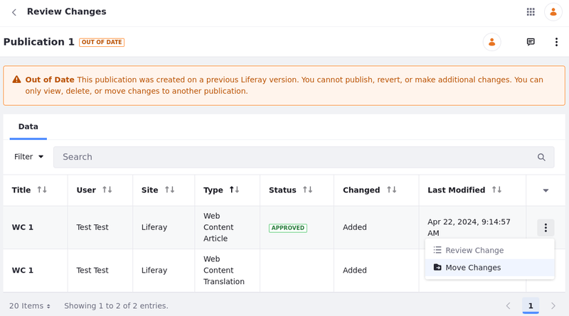

# Creating and Managing Publications

> Available: Liferay DXP/Portal 7.3+

With Publications, users can create instance-scoped blocks of changes. Because each publication is instance-scoped, they can be accessed anywhere in the Liferay UI and include changes from multiple Sites. By default, users can only view and manage publications they've created. However, users can invite each other to collaborate on their publications. See [Collaborating on Publications](./collaborating-on-publications.md) for more information.

[$LIFERAY_LEARN_YOUTUBE_URL$]=https://www.youtube.com/embed/QifaRHHuoX8

Once Publications is [enabled](./enabling-publications.md), you can create, edit, publish, or remove a publication via the Publications application page or the Publications drop-down menu.

```{important}
Before upgrading your Liferay version, ensure you've published all active publications. After upgrading, active publications are marked as out of date and cannot be published or changed. Also, you cannot revert any publications published before your upgrade. The *Revert* option is removed for these publications.
```

## Creating a New Publication

Follow these steps to create a new publication.

1. Click on the Publications *drop-down menu*, and select *Create New Publication*.

   

   Alternatively, open the Publications application and click on the *Add* button (  ) in the *Ongoing* tab.

1. Enter a *name* and *description* for the publication.

   ```{note}
   Publication names do not need to be unique. However, using unique names is recommended for organization.
   ```

1. Click on *Create*.


Once the publication is created, you can begin adding changes to it. See [Making and Publishing Changes](./making-and-publishing-changes.md) to learn more about the editing and publishing process.

```{note}
After creation, each publication is automatically updated with changes made in production, provided they don't conflict with any changes made in the publication.
```

## Managing Ongoing Publications

In the *Ongoing* tab, you can view a table of all active, unpublished publications that you have permission to view. The table is ordered by *Modified Date* and includes each publication's name, description, time of last modification, time of creation, and owner.


From here, you can click on a publication's *Actions* button (  ) to perform the following actions.

**Work on Publication**: Select the publication to add changes to it. Once selected, you can easily toggle between the publication and production via the Publications drop-down menu. See [Making Changes in a Publication](./making-and-publishing-changes.md#making-changes-in-a-publication) for more information.

**Edit**: Modify the publication's name or description.

**Review Changes**: View all changes included in the publication. See [Reviewing Publication Changes](./making-and-publishing-changes.md#reviewing-publication-changes) for more information.

**Invite Users**: Invite users to collaborate on the publication. See [Collaborating on Publications](./collaborating-on-publications.md) for more information.

**Publish**: Begin the publishing process for the publication. This redirects users to the publishing page, where they can resolve conflicts. If there are no conflicts, they can then click on *Publish* to make their changes live. See [Publishing Changes](./making-and-publishing-changes.md#publishing-changes) and [Resolving Conflicts](./resolving-conflicts.md) for more information.

**Schedule**: Schedule the publication's changes to be applied to production. See [Publishing Changes](./making-and-publishing-changes.md#publishing-changes) for more information.

**Permissions**: Assign publication-specific permissions to User roles. Permissions configured in this way are scoped to the individual publication. <!--TASK: Link to the permissions article once finished.-->

**Delete**: Remove the publication from your instance. When selected, you are prompted to confirm your choice.

```{warning}
Deleting a publication permanently removes all of its changes from your database and cannot be undone. Before deleting a publication, ensure you've saved any data you want to preserve.
```

## Managing Scheduled Publications

In the *Schedule* tab, you can view a table of all scheduled publications that you have permission to view. By default, scheduled publications are listed by *Name*, though you can order them by modified date or when each publication is scheduled for Publishing.


Once scheduled, changes cannot be added to a publication. However, you can click on the *Actions* button (  ) for a scheduled publication to perform the following actions:

**Unschedule**: Cancel the scheduled publishing and return the publication to the *In Progress* status.

**Reschedule**: Set an alternative date and time for publishing the changes to production.

**Review Changes**: View all changes included in the publication.

## Managing History of Publications

In the *History* tab, you can view a table of all published publications for the DXP instance, including those published by other users. By default, publications are ordered by *Published Date*, though you can order them by name.



From here, you can click *Revert* for a publication to automatically create a new publication that reverts its changes. You can also make additional changes to your DXP instance as part of your Revert publication. See [Reverting Changes](./reverting-changes.md) for more information.

```{note}
While all published publications on an instance are listed in the History tab, only publication owners and collaborators can view the publication's list of changes or revert it.
```

## Additional Information

* [Publications Overview](../publications.md)
* [Enabling Publications](./enabling-publications.md)
* [Making and Publishing Changes](./making-and-publishing-changes.md)
