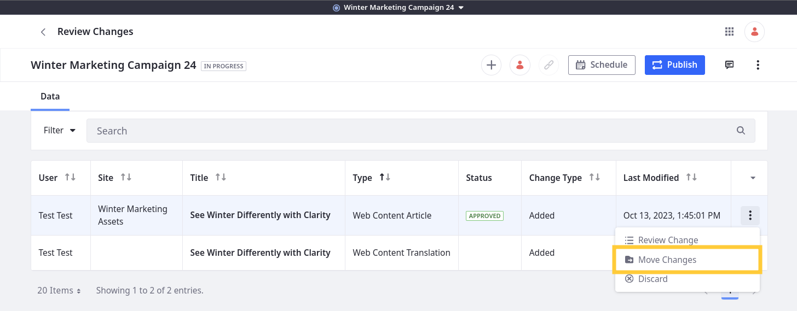
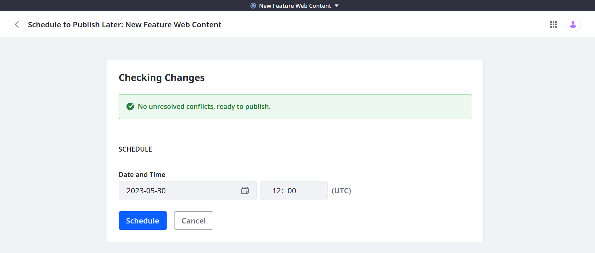
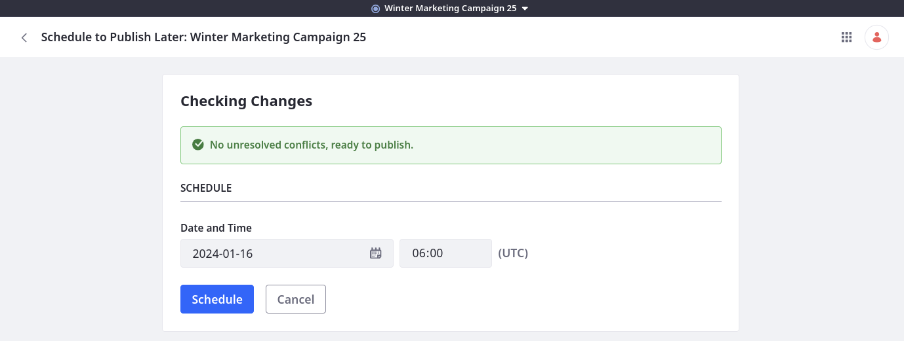

# Making and Publishing Changes

{bdg-secondary}`Liferay 7.3+`

Publications provides a convenient way to manage changes to your Liferay instance. With it, you and your team can create and collaborate on blocks of changes called 'publications'. You can then publish those changes to production when ready.

[$LIFERAY_LEARN_YOUTUBE_URL$]=https://www.youtube.com/embed/YNOLwu19oBk

```{note}
By default, users can only contribute to publications they've created. However, they can invite other users to collaborate on their publications. See [Collaborating on Publications](./collaborating-on-publications.md) for more information.
```

If you haven't already created a publication to track changes, see [Creating a Publication](./creating-and-managing-publications.md#creating-a-publication) for more information.

Once created, a publication is automatically updated with changes made to production, provided they don't conflict with changes made in the publication. This ensures you and your team are working on the latest version of production.

```{important}
After upgrading your Liferay version, existing publications cannot be changed, published, or reverted. All active publications are marked as out of date and can only be viewed or deleted. Also, the *Revert* option is removed for publications published before your upgrade.
```

## Making Changes in a Publication

Before making changes to your instance, ensure you're working on the correct publication. You can confirm this via the Publications bar. If you're not currently in a publication, you can create one or select an existing one.


When you add, edit, or remove assets in a publication, your changes are only visible in the publication where they're made. When you delete an asset in a publication, DXP marks it for deletion and hides it when viewing the publication. The asset remains viewable to production and other publications, since its removal is only a logical deletion.

While working on a publication, any changes made to supported Liferay components are tracked in the publication. This includes changes across multiple sites.

```{important}
When editing different sites in the same publication, keep in mind that all tracked changes are applied to production when the publication is published.
```

If you navigate to an application that does not support Publications, Liferay indicates that changes in the application cannot be saved to a publication.

* For some applications, you can directly edit production while in a publication.

   

* For other applications, you must switch to production before you can make changes.

   

## Making Changes in Parallel Publications

Users can have multiple active publications at the same time. Changes made in these parallel publications create alternative edit histories for your instance's entities. These changes can be compatible or conflicting, depending on whether they modify the same or related content.

### Compatible Changes

If parallel publications include compatible changes, they can be published without issue. In this case, the tracked changes of both publications are applied to production.

### Conflicting Changes

If parallel publications include incompatible changes and one of the publications is applied to production first, then the other publication will encounter publishing conflicts. These conflicts can also be caused when production is updated directly. See [Resolving Conflicts](./resolving-conflicts.md) for more information on this process.

## Reviewing Publication Changes

Before publishing, you can review a publication's tracked changes to ensure it only includes the desired edits. To do this, open the Publications drop-down menu and select *Review Changes*.


Alternatively, you can review any publication's tracked changes via the Publications application. Simply navigate to the *Ongoing* tab, click on the *Actions* button (  ) for the desired Publication, and select *Review Changes*.

When reviewing changes, all tracked changes appear in a list that you can order by User, Site, Title, Type, Status, Change Type, or Last Modified.

By default, Publications only displays some changes, but you can view all system changes as well. To do this, click the *Actions* button (  ) for the publication and select *Show System Changes*. This displays all changes included in the publication.


During review, you can select a change to view more details and access additional actions (e.g., edit, discard). Available actions depend on the entity's type.


### Previewing Changes to Pages

{bdg-secondary}`Liferay 7.4 U98+/GA98+`

<!-- Confirm release; also 23.Q4+ or U98+? -->

If a publication includes edits to a page, you can preview those changes alongside the original version of the page.


When reviewing changes to a page with alternate [user experiences](../../personalizing-site-experience/experience-personalization/creating-and-managing-experiences.md), you can use the experiences drop-down menu to switch between them.



Once selected, you can view each page version individually or select Split View to review them side by side.


### Moving Changes Between Publications

{bdg-link-primary}`[Beta Feature](../../../system-administration/configuring-liferay/feature-flags.md#beta-feature-flags)`

{bdg-secondary}`Liferay 7.4 U98+/GA98+`

<!--23.Q4+ or U98+?-->

While reviewing changes, you can move them to different publications. This provides greater flexibility when managing content.

To move changes,

1. Click the *Actions* button (  ) for the desired change and select *Move Changes*.

   

1. Select the desired *publication*.

   <!--TASK:  -->

1. Click *Move*.

This moves the change into the selected publication along with its children. It also removes the change and its children from the current publication.

## Publishing Your Changes

When you've finished making your changes, you can publish them immediately or schedule them to be published at a later time. Once published, a publication is listed in the *History* tab of the Publications application. This maintains a clear audit trail that you can use review and revert site changes when needed. See [Reverting Changes](./reverting-changes.md) for more information.

When you begin the publishing process, Liferay performs a compatibility check to determine if there are any conflicts between the publication and production. If there are conflicts, DXP notifies you. While some conflicts are resolved automatically, others require manual resolution. Resolving all conflicts is necessary for publishing changes. See [Resolving Conflicts](./resolving-conflicts.md) for more information.

### Publishing Now

Follow these steps to publish changes immediately:

1. Open the Publications drop-down menu, and select *Review Changes*.

   Alternatively, open the Publications application, and click on the desired publication.

1. Click *Publish*.

   

1. If necessary, manually resolve any detected conflicts. Once all conflicts are resolved, you can proceed.

   

1. Click *Publish*.

The publication's changes are immediately applied to production, and you are redirected to the History tab. From here, you can view publishing details (e.g., date, publisher, status) and [revert](./reverting-changes.md) a publication's changes if desired.

### Scheduling for Later

Follow these steps to schedule publishing for a later time.

1. Open the Publications drop-down menu, and select *Review Changes*.

   Alternatively, open the Publications application, and click on the desired publication.

1. Click *Schedule*.

   

1. If necessary, manually resolve any detected conflicts. Once all conflicts are resolved, you can proceed.

   ```{important}
   At the time of the publication, DXP performs a second conflict detection to ensure there are no new conflicting changes. The publish fails if DXP detects new conflicts that cannot be automatically resolved. If the conflicts can be resolved automatically, DXP proceeds with publishing.
   ```

1. Enter a date and time to determine when the changes are published to production.

   

1. Click *Schedule* to complete the process.

This redirects you to the Scheduled tab where you can view and [manage scheduled publications](./creating-and-managing-publications.md#managing-scheduled-publications).

## Removing Unnecessary Publication Data

When reviewing publication changes, file and page previews can accumulate in the document library. If desired, you can remove this data.

1. Open the *Global Menu* (), go to *Control Panel*, and click *System Settings*.

1. Click *Upgrades* under Platform.

1. Go to the *Data Removal* tab.

1. Select *Remove DL Preview Change Tracking Store Content Data*.

   

1. Click *Save*.

Liferay immediately removes the unnecessary data.

## Related Topics

* [Publications Overview](../publications.md)
* [Enabling Publications](./enabling-publications.md)
* [Creating and Managing Publications](./creating-and-managing-publications.md)
