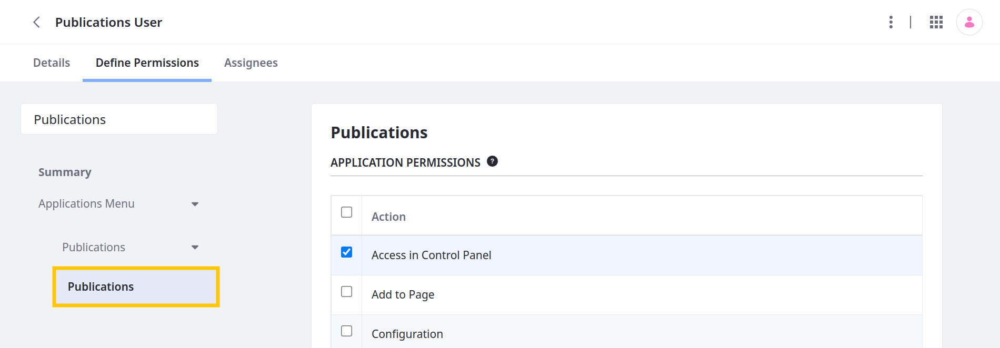

# Publications Permissions

<!--I think we discussed using the format `7.4 U##+/GA##+` I assume that means in this case we can just use the number (7.4+). If I'm wrong go ahead and change it.-->
{bdg-secondary}`7.4+`

Publications is integrated with Liferay's permissions framework, so you can assign [application](#application-permissions) and [resource](#resource-permissions) permissions to user roles. Only permitted users can access publications and perform actions on its resources. 

```{note}
The publications permissions do not include page and content editing priviliges. Publications users require explicit permissions for the applications and resources (e.g., web content, blogs, pages) they're expected to act upon.
```

<!-- We might want to update the Default Roles Reference article to include this new default role -->

By default, Liferay provides the [*Publications User*](#publications-user-role) role with basic permissions for creating and accessing publications.


If needed, you can create additional [regular roles](../../../users-and-permissions/roles-and-permissions/understanding-roles-and-permissions.md) or configure existing roles for content creators, reviewers, and publishers. See [Creating and Managing Roles](../../../users-and-permissions/roles-and-permissions/creating-and-managing-roles.md) and [Defining Role Permissions](../../../users-and-permissions/roles-and-permissions/defining-role-permissions.md) for more information.



<!-- My brain likes the first sentence of the below note better when it's about the resource (i.e., Since publications are company scoped ...) and not the application, but it might just be personal preference. -->
```{note}
Since Publications is company scoped, you can only assign its permissions to *Regular Roles*. See [Understanding Roles and Permissions](../../../users-and-permissions/roles-and-permissions/understanding-roles-and-permissions.md) for more information on role types.
```

## Application Permissions

Application permissions grant the ability to perform operations on the Publications application itself, and do not include [resource permissions](#resource-permissions).

| Permission | Description |
| :--- | :--- |
| Access in Control Panel | Access the Publications application in the Global Menu (  ). |
| Add to Page | N/A |
| Configuration | [Enable or disable](./enabling-publications.md) Publications and the Sandbox Only mode. |
| Permissions | View and modify permissions for the Publications application. |
| Preferences | N/A |
| View | View the Publications application in the Global Menu (  ) and access the Publications Bar. |
| Work on Production | Access and work in production while Publications is enabled. |

At minimum, contributing to a publication requires the Access in Control Panel and View permissions.

```{important}
If you've enabled Sandbox Only and don't want users to work in production, ensure they do not have the Work on Production permission.
```

## Resource Permissions

<!-- I want to say this because the existing intro paragraph to this section confuses me, but want to let you decide if it's an improvement.

Resource permissions grant abilities to view or act on the Publications application's resources. Some permissions act on the entire collection of publications (e.g., configuring permissions on the entire collection) while others are limited to an individual existing publication (e.g., deleting a publication). -->

Resource permissions grant specific abilities related to the Publications application's resources. Some of these permissions grant the ability to perform [actions on database entities](#publication-actions-on-database-entities) (e.g., update the publication). Others grant permission to perform [resource-related actions](#publications-resource-related-actions) in the Publications context (e.g., create a new publication).

Publications has the following resource permissions.

<!-- I don't think I'd bother separating these into sections, since they draw attention to the somewhat confusing UI. -->
### Publications (Resource Related Actions)

| Permission | Description |
| :--- | :--- |
| Add Publication | Create a publication. Without this permission, users can only access and contribute to a publication when [invited](./collaborating-on-publications.md). |
| Permissions | N/A |

### Publication (Actions on Database Entities)

| Permission | Description |
| :--- | :--- |
| Delete | Delete a publication. |
| Permissions | View and modify permissions for an individual publication. This includes the ability to [invite users](./collaborating-on-publications.md) to the publication. |
| Publish | Publish a publication |
| Update | Update a publication. |
| View | View a publication. |

<!-- Idea: I'd put this note in its own section, like Granting Permissions to Invited Users or something. Then it becomes linkable. -Russ -->
```{note}
Publication creators are automatically assigned the Owner role and granted all resource-level permissions on their publication. When they invite users to their publication and assign a role, the invitees can be granted more limited permissions.

* Viewer: View
* Editor: View and Update
* Publisher: View, Update, and Publish
* Admin: View, Update, Publish, and Permissions

By default, only the publication owner has the Delete permission.
```

## Publications User Role

By default the *Publications User* role has these permissions:

* Portal: View Control Panel Menu
* Publications: Access in Control Panel
* Publications: View
* Publications > Publications: Add Publication


## Additional Information

* [Publications](../publications.md)
* [Creating and Managing Publications](./creating-and-managing-publications.md)
* [Collaborating on Publications](./collaborating-on-publications.md)
* [Defining Role Permissions](../../../users-and-permissions/roles-and-permissions/defining-role-permissions.md)
