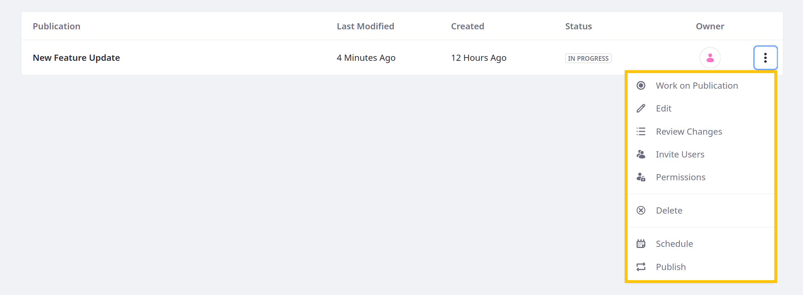
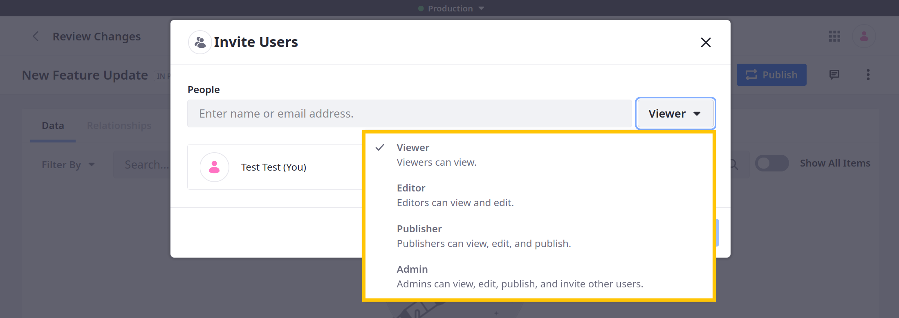

# Publications Permissions

{bdg-secondary}`7.4+`

Publications is integrated with Liferay's permissions framework, so you can assign [application](#application-permissions) and [resource](#resource-permissions) permissions to regular roles. You can also assign permissions [scoped to individual publications](#assigning-roles-to-publication-collaborators) when inviting collaborators. Only permitted users can access publications and perform actions on its resources.

```{note}
Publications permissions do not include page and content editing privileges. Publications users require explicit permissions for the applications and resources they're expected to act upon (e.g., web content, blogs, pages).
```

By default, Liferay provides the [*Publications User*](#publications-user-role) role with basic permissions for creating and accessing publications.


If needed, you can create additional [regular roles](../../../users-and-permissions/roles-and-permissions/understanding-roles-and-permissions.md) or configure existing roles for content creators, reviewers, and publishers. See [Creating and Managing Roles](../../../users-and-permissions/roles-and-permissions/creating-and-managing-roles.md) and [Defining Role Permissions](../../../users-and-permissions/roles-and-permissions/defining-role-permissions.md) for more information.


```{note}
You can only assign Publications permissions to *regular roles*. See [Understanding Roles and Permissions](../../../users-and-permissions/roles-and-permissions/understanding-roles-and-permissions.md) for more information.
```

## Application Permissions

Application permissions grant abilities related to the Publications application itself and do not include [resource permissions](#resource-permissions).

| Permission | Description |
| :--- | :--- |
| Access in Control Panel | Access the Publications application in the Global Menu (  ). |
| Add to Page | N/A |
| Configuration | [Enable or disable](./enabling-publications.md) Publications and the Sandbox Only mode. |
| Permissions | View and modify permissions for the Publications application. |
| Preferences | N/A |
| View | View the Publications application in the Global Menu (  ) and access the Publications Bar. |
| Work on Production | Access and work in production while Publications is enabled. |

At minimum, using Publications requires a regular role with the Access in Control Panel and View permissions.

```{important}
If you've enabled Sandbox Only and don't want users to work in production, ensure they do not have the Work on Production permission.
```

## Resource Permissions

Resource permissions grant the ability to view and act on resources in the Publications application. Some of these permissions [relate to creating publications](#publications-related-to-creating-publications), while others are for [performing actions on existing publications](#publication-for-performing-actions-on-existing-publications) (e.g., edit, delete, publish).

### Publications (Creating Publications)

| Permission | Description |
| :--- | :--- |
| Add Publication ( 1 ) | Create a publication. Without this permission, users can only access and contribute to a publication when [invited](./collaborating-on-publications.md#inviting-users-to-a-publication). |
| Permissions ( 2 ) | View and modify permissions related to creating publications: Add Publication and Permissions.  |

Users with these permissions can perform these actions in the Publications application.


### Publication (Acting on Existing Publications)

| Permission | Description |
| :--- | :--- |
| Delete | Delete publications you can view. |
| Permissions | View and modify permissions for publications you can view. This includes the ability to [invite users](./collaborating-on-publications.md#inviting-users-to-a-publication) to a publication. |
| Publish | Publish publications you can view. |
| Update | Update publications you can view; this includes the ability to work in a publication and edit the publication's name and description. |
| View | View all publications in the Liferay instance; this includes the ability to review each publication's changes. |

Users with these permissions can perform actions on existing publications.



## Publications User Role

By default, the *Publications User* role has these permissions:

* Portal: View Control Panel Menu
* Publications: Access in Control Panel
* Publications: View
* Publications > Publications: Add Publication


## Assigning Roles to Publication Collaborators

By default, publication creators are automatically assigned the *owner* role and can perform all actions on their publication. When [inviting users to their publication](./collaborating-on-publications.md#inviting-users-to-a-publication), owners can assign these publication roles:

| Publication Role | View | Update | Publish | Permissions | Delete |
| :--- | :--- | :--- | :--- | :--- | :--- |
| Viewer | &#10004; | &#10008; | &#10008; | &#10008; | &#10008; |
| Editor | &#10004; | &#10004; | &#10008; | &#10008; | &#10008; |
| Publisher | &#10004; | &#10004; | &#10004; | &#10008; | &#10008; |
| Admin | &#10004; | &#10004; | &#10004; | &#10004; | &#10008; |



Each publication role is scoped to the current publication and does not grant permissions in other publications.

Publication roles do not restrict regular role permissions. For example, if users with the delete permission are invited to a publication and assigned the *viewer* role, they can delete the publication because of their regular role permissions.

## Additional Information

* [Publications](../publications.md)
* [Creating and Managing Publications](./creating-and-managing-publications.md)
* [Collaborating on Publications](./collaborating-on-publications.md)
* [Defining Role Permissions](../../../users-and-permissions/roles-and-permissions/defining-role-permissions.md)
