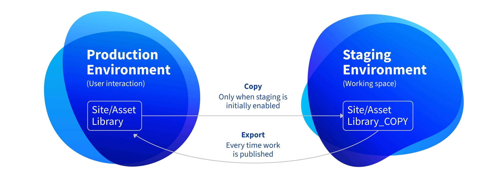

---
toc:
  - ./staging/understanding-the-publishing-process.md
  - ./staging/configuring-local-live-staging.md
  - ./staging/configuring-remote-live-staging.md
  - ./staging/managing-data-and-content-types-in-staging.md
  - ./staging/page-versioning.md
  - ./staging/publishing-single-assets-and-widgets.md
  - ./staging/configuring-automatic-publishing-of-displayed-content.md
  - ./staging/configuring-page-publishing.md
  - ./staging/managing-staging-permissions.md
  - ./staging/using-staging-in-asset-libraries.md
  - ./staging/site-staging-ui-reference.md
taxonomy-category-names:
- Platform
- Staging
- Liferay Self-Hosted
- Liferay PaaS
- Liferay SaaS
uuid: 60669ae7-b0b6-4239-8c0c-d38d93e15339
---

# Staging

Liferay's Staging application provides a working environment for making changes to a site or asset library before publishing your changes to your live environment. With it, you can modify staged application data and pages behind the scenes and then publish your changes when ready, whether individually or all together, while the live environment handles incoming user traffic.



When setting up Staging, determine whether to host your site or asset library locally (i.e., on the same server) or remotely (i.e., on separate servers connected by a network). Then customize which application data is staged. For sites, you can also enable page versioning for widget pages and content pages.

!!! important
    Staging is supported for asset libraries since Liferay DXP 7.4 and 7.3.10 FP1. However, you should only connect staged sites with staged asset libraries, and vice versa. See [Using Staging in Asset Libraries](./staging/using-staging-in-asset-libraries.md) for more information.

Publications is recommended over Staging in most use cases. See [Comparing Publishing Tools](./comparing-publishing-tools.md) for more information.

## Configuration Options

There are two options for configuring Staging: *Local Live* and *Remote Live*.

**Local Live Staging**: You can host both your staging and live environments on the same Liferay server. When enabled, Liferay DXP creates a local clone of your site or asset library that serves as the staging environment, while your original site or asset library becomes your live environment.

**Remote Live Staging**: You can host your staging and live environments on separate Liferay servers. When enabled, the site or asset library used to configure Staging becomes your staging environment, while the configured remote server becomes your live environment.

While both options use the same interface for managing and publishing staged pages, applications, and content, they differ in their setup. Once you've chosen the configuration option that best suits your needs, see [Configuring Local Live Staging](./staging/configuring-local-live-staging.md) or [Configuring Remote Live Staging](./staging/configuring-remote-live-staging.md) for more information and setup instructions.

### Staged Data and Content Types

As part of Staging configuration, you can select which content groups and application data are staged. If staged, the selected data and content are managed by your staging environment. Also, when an application or content group is selected, all contained entities (e.g., application folders) are staged as well. See [Managing Data and Content Types in Staging](./staging/managing-data-and-content-types-in-staging.md) for more information.

### Page Versioning

When configuring Staging for sites, you can enable the *page versioning* feature. With this feature, you and your team can develop variations of a site's content pages and widget pages simultaneously. You can see the complete history of page versions and revert pages to an earlier version if needed. See [Page Versioning](./staging/page-versioning.md) to learn how to create and manage variations and [Managing Staging Permissions](./staging/managing-staging-permissions.md) to learn about managing permissions for each variation.

## Understanding the Publishing Process

From a low level perspective, staging is an equivalence relation where entities are mirrored to a different location. From a high level perspective, the staging process is executed in three sequential phases: Export, Validation, and Import.

Understanding this process can improve efficiency and help you plan ahead to achieve a seamless publishing experience. See [Understanding the Publishing Process](./staging/understanding-the-publishing-process.md) for more information.

!!! important
    Staging does not support [Commerce applications](https://learn.liferay.com/w/commerce/index) and [custom objects](../../liferay-development/objects.md). During the publishing process, entities from Commerce and objects are not staged. Also, [A/B testing](../optimizing-sites/ab-testing.md) is not supported if staging is enabled.

```{raw} html
:file: ../../landingpage_template.html
```

```{raw} html
:file: staging/landing.html
```
