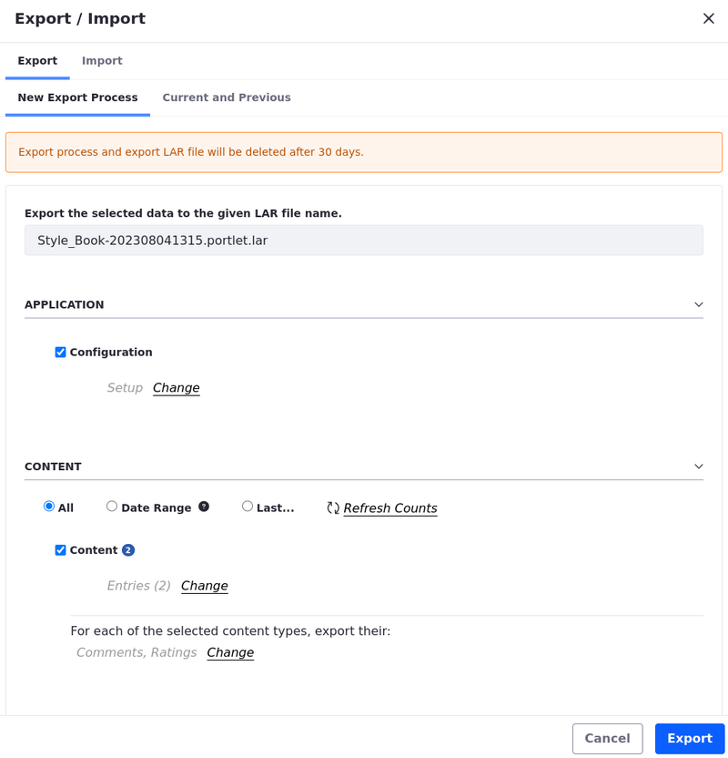

# Exporting and Importing Style Books

You can export and import style books to share them between Liferay installations. It is possible to export/import your style books as a [Liferay Archive (LAR) file](#exporting-style-books-as-a-lar-file) or a [ZIP file](#exporting-style-books-as-a-zip-file).

## Exporting Style Books as a LAR File

1. Open the *Product Menu* (  ) and select *Design* &rarr; open the *Style Books* app.

1. Select the style book you want to export. On the Applications bar, click *Options* (  ) &rarr; select *Export / Import*.

    

1. In the Export / Import modal, select *Export*.
 
1. You can start a *New Export Process* or you can select the *Current and Previous* tab where you can view a list of previous processes and download exported LAR files.

1. When starting a new export process, you can name the LAR file and [configure the process](#configuring-export-and-import-processes-as-a-lar-file).

    

1. Click *Export* to begin the export process.

You can now share and import your LAR file.

## Importing Style Books as a LAR File

1. In the Export / Import modal, select *Import*.

1. You can start a *New Import Process* or you can select the *Current and Previous* tab where you can view a list of previous processes.

1. Upload the LAR file and click *Continue*.

1. [Configure the process](#configuring-export-and-import-processes-as-a-lar-file).

1. Click *Import* to begin the import process.

You can now use your imported style guide.

## Configuring Export and Import Processes as a LAR File

Liferay provides settings for configuring export and import processes.

| Setting | Description |
| :--- | :--- |
| Application | You can choose to export your style book’s configuration settings. |
| Content | You can select a date range of content that you want to export. Content added to your style book within your specified date range is included in the LAR file. |
| Deletions | You can choose to export individual deletions. This exports delete operations performed for content types to the LAR file. |
| Delete Application Data Before Importing (Import) | When checked, all data created by the application is deleted before the import process. Be careful: other applications may reference this data. This process cannot be undone. If you are unsure, please do an export first. |
| Permissions | You can choose whether to include permissions for your exported content. The permissions assigned for the exported style book are included if you enable the Export Permissions selector. |
| Update Data (Import) | You can decide how to handle the updated data once it is applied to existing content. |
| Authorship of the Content (Import) | You can decide about the authorship of the imported content. |



## Exporting Style Books as a ZIP File

1. Find the style book you want to export and click *Actions* (  ) &rarr; select *Export*.

1. A ZIP file is downloaded to your machine. It contains two files:

    * `style-book.json` contains the name of the style book and the path to `frontend-token-values.json`.

    * `frontend-token-values.json` contains a list of the token values of the style book. Each token references the CSS variable name and the value mapped to it.

    ```json
    {"brandColor1":{"cssVariableMapping":"brand-color-1","value":"#F05321"},"bodyBgColor":{"cssVariableMapping":"body-bg","value":"#FCBA21"},"btnPrimaryBackgroundColor":{"cssVariableMapping":"btn-primary-background-color","value":"#024da1"}}
    ```

    You can now share and import your ZIP file.

## Importing Style Books as a ZIP File

1. On the Applications bar, click *Options* (  ) and select *Import*.

1. Choose the ZIP file you want to import. 

    Check the *Overwrite Existing Style Books* to overwrite existing style books with the same name. If you uncheck this option and try to import a style book with the same name as an existing one, an error message is displayed.

1. Click *Import*.

You can now use your imported style guide.