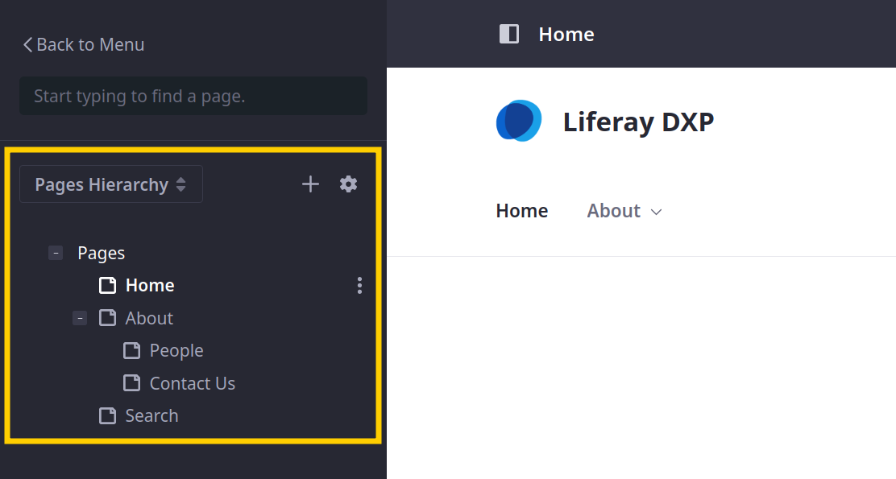

# Managing Page Hierarchies

With Liferay, you can organize pages into hierarchies to achieve the desired structure for your site. This can be done by directly [adding child pages](../creating-pages/adding-pages/adding-a-page-to-a-site.md#adding-a-child-page) to an existing page or by reorganizing existing pages into parent/child relationships.

To view a site's page hierarchy, open the *Site Menu* (), expand *Site Builder*, and click *Pages*. This is the main reference for the organization of pages on that site. While Navigation Menus are customized to show some of the pages, this menu is always the primary reference for the pages on your site.

The page listed first is the first page users see when visiting your site.

You can drag and drop pages to reorganize them in the hierarchy. Pages can be nested up to four levels.

Create new pages in *Site Builder* &rarr; *Pages*. See [Adding a Page to a Site](../creating-pages/adding-pages/adding-a-page-to-a-site.md) to learn how to add a page.

## Configuring Page Options

Users can access page options by clicking _Options_ ().

| Function | Description |
| :--- | :--- |
| **View** | View the selected page on the site. |
| **Configure** | View the Page Configuration screen. |
| **Copy Page** | Create a new page in the current site that duplicates the selected page. |
| **Permissions** | Configure the page's permissions. |
| **Orphan Widgets** | Clears the data related to widgets that have been removed from the page. |
| **Delete** | Deletes the page and all its data. |

## Using the Page Tree

Another way to manage a site's page hierarchy is to use the *Page Tree*. Here, you can view and configure the pages in the current site.

To access the page tree,

1. Click the *Product Menu* (). 

1. Click *Page Tree*.

   

1. The left menu displays the site's page hierarchy:

   

1. You can choose your navigation menus from this drop-down control.

1. From here you can

   - Find pages in the tree by using the search bar (1).
   - Click on any page for a page preview.
   - Add pages or configure pages using the Add () and Configure () buttons and the Actions menu () next to each page's name (2).
   - Modify the order of pages in the navigation menu by dragging and dropping the pages in the tree (3).

   

## Related Topics

* [Using the Navigation Menus Application](./using-the-navigation-menus-application.md)
* [Configuring Navigation Menus](./configuring-menu-displays.md)
* [Adding a Page to a Site](../creating-pages/adding-pages/adding-a-page-to-a-site.md)

