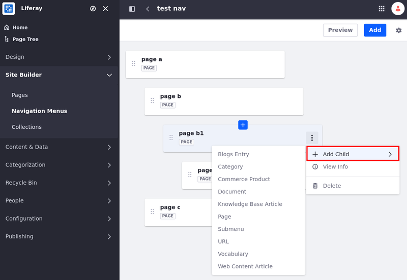
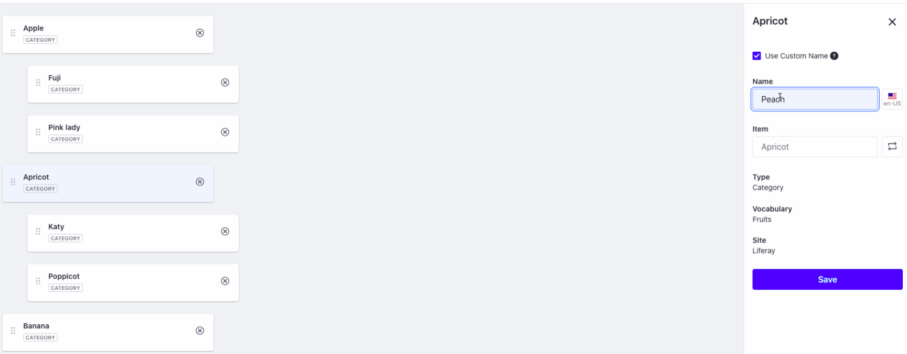
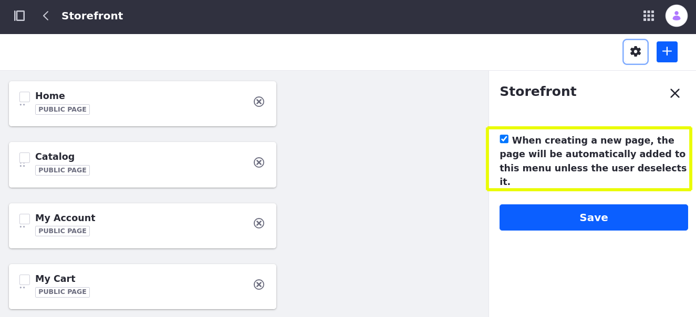

# Using the Navigation Menus Application

The Navigation Menus application is used to create custom menus for site pages and content. With it, you can determine which elements are included in a menu, and how they're organized. Once created, you can display your custom menus using [page fragments](../creating-pages/page-fragments-and-widgets/using-fragments.md) or [widgets](../creating-pages/using-widget-pages/adding-widgets-to-a-page.md).

```{note}
For Liferay 7.3 and earlier, pages are the only entity that can be added to a navigation menu. As of Liferay 7.4 U1+, navigation menus support adding additional entity types to a navigation menu.
```


```{tip}
On Liferay 7.3+, you can use custom fields to add more information to items in navigation menus (under *Site Navigation Menu Item* in the *Custom Fields* menu). You can then use this information with Application Display Templates to further customize your navigation menus.
```

## Creating Navigation Menus

Follow these steps to create a Navigation Menu:

1. Open the *Site Menu* (  ) and navigate to *Site Builder* &rarr; *Navigation Menus*.

    

1. Click *Add* (  ).

1. Enter a *Name* for the navigation menu.

    

1. Click *Save*.

This redirects you to the new custom menu where you can begin adding elements (e.g., pages, documents, and categories).

### Adding New Elements to a Navigation Menu

While editing a navigation menu, follow these steps to add an element to the navigation menu:

1. Click *Add* (  ).

1. Select the type of element you want to add to the menu (e.g., page, document, or category). This opens an item selector window.

    You can add multiple elements to the same menu.

   

1. Select the elements you want to add and click *Select*.

    You can select multiple elements.

    ```{important}
    When the added element does not have an [associated display page](../displaying-content/using-display-page-templates.md), Liferay shows a warning. Items without a display page do not have links and are hidden from menus.
    ```

    

1. Optionally, drag and drop menu elements to reorganize them or arrange them in a hierarchy.

    ```{tip}
    In addition to structuring menu elements into a hierarchy, you can also use the *Submenu* type to add subsections to a menu. If you delete an element with child elements, the child elements are also removed.
    ```

    

1. Optionally, define custom display names for each of your menu elements. You can define custom names for page elements, or for any content type elements that use display pages (including blog entries, web content articles, documents, vocabularies, and categories).

    ```{note}
    You can only define custom display names for content type elements using display pages on Liferay 7.4 versions U9+ or GA13+.
    ```

    To do this, select a menu element, check *Use Custom Name* in the side panel, enter a name, and click *Save*.

    

All changes to the menu are saved.

### Using Dynamic Vocabulary Elements

[Vocabulary navigation menu elements](./navigation-menu-element-types.md#vocabularies) are dynamic; when one is displayed on a page, it adds all of the categories and subcategories in its current hierarchy instead of a single element. Any changes to the vocabulary's contents are automatically reflected in the menu.

Dynamic vocabulary elements allow you to quickly and easily update your navigation menus when you have changing hierarchies of items. For example, you can use categories to represent types of products in a [catalog](https://learn.liferay.com/commerce/latest/en/product-management/catalogs/creating-a-new-catalog.html), and then let any updates to your categories automatically update any menus using the vocabulary. Then, depending on the [display page](../displaying-content/using-display-page-templates/publishing-content-with-display-pages.md) used for those categories, any changes to the categorization may automatically reflect in the pages and the navigation menu.



### Previewing Navigation Menus

You can a preview a navigation menu while you are editing it to see how it looks when displayed on a page. Click the *Eye icon* (  ) to open a popup window with a preview of the navigation menu.


You can also select different options from the drop-down menu to see different styles the menu can be displayed in, such as the List or Tabs styles.

## Using Menus During Page Creation

When users are creating site pages, they are shown a list of all existing navigation menus. You can modify this behavior by hiding specific menus from the list of available menus.


Follow these steps to configure this behavior for a Navigation Menu:

1. Open the *Site Menu* (  ) and navigate to *Site Builder* &rarr; *Navigation Menus*.

1. Select the desired menu.

1. Click *Actions* (  ).

1. Uncheck/Check the setting.

    

1. Click *Save*.

## Configuring Navigation Menu Type

Follow these steps to configure the navigation menu's type:

1. Open the *Site Menu* (  ) and navigate to *Site Builder* &rarr; *Navigation Menus*.

1. Click *Actions* (  ) for the desired menu.

1. Select the desired navigation type: Primary Navigation, Secondary Navigation, or Social Navigation.

    

    Once selected, each menu's configuration appears in the Marked As column.

| Navigation Menu Type | Usage |
| :--- | :--- |
| **Primary Navigation** | Primary Navigation is the main navigation for a page. |
| **Secondary Navigation** | Secondary Navigation is a second level of navigation, possibly a sidebar or a separate menu within a page. |
| **Social Navigation** | Social Navigation is for menus that contain links for sharing content on social media or similar tasks. |

## Deleting a Navigation Menu

1. Open the *Site Menu* (  ) and navigate to *Site Builder* &rarr; *Navigation Menus*.

1. Click *Actions* (  ) for the desired menu then click *Delete*.

1. Click *OK* in the confirmation.

The navigation menu is deleted.

## Related Topics

* [Managing Site Navigation](./managing-site-navigation.md)
* [Navigation Menu Element Types](./navigation-menu-element-types.md)
* [Configuring Menu Displays](./configuring-menu-displays.md)
