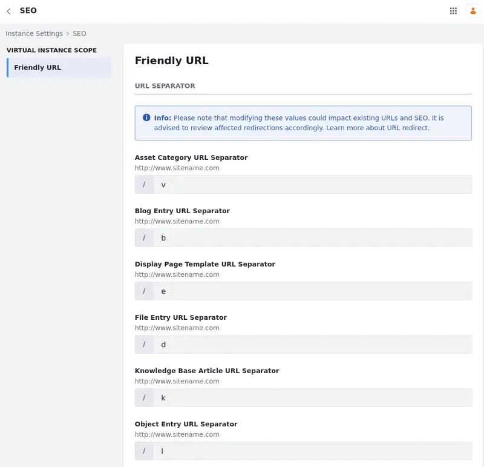
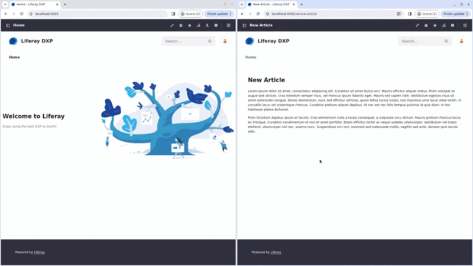

---
taxonomy-category-names:
- Sites
- SEO
- Liferay Self-Hosted
- Liferay PaaS
- Liferay SaaS
uuid: 93b7a0b6-926f-47dd-a26a-c50f40de6fb4
---

# Configuring Friendly URL Separators

{bdg-secondary}`Liferay DXP 2024.Q2+/Portal 7.4 GA126+`

!!! important
    Currently, this feature is behind a beta feature flag (LPD-11147). Read [Beta Feature Flags](../../../system-administration/configuring-liferay/feature-flags.md#beta-feature-flags) for more information.

You can customize URL separators to improve URL readability and enhance SEO.

For example, web content articles use the default `w` separator in URLs, such as `http://your-site/w/new-article`. However, you can personalize this separator to `web-content` instead, resulting in more descriptive URLs like `http://your-site/web-content/new-article`.

Additionally, you can customize separators for other elements including asset categories, blog entries, display page templates, file entries, knowledge base articles, object entries, and web content articles.

To configure friendly URL separators,

1. Open the *Global Menu* (), navigate to *Control Panel*, and open *Instance Settings* under Configuration.

1. Select *SEO* under Platform and click *Friendly URL* on the left.

1. Change the default values to set your friendly URL separators.

   Click *Reset to Default Value* () to go back to the default value.

   !!! warning
       Each category must have a unique separator.

1. Click *Save*.

Below, a [web content article](../../../content-authoring-and-management/web-content.md) appears in a [display page template](../../displaying-content/using-display-page-templates.md). The URL separator for the web content article is altered from `w` to `web-content`. If you refresh the page with the old URL, a 404 utility page appears, as the page uses a new separator now. Once you change the separator to the new value, the display page template appears again.

## Related Topics

- [Configuring Your Site's Friendly URL](./configuring-your-sites-friendly-url.md)
- [Configuring Friendly URL Redirects](./configuring-friendly-url-redirects.md)
