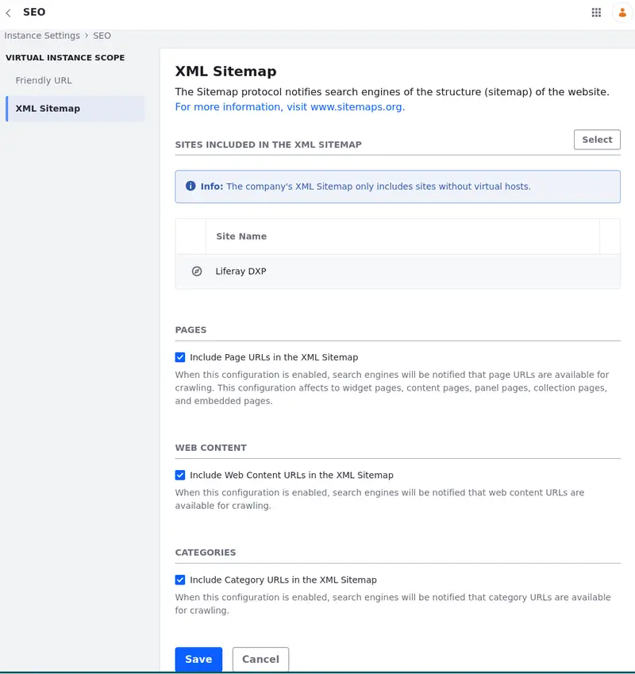

---
taxonomy-category-names:
- Sites
- SEO
- Liferay Self-Hosted
- Liferay PaaS
- Liferay SaaS
uuid: 42d221de-7c20-4e65-ba94-c7734e59e8c0
---

# Configuring XML Sitemaps

{bdg-secondary}`Liferay DXP 2024.Q2+/Portal 7.4 GA126+`

XML sitemaps are XML-formatted documents listing the URLs of a website along with additional metadata (e.g. last update, change frequency, and importance relative to other URLs in the site). They streamline the process for search engine crawlers, enhancing their ability to uncover and index website content effectively.

!!! tip
    You can view your XML sitemap by accessing `http://your-site/sitemap.xml`.

With Liferay, you can configure your XML sitemap to include/exclude sites and URLs from the sitemap.

To configure your XML sitemap,

1. Open the *Global Menu* (), navigate to *Control Panel*, and open *Instance Settings* under Configuration.

1. Select *SEO* under Platform and click *XML Sitemap* on the left.

1. Click *Select* to include sites from your sitemap.

   You can also include/exclude child sites in the XML sitemap. When selecting a site, the number of child sites is shown below the site's name. Click on it to see the child sites and select them.

   

   To exclude a site from your sitemap, click *Remove New Site* () next to the added site.

   !!! note
       The XML sitemap only includes sites that don't use virtual hosts.

1. Select whether to include page (e.g., widget, content, panel, collection, and embedded) URLs in the XML sitemap.

   You can add a page to the sitemap through the page's configuration. Read [Configuring SEO and Open Graph](../../displaying-content/using-display-page-templates/configuring-seo-and-open-graph.md#sitemap) to learn more.

1. Select whether to include web content URLs in the XML sitemap.

1. Select whether to include category URLs in the XML sitemap.

## Related Topics

- [Setting Up Redirects and 404 Tracking](./setting-up-redirects-and-404-tracking.md)
- [Configuring Your Site's Friendly URL](./configuring-your-sites-friendly-url.md)
- [Configuring Virtual Hosts Site URLs](./configuring-virtual-hosts-site-urls.md)
