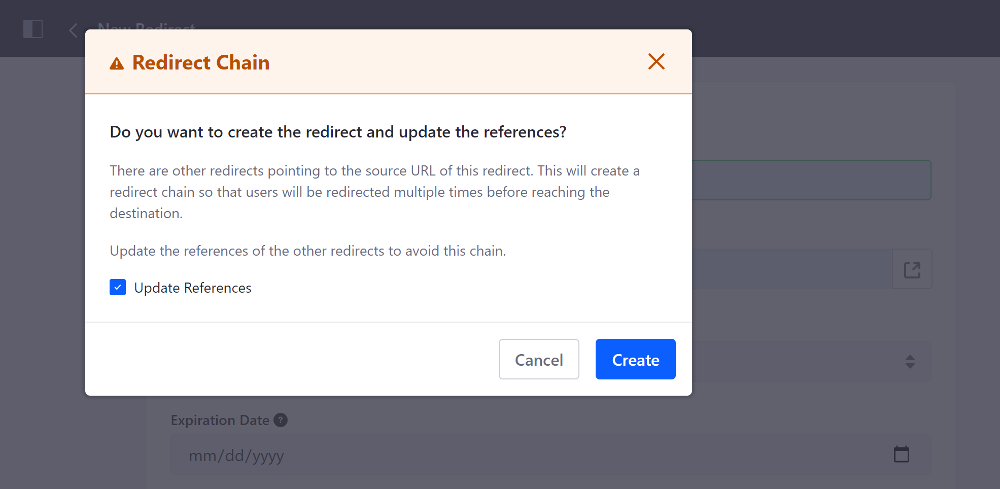

# Using Alias Redirects

Alias redirects explicitly define absolute source and destination URLs. For this reason, they are more predictable and recommended in most use cases. When creating them, you can make alias redirects permanent (301) or temporary (302). Both automatically direct users to a specified destination, but they each have unique implications for your Site.

Before creating an alias redirect, consider which type is best for your situation.

**Permanent**: Use a 301 code to inform search engines and other tools accessing your Site that the requested resource has been permanently relocated. Search engines will replace the old URL with the new destination in search results, and browsers will cache the new destination for an indeterminate amount of time. A 301 code should only be used when you intend to use the destination URL indefinitely. This improves SEO and helps avoid unintended caching.

**Temporary**: Use a 302 code to inform search engines and other tools accessing your Site that the requested resource is temporarily moved. A 302 code is useful when you want to conduct A/B testing or redirect traffic while fixing a problem, without impacting your Site ranking. Liferay uses 302 codes by default.

See [Optimizing Sites](../../../optimizing-sites.md) to learn more about the implications of each redirect type for SEO. Also, see [A/B Testing](../../../optimizing-sites/ab-testing/ab-testing.md) to learn about using 302 codes when testing.

```{note}
If you need to perform bulk redirects, see [Using Pattern Redirects](./using-pattern-redirects.md).
```

## Creating Alias Redirects

1. Open the *Site Menu* () and go to *Configuration* &rarr; *Redirection*.

   

1. In the Aliases tab, click the *Add* button ().

1. Enter a unique relative URL into the *Source URL* field to determine the link that triggers the redirect. The entered value is added to the base URL displayed above it.

   

1. Enter an absolute URL into the *Destination URL* field to specify the link for your desired destination.

   This destination can be internal or external, but must always be entered as an absolute URL. You can also click the *Check URL* button () to verify the URL.

   

1. Use the *Type* drop-down menu to determine whether the redirect is permanent (301) or temporary (302).

   

1. You can optionally set an automatic *Expiration Date* for the redirect. Leave this field empty to avoid expiration.

   

1. When finished, click *Create* to save the redirect.

Once saved, Liferay validates your configuration. If other redirects point to your specified source URL, Liferay notifies you and asks whether you want to update the existing redirects to avoid a redirect chain.



Liferay also returns an error if you attempt to create multiple redirects for the same source URL, or if your specified source and destination URLs would result in a redirect loop.

## Editing and Removing Alias Redirects

Once you've successfully added a URL redirect, you can edit or remove it at any time by clicking on its *Actions* button () and selecting *Edit* or *Delete*.


```{note}
Changes made to a redirect may not immediately display in browsers that have cached the old redirect configuration.
```

## Additional Information

* [Tracking 404 URLs](./tracking-404-urls.md)
* [Using Pattern Redirects](./using-pattern-redirects.md)
* [Configuring Virtual Hosts Site URLs](../configuring-virtual-hosts-site-urls.md)
* [Configuring Your Site's Friendly URL](../configuring-your-sites-friendly-url.md)
