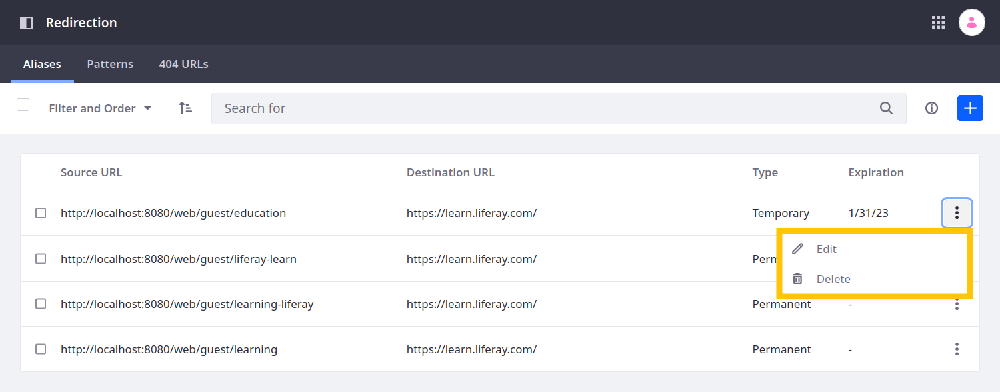

# Using Alias Redirects

Alias redirects define absolute source and destination URLs explicitly. Because of their predictability, alias redirects are recommended for most use cases. You can make alias redirects permanent (301) or temporary (302). Both types direct users automatically to a specified destination, but they each have unique implications for your site. Consider which type is best for your situation.

**Permanent**: Use a 301 code to inform search engines and other tools accessing your site that the requested resource has been permanently relocated. Search engines replace the old URL with the new destination in search results, and browsers cache the new destination for an indeterminate amount of time. A 301 code should only be used when you intend to use the destination URL indefinitely. This improves SEO and helps avoid unintended caching.

**Temporary**: Use a 302 code to inform search engines and other tools accessing your site that the requested resource is temporarily moved. A 302 code is useful when you want to conduct A/B testing or redirect traffic while fixing a problem, without impacting your site ranking. Liferay uses 302 codes by default.

See [Optimizing Sites](../../../optimizing-sites.md) to learn more about the implications of each redirect type for SEO. Also, see [A/B Testing](../../../optimizing-sites/ab-testing/ab-testing.md) to learn about using 302 codes when testing.

```{note}
If you need to perform bulk redirects, see [Using Pattern Redirects](./using-pattern-redirects.md).
```

## Creating Alias Redirects

1. Open the *Site Menu* () and go to *Configuration* &rarr; *Redirection*.

   

1. In the Aliases tab, click *Add* ().

1. Enter a unique relative URL into the *Source URL* field to determine the link that triggers the redirect. The entered value is added to the base URL displayed above it.

   

1. Enter an absolute URL into the *Destination URL* field to specify the link for your desired destination.

   This destination can be internal or external, but must always be entered as an absolute URL. You can also click the *Check URL* button () to verify the URL.

   

1. Use the *Type* drop-down menu to define the redirect as permanent (301) or temporary (302).

   

1. You can set an automatic *Expiration Date* for the redirect. Leave this field empty to avoid expiration.

   

1. When finished, click *Create* to save the redirect.

Once saved, Liferay validates your configuration. If other redirects point to your specified source URL, Liferay notifies you and asks if you want to update the existing redirects to avoid a redirect chain. To help reduce conflicts, Liferay prevents users both from defining multiple alias redirects for the same source URL and from directly redirecting URLs to themselves.


```{warning}
Avoid creating circular redirects. These are easy to create when defining redirects for content friendly URLs (e.g. redirecting between different friendly URLs for the same content). Liferay cannot reliably detect these loops.
```

## Editing and Removing Alias Redirects

Once you've added a URL redirect, edit or remove it at any time by clicking its Actions button () and selecting Edit or Delete.



```{note}
Changes made to a redirect may not immediately display in browsers that have cached the old redirect configuration.
```

## Related Topics

* [Tracking 404 URLs](./tracking-404-urls.md)
* [Using Pattern Redirects](./using-pattern-redirects.md)
* [Configuring Virtual Hosts Site URLs](../configuring-virtual-hosts-site-urls.md)
* [Configuring Your Site's Friendly URL](../configuring-your-sites-friendly-url.md)
