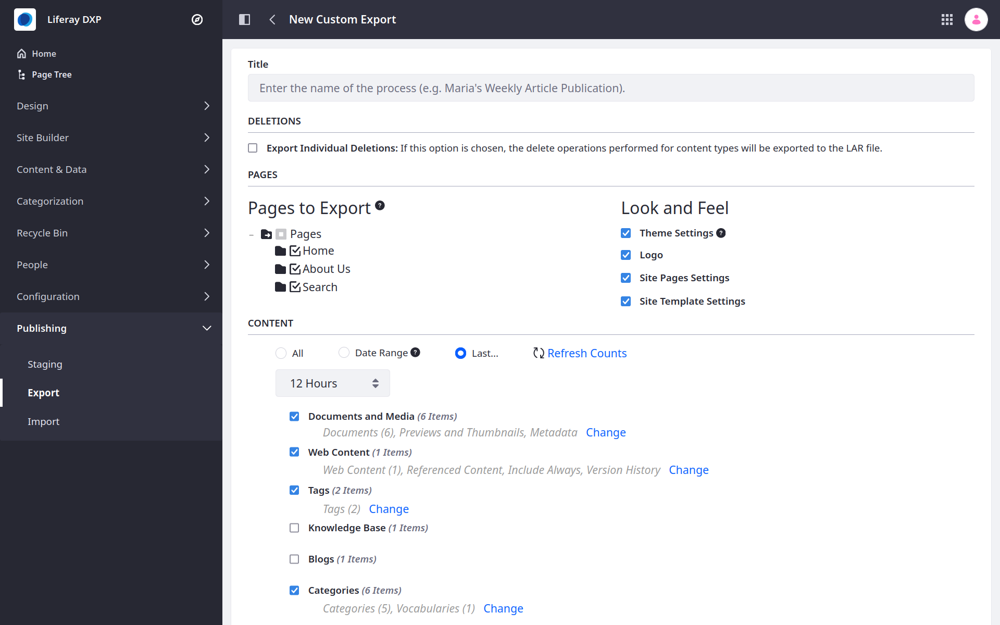
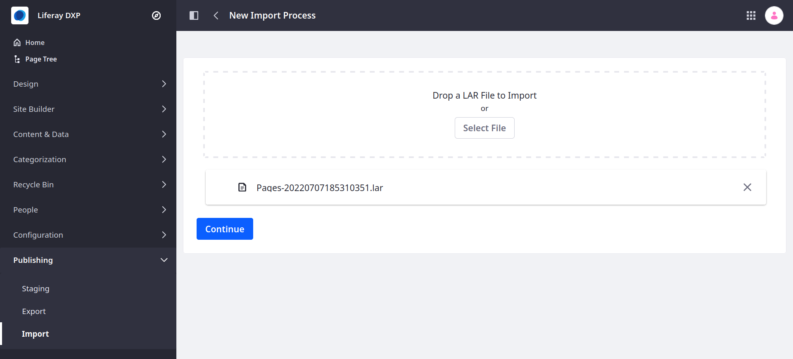

# Exporting/Importing Site Pages and Content

Liferay Sites include the Export/Import applications for extracting and transferring Site data as Liferay Archive (LAR) files. You can access these tools at the Site level.

```{note}
You can also access export and import functions for individual Site applications and [Page widgets](../creating-pages/page-fragments-and-widgets/using-widgets/configuring-widgets/exporting-importing-widget-data.md).
```

## Site LAR Properties and Requirements

LARs have these properties and requirements:

* LARs are version dependent. They can be imported into a Site on another Liferay server, as long as the Liferay versions on each server are the same.

* Some naming conflicts are handled automatically. For example, if the LAR you're importing and the Site both have a page with the same friendly URL, a number is appended to the friendly URL and incremented until the conflict no longer occurs. The same is true for category names.

* You can use LARs to restore a Site, but you must delete your Site entirely and then create a new Site with the same name to import the LAR into. This avoids potential data conflicts between content that exists both in the LAR and in the Site.

```{important}
Periodically exporting LARs is *not* a backup solution; it should only be used to migrate data between two environments. Please refer to the [Backing up a Liferay Portal Installation](../../installation-and-upgrades/maintaining-a-liferay-installation/backing-up.md) to learn about backing up your Liferay installation.
```

## Exporting Site Pages and Content

Follow these steps to export Site Pages and Content:

1. Open the *Site Menu* (), expand *Publishing*, and click *Export*.

1. Click the *Add* button () to create a new export process.

   This opens an export template.

   

1. Enter a title for the export process.

1. Configure the export process by selecting the Site Pages and content you want to export.

   Under *Pages* you can select which Pages and Page Sets are included in the export. You can also determine whether the Theme Settings, Logo, Site Page Settings, and Site Template Settings are included.

   Under *Content*, you can select which applications are included in the export. You can also determine whether to export all data for the selected applications, or filter included application data by date or time.

   Under *Permissions*, determine whether to include Page and content permissions  in the export.

1. Click *Export* to begin the export process.

Once finished, click the *Download* button () to download the generated LAR file. You can now import the LAR to another Liferay Site.


```{note}
The generated LAR includes all data selected during export configuration. If this includes private or sensitive information, ensure the LAR file is stored in a secure location.
```

## Importing Site Pages and Content

```{important}
If the exported Site uses a template, you must first export and import the Site Template to the Liferay installation before you can import the Site. See [Exporting and Importing Site Templates](./site-templates/exporting-importing-site-templates.md) for more information.
```

Follow these steps to import Site Pages and Content:

1. Open the *Site Menu* (), expand *Publishing*, and click *Import*.

1. Click the *Add* button () to create a new import process.

1. Add the desired LAR file and click *Continue*.

   

1. Review and configure the import process.

1. Click *Import* to begin importing.

   

## Creating Export Templates

Instead of manually creating an export process every time you export Site Pages content, you can create an Export Template to store and reuse your export settings. To create an Export Template, follow these steps:

1. Open the *Site Menu* (), expand *Publishing*, and click *Export*.

1. Click the *Actions* button  in the Application Bar and select *Export Templates*.

   

1. Click the *Add* button ().

1. Name and configure the export template.

1. Click *Save*.

You can now select your template when [creating a new export process](#exporting-site-pages-and-content).

## Configuring Export/Import Processes

Liferay provides settings for configuring export/import processes as well as Staging specific features. These settings affect Staging and Site Template propagation.

| Setting | Description |
| :--- | :--- |
| Include All Asset Links | If checked, all asset links are included from the site within the given date range. If unchecked, only asset links connected to the content are included. |
| Replicate Individual Deletions by Default | If checked, delete operations performed for content types are always replicated in the target site by default. |
| Publish Permissions by Default | If checked, permissions assigned for exported pages and individual portlet windows are always included by default. |
| Validate File Entries | If checked, publishing or importing content types with text causes Liferay to check the content for links to documents and ensure they point to valid documents. |
| Validate Journal Feed References | If checked, publishing or importing content types with text causes Liferay to check the content for references to web content feeds and ensure they point to valid feeds. |
| Validate Layout References | If checked, publishing or importing content types with text causes Liferay to check the content for links to one of the portal's virtual hosts and ensure they point to a valid Liferay page. Uncheck this if your virtual host has pages not in Liferay. |
| Validate Missing References | If checked, publishing and import processes cause Liferay to check for missing references. If unchecked, missing reference validation is skipped. As a result, references without existing targets can be published or imported to the target site. |

## Additional Information

* [Adding a Site](./adding-a-site.md)
* [Site Templates](./site-templates.md)
* [Exporting/Importing Site Templates](./site-templates/exporting-importing-site-templates.md)
