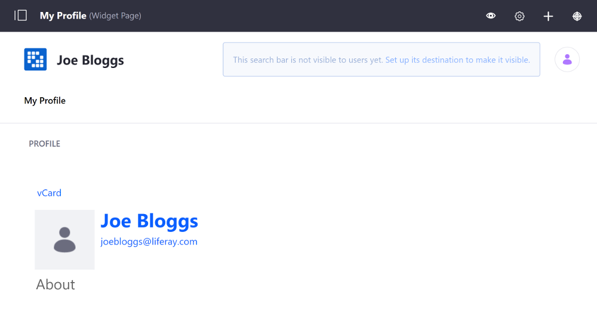

# Personal Sites

By default, Liferay generates a personal Site for every User. Each Site includes two [page sets](../creating-pages/understanding-pages/understanding-pages.md#page-sets): My Profile (public) and My Dashboard (private). Each User is the sole member of their personal Site and can use it to display and manage their content.

If desired, you can [disable or customize](#customizing-personal-sites-with-portal-properties) personal Sites using portal properties.

```{important}
For Liferay 7.4 U22+ and GA22+, new Liferay installations include a release feature flag that disables the creation of Private Pages, including Dashboard Pages. To manually create custom Dashboard Pages for a personal Site, Private Pages must be enabled for your Liferay system. See [Enabling Private Pages](../creating-pages/understanding-pages/understanding-pages.md#enabling-private-pages) for more information.
```

```{tip}
With User Group Sites, you can dynamically add Pages to the personal Sites of all group members. See [User Group Sites](../../users-and-permissions/user-groups/user-group-sites.md) for more information.
```

## Profile Pages and Dashboard Pages

In Profile Pages, Users can share content (e.g., blog, activities) publicly. By default, each Profile Page displays the User's basic information and provides a download link to the User's vCard (virtual business card).



In Dashboard Pages, user can access private files, create personalized RSS feeds, manage Site memberships, and more. By default, each Dashboard Page includes the My Sites widget.


## Managing Personal Site Pages

To access your Personal Site pages, follow these steps:

1. Open the Personal Menu icon and select either *My Profile* or *My Dashboard*.

    

1. Open the *Site Menu* (), expand *Site Builder*, and click *Pages*.

1. Manage them as you would any other [Site Page](../creating-pages/understanding-pages/understanding-pages.md).

You can also add and define pages for a User's Personal Site via a User Group. See [User Group Sites](../../users-and-permissions/user-groups/user-group-sites.md) for more information.

## Personal Site Permissions and Roles

Permissions and Roles for personal sites follow the behavior shown below:

- Administrators can customize the modifiable portions of personal Sites through Liferay Portal's permissions system by removing permissions from Roles (disallow all Users from modifying something by removing the relevant permission from the User Role).
- Users can administer their personal sites and modify the pages and applications when they are members of the [Power User Role](../../users-and-permissions/roles-and-permissions/default-roles-reference.md#regular-roles).

## Customizing Personal Sites with Portal Properties

There are several portal properties you can add to [`portal-ext.properties`](../../installation-and-upgrades/reference/portal-properties.md) to customize the default pages of personal Sites. You can customize the names of the pages, the applications that appear on the pages, the themes and layout templates of pages, and more. Please refer to the [Default User Public Layouts](https://learn.liferay.com/reference/latest/en/dxp/propertiesdoc/portal.properties.html#Default%20User%20Public%20Layouts) and [Default User Private Layouts](https://learn.liferay.com/reference/latest/en/dxp/propertiesdoc/portal.properties.html#Default%20User%20Private%20Layouts) sections of the `portal.properties` file for details. Some of these properties are listed in the table below:

| Functionality | Property |
| :--- | :--- |
| Disable personal Sites | `layout.user.public.layouts.enabled=false`
| Disable Private Pages on personal Sites | `layout.user.private.layouts.enabled=false` |
| Disable automatic creation of personal Sites | `layout.user.public.layouts.auto.create=false`
| Disable automatic creation of Private Pages on personal Sites | `layout.user.private.layouts.auto.create=false` |

The Public and Private Page Sets of personal Sites are handled separately. You can leave one Page Set enabled while disabling the other. If you initially had user personal Sites enabled for your instance but then disabled them, existing personal Sites remain on your instance until the next time users sign in, at which point they're removed.

## Additional Information

- [Adding a Site](./adding-a-site.md)
- [Sites Templates](./site-templates.md)
- [User Group Sites](../../users-and-permissions/user-groups/user-group-sites.md)
