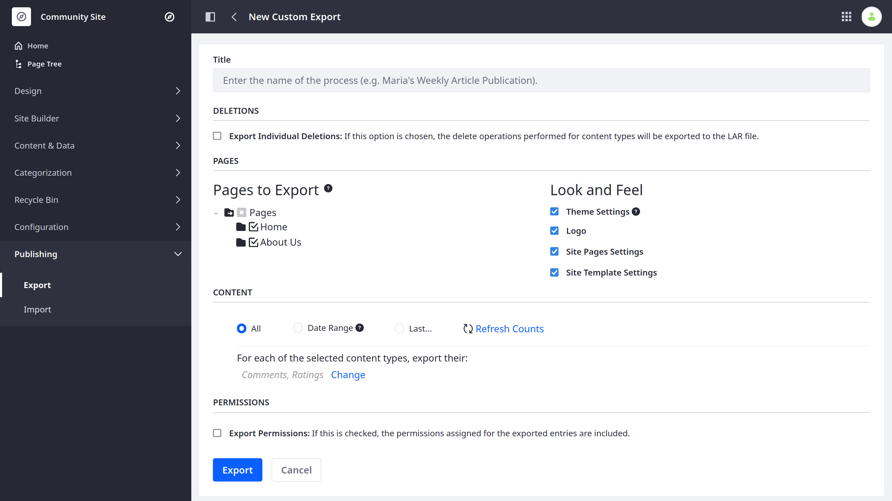
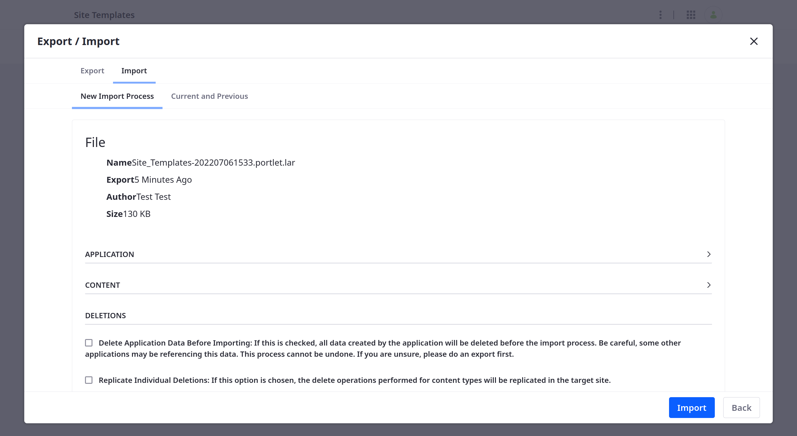

# Exporting/Importing Site Templates

You can export and import site templates to share them between Liferay installations.

## Exporting Individual Site Templates

Follow these steps to export a site template:

1. Open the *Applications Menu* (), go to the *Control Panel*, and click *Site Templates*.

1. Click the site template you want to export.

1. Open the *Product Menu* (), expand *Publishing*, and click *Export*.

1. Click the *Add* button () to create a new export process.

   This opens an export template.

   

1. Enter a title for the export process.

1. Configure the export process by selecting the template pages and content you want to export.

1. Click *Export* to begin the export process.

Once finished, click the *Download* button () to download the generated LAR file.

## Importing Individual Site Templates

Follow these steps to import a site template:

1. Open the *Applications Menu* (), go to the *Control Panel*, and click *Site Templates*.

1. [Create](./creating-site-templates.md) a site template.

1. Click the new site template.

1. Open the *Product Menu* (), expand *Publishing*, and click *Import*.

1. Click the *Add* button () to create a new import process.

1. Add the desired LAR file and click *Continue*.

   

1. Review and configure the import process.

1. Click *Import* to begin importing.

   

Once complete, you can use the imported site template to [create sites](../adding-a-site.md).

## Bulk Export/Import

If needed, follow these steps to perform bulk export/import operations for site templates:

1. Open the *Applications Menu* (), go to the *Control Panel*, and click *Site Templates*.

1. Click the *Options* icon () in the Application Bar and select *Export/Import*.

   

1. Go to the *Export* or *Import* tab to start the desired process.

   Configuration options for bulk export are mostly the same as when [exporting individual site templates](#exporting-individual-site-templates). However, you cannot configure the pages and content included for each template. Also unlike individual exports, you can determine whether page templates are included in your export.

   

   Configuration options for bulk import are mostly the same as when [importing individual site templates](#importing-individual-site-templates). However, you can determine whether page templates included in the LAR file are imported with the site templates.

   

## Related Topics

* [Site Templates](../site-templates.md)
* [Creating Site Templates](./creating-site-templates.md)
* [Exporting and Importing Site Pages and Content](../exporting-importing-site-pages-and-content.md)
