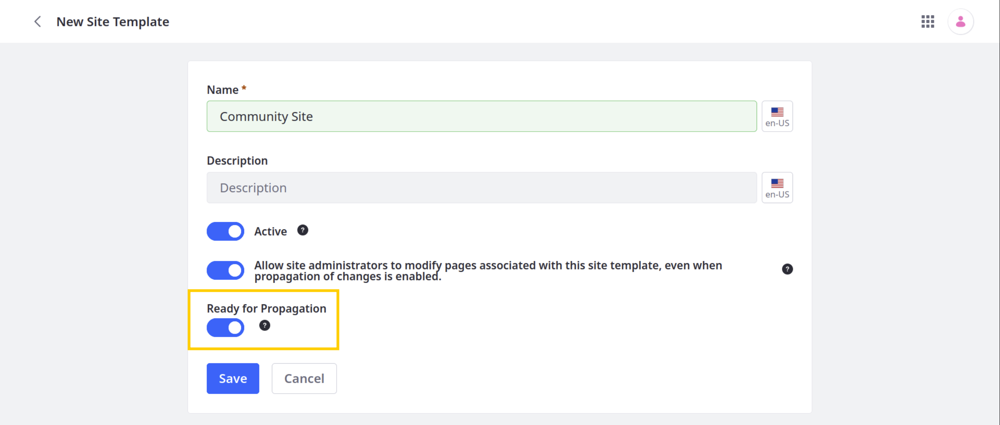
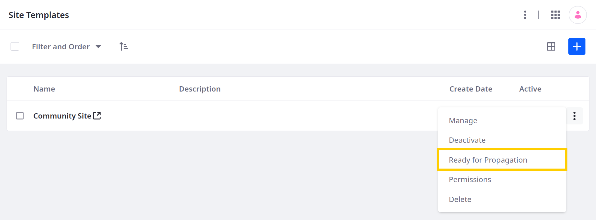
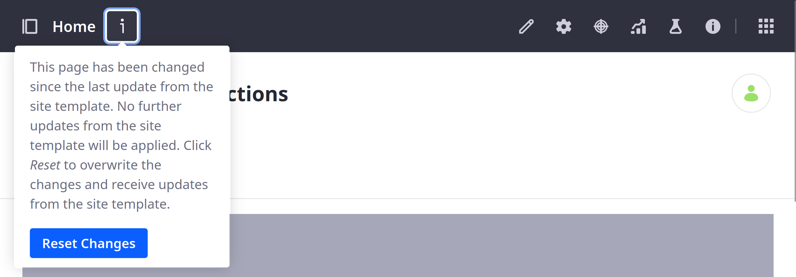

# Propagating Template Changes

When Site Template propagation is enabled, you can make changes to the template's Pages and automatically propagate those changes to connected Sites. However, making changes to a Site Page inherited from a template prevents the propagation of template changes to that Page. To restore propagation for the Page, you must discard changes made to it in the Site. If you've edited multiple inherited Pages and you'd like to restore propagation from the Site Template, you must reset changes for each one individually.

```{note}
By default, propagation is triggered for each connected Site individually, when it is first visited by a user after changes are made. However, you can configure your system to also trigger propagation to connected Sites simultaneously whenever users toggle a template to *Ready for Propagation*. See [Configuring Site Template Propagation](./configuring-site-template-propagation.md) for more information.
```

## Which Template Changes are Propagated?

Only changes to a template's Pages and Page elements are propagated to connected Sites. This includes newly created Pages as well as any changes to fragments and widgets in existing Pages. Other application data is only copied at initial Site creation; subsequent changes are not automatically propagated.

For this reason, Site Templates are primarily intended for maintaining Pages across multiple Sites. If you need to create and maintain Web Content and other assets across Sites, use [Asset Libraries](../../../content-authoring-and-management/asset-libraries/asset-libraries-overview.md).

## Enabling and Disabling Propagation

When [creating a template](./creating-site-templates.md), you determine whether to enable or disable automatic propagation, but you can change this setting at any time.



Follow these steps to enable or disable propagation after template creation:

1. Open the *Global Menu* (), go to the *Control Panel* tab, and click *Site Templates*.

1. Select the desired *template*.

1. Click the *Propagation* button ()

   If propagation is enabled, click *Disable Propagation* to prevent template changes from being automatically propagated to connected Site Pages.

   

   If propagation is disabled, click *Ready for Propagation* to enable automatic propagation.

   

Alternatively, you can enable or disable automatic propagation via the Site Templates application page. Just click the *Actions* button () for the desired template and select *Disable Propagation* or *Ready for Propagation*.



## Reconnecting Inherited Pages to Their Template

If you make changes to a Site Page inherited from a template, it is disconnected from the template's Page and is not automatically propagated. To reconnect the Site Page to the template, you must discard your changes to the Site Page.

Follow these steps to discard changes to a Site Page and resync it with its template:

1. Navigate to the Site Page.

1. Click the Information icon () in the Application Bar.

   

1. Click *Reset Changes*.

   ```{warning}
   Resetting changes **reverts any changes made to the Site Page directly**. This can result in data loss. Proceed with caution.
   ```

<!-- ## Resolving Propagation Conflicts

In some cases, you may encounter conflicts when propagating Site Template changes. For example, if Pages in a template have conflicting friendly URLs, Liferay DXP stops the propagation and displays an error message.


After encountering a conflict, follow these steps to restore automatic propagation:

1. Manually resolve all conflicts identified in the error message.

1. Open the *Site Menu* (), expand *Configuration*, and go to *Site Settings*.

1. Click the *Reset and Propagate* button to reset the merge fail count and attempts to propagate your site's changes again. -->

## Additional Information

* [Site Templates](../site-templates.md)
* [Configuring Site Template Propagation](./configuring-site-template-propagation.md)
