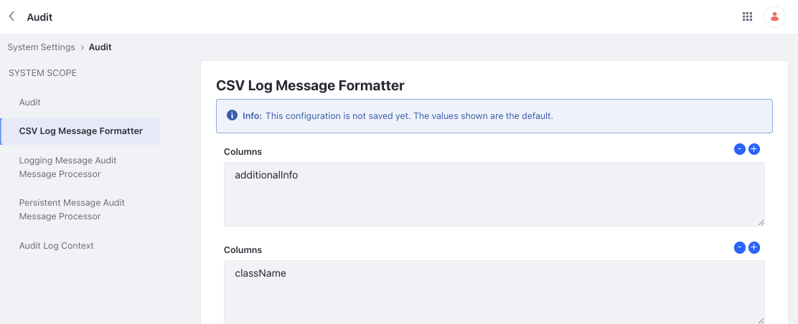
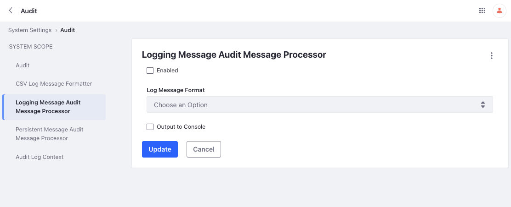
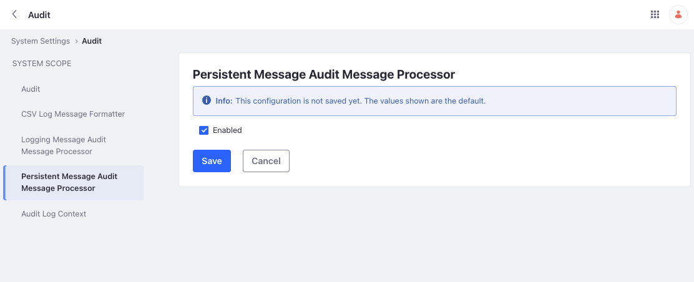
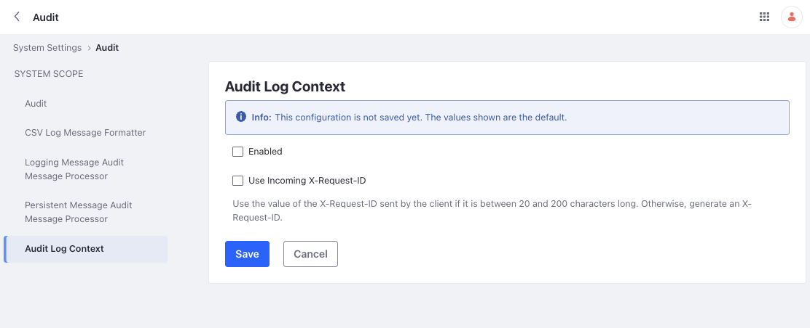

# Audit Configuration Reference

Configuration settings for audits are available at a system scope. You can find these settings by opening the *Global Menu* () and navigating to *Control Panel* &rarr; *System Settings* &rarr; *Audit*. 

## Audit

Use this checkbox to enable or disable auditing entirely for your Liferay instance. Note that when auditing is enabled, you can adjust the *Audit Message Maximum Queue Size* field from its default value.

## CSV Logging Message Formatter

Use this to define the columns present in the CSV export of audit events. Note, you cannot add new columns. You can only remove the ones present or add them back after removal. 

## Logging Message Audit Message Processor

Follow these steps to configure the reporting of log events in Liferay DXP’s log and console:

1. Select the *Enabled* checkbox to report audit events in Liferay DXP’s log.

1. Select the *Output to Console* checkbox to report audit events in the console.

1. In the *Log Message Format* dropdown, select the format for the audit events (CSV or JSON).

1. Click *Save*.

## Persistent Message Audit Message Processor

Enable this setting to write audit messages to the database. The interface uses data from the database to render audit messages. Disabling it causes the interface to be empty. 

## Audit Log Context

Use this to add audit information, in JSON format, to every log message written by Log4J. You must enable it and configure the Log4J logging via an XML file. 

When enabling *Use Incoming X-Request-ID*, a client can send the `X-Request-ID` header, and Liferay tags every log statement with this value. This allows tracing of specific requests through multiple systems.

## Configuring Audit Events for Scheduled Jobs

By default, Liferay's scheduled jobs don’t trigger audit events. To change it,

1. Open the *Global Menu* () and navigate to *Control Panel* &rarr; *System Settings*.

1. Select *Infrastructure* from the *Platform* section. 

1. Under *System Scope* on the left, select *Scheduler Engine Helper*. 

1. Enable the checkbox for *Audit Scheduler Job Enabled*. 

1. Click *Save*.

## Related Topics

* [Searching and Exporting Audit Events](./searching-and-exporting-audit-events.md)
