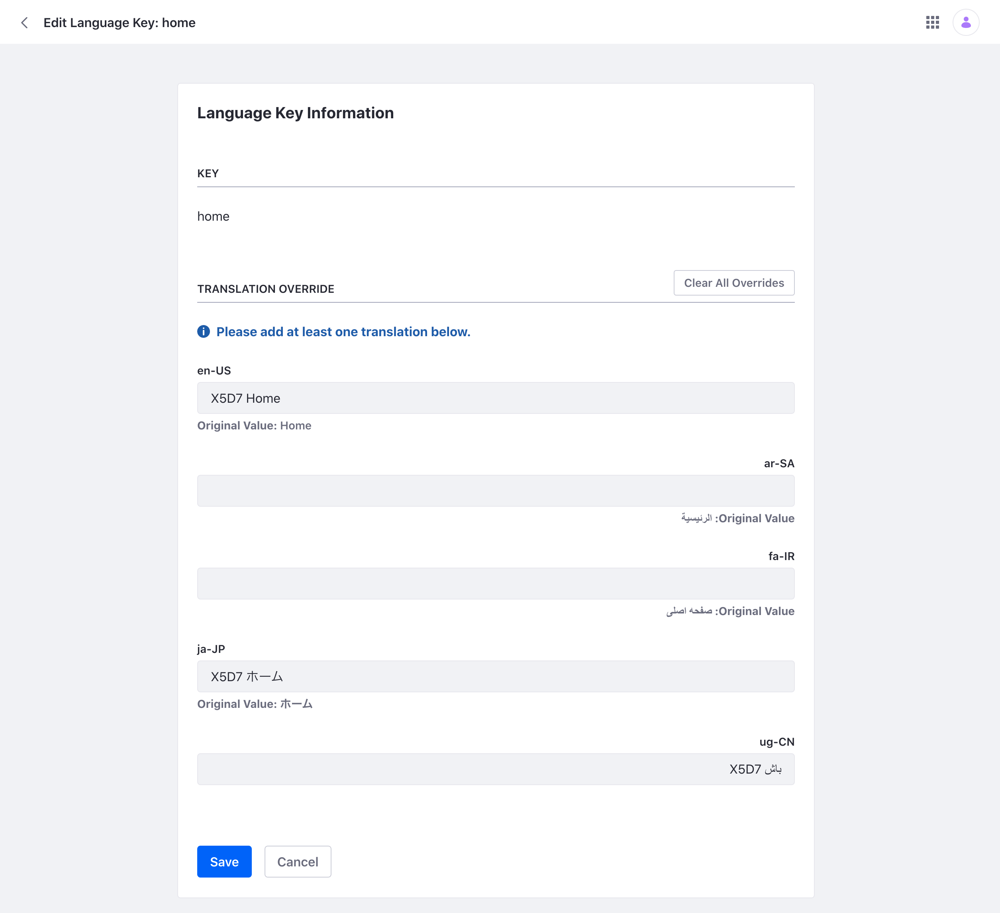
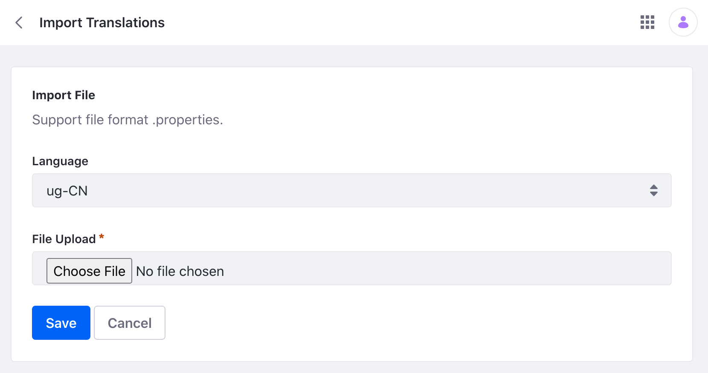

# Changing Translations with Language Override

{bdg-secondary}`Liferay DXP 7.4 U4/Portal 7.4 GA8.`

!!! note
    Import/Export and filtering functionality in Liferay DXP 7.4 U17/Liferay Portal 7.4 GA17

Use the Language Override tool to override existing translations or add new language keys and translations. Note that these overrides take place at the Instance level of [Configuration Scope](./understanding-configuration-scope.md). For previous Liferay versions, see [Overriding Global Language Translations with Language Properties](../../liferay-internals/extending-liferay/customizing-localization/overriding-global-language-translations-with-language-properties.md).

## Overriding a Translation

1. Open the Global Menu (). Navigate to *Control Panel* &rarr; *Configuration* &rarr; *Language Override*.

1. Use the search bar to find the translation you wish to override. For example, if you want to override `home` found at the top of the Product Menu, search for the term `home`.

    

    Note, the search bar searches language keys for the selected locale's translations. Use the locale selector to switch between languages. For example, select `en-US` to search within US English translations.

1. Locate and click on the translation. A new window opens. You can also click the *Actions* () &rarr; _Edit_ to the right of the translation.

1. Enter a new translation for each language you want to override. Click *Save* at the bottom of the page.

    

1. The translation for `home` is now overridden.

    

## Modifying a Translation Override

1. Open the Global Menu (). Navigate to *Control Panel* &rarr; *Configuration* &rarr; *Language Override*.

1. Use the search bar to find the override you wish to modify. To filter the results for only the translations that have overrides, click *Filter and Order* and select *Any Language*. Or click *Selected Language* to only show overrides within the locale selected.

    Note existing overrides are indicated under each language key. For example, "Languages With Override: en_US, ja_JP".

1. Select the translation you wish to modify. A new window opens. You can also click the *Actions* () &rarr; _Edit_ to the right of the translation.

    If overrides exist, the *Actions* icon () also has an option to remove translation overrides. Click *Remove all translation overrides* and click *OK* in the pop-up window to remove all overrides. If an override exists in the locale you have selected, there's an additional option to remove just that locale's translation (e.g. *Remove translation override for en_US* if US English is selected).

    

1. Enter your changes and click *Save* at the bottom of the page. If you wish to remove all overrides and revert back to the original translations, click *Clear All Overrides*.

## Adding a Language Key and Translation

1. Open the Global Menu (). Navigate to *Control Panel* &rarr; *Configuration* &rarr; *Language Override*.

1. Click *Add* () and a new window opens.

1. Enter a key and at least one language translation. Note, the maximum length is 1,000 characters for the key. Click *Save* when finished.

## Importing and Exporting Language Translations

Language overrides can be easily imported or exported with language properties files.

### Importing Language Translations

1. To import, click the *Actions* () to the left of the Global Menu icon.

1. Select *Import Translations* and a new window will open.

    

1. Use the drop-down menu to select the language.

1. Click *Choose File* and select the `Language.properties` file that contains your overrides. Note, that you must supply a separate file for each language you wish to override. Each language has its own [language properties file](https://github.com/liferay/liferay-portal/tree/master/modules/apps/portal-language/portal-language-lang/src/main/resources/content) containing keys for its language.

1. Click *Save* and the overrides are now saved.

### Exporting Language Translations

1. To export, click the *Actions* () to the left of the Global Menu icon.

1. Select *Export* and a ZIP file containing `Language.properties` files for each language with overrides will begin downloading.

## Related Topics

- [Overriding Global Language Translations with Language Properties](../../liferay-internals/extending-liferay/customizing-localization/overriding-global-language-translations-with-language-properties.md)
- [Adding a Language](../../liferay-internals/extending-liferay/customizing-localization/adding-a-language.md)
- [Automatically Generating Translations](../../liferay-internals/extending-liferay/customizing-localization/automatically-generating-translations.md)