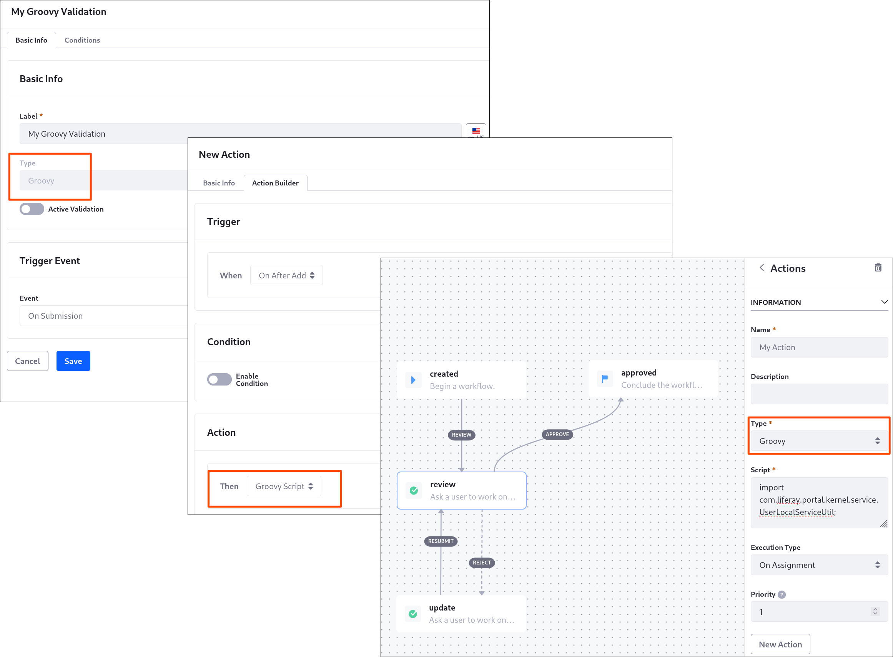

# Scripting

In self-hosted or PaaS instances, Liferay's script engine is leveraged by multiple applications:

- [Object actions](../../liferay-development/objects/creating-and-managing-objects/actions.md)
- [Object validations](../../liferay-development/objects/creating-and-managing-objects/validations.md)
- [Workflow](../../process-automation/workflow/developer-guide/using-the-script-engine-in-workflow.md)
- [The script console](../using-the-script-engine.md)

Beginning in DXP 2024.Q2/Portal 7.4 GA120, scripting is disabled by default. Administrators won't even see the option for creating or executing scripts unless permission is granted explicitly by a system-level administrator.

## Enabling Scripting

To enable scripting for administrative users,

1. Open the *Global Menu* () and navigate to *Control Panel* &rarr; *System Settings* (in the Configuration section.

1. From the Security category, click _Script Management_.

1. Check the box to enable scripting.

1. Click _Save_.

Once enabled, administrative applications that can leverage scripting will display the option to users:

## Related Topics

* [Using the Script Engine in Workflow](../../process-automation/workflow/developer-guide/using-the-script-engine-in-workflow.md)
* [Object Actions](../../liferay-development/objects/creating-and-managing-objects/actions.md)
* [Object Validations](../../liferay-development/objects/creating-and-managing-objects/validations.md)
* [Using the Script Engine](../using-the-script-engine.md)
