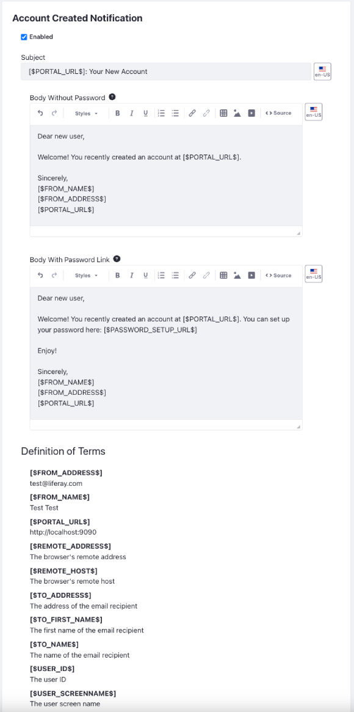
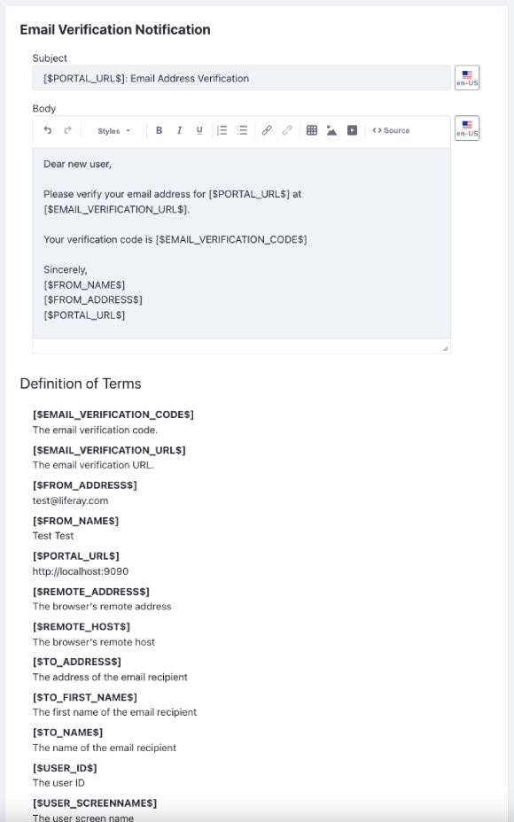
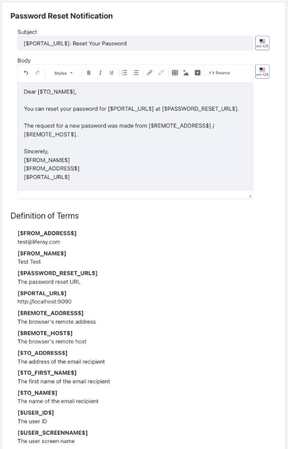

# Email Settings

The email configuration is where you configure email notifications at the virtual instance scope. Open the *Global Menu* () and navigate to *Control Panel* &rarr; *Configuration* &rarr; *Instance Settings*. Select *Email* under the platform section. The email configuration contains six entries:

| Configuration                   | Purpose                                                            |
| :------------------------------ | :----------------------------------------------------------------- |
| Account Created Notification    | Enable and set what to email users when they create a new account. |
| Email Sender                    | Set the *From* name and address for the email templates.           |
| Email Verification Notification | Create the template that asks users to verify their email address. |
| Mail Host Names                 | Enter mail hosts associated with the instance.                     |
| Mail Setting                    | Set up a mail server for the instance.                             |
| Password Changed Notification   | Notify users when their password has been changed.                 |
| Password Reset Notification     | Notify users when a request to reset their password is received.   |

```{note}
Your installation must have a [configured connection to a mail server](../../../installation-and-upgrades/setting-up-liferay/configuring-mail.md) in order to send email notifications. Mail server configurations set at the instance scope override server level configurations. 

Each notification type has a section called ***Definition of Terms***. This section contains all the template variables you can use to change the default email template provided. 
```

## Account Created Notification

This is the template of the email sent to users when they create a new account. It contains the email templates with and without the new user's password included in the body of the text. You can use the *Enabled* checkbox at the top to enable this notification. 



## Email Sender

The email sender specifies the virtual instance's administrative name and email address for email notifications. It uses the `[$FROM_NAME$]` and `[$FROM_ADDRESS$]` variables respectively in the email templates. By default, they are from the `admin.email.from.name` and `admin.email.from.address` [portal properties](https://learn.liferay.com/reference/latest/en/dxp/propertiesdoc/portal.properties.html#Admin%20Portlet). This name and email address appear in the *From* field in all email messages sent by the virtual instance. 


## Email Verification Notification

This is the template of the email sent to users when asked to verify their email address. 



## Mail Host Names

You can specify additional mail host names here that are owned by your organization for the virtual instance. Enter one mail host name per line, but don't enter the one specified in the virtual instance configuration. 


## Password Changed Notification

This is the template of the email sent to users when a password has changed. 


## Password Reset Notification

This is the template of the email sent to users when a password reset request has been made. 



## Related Topics

* [Configuring Mail](../../../installation-and-upgrades/setting-up-liferay/configuring-mail.md)
* [Notifications](../../../process-automation/notifications.md)
