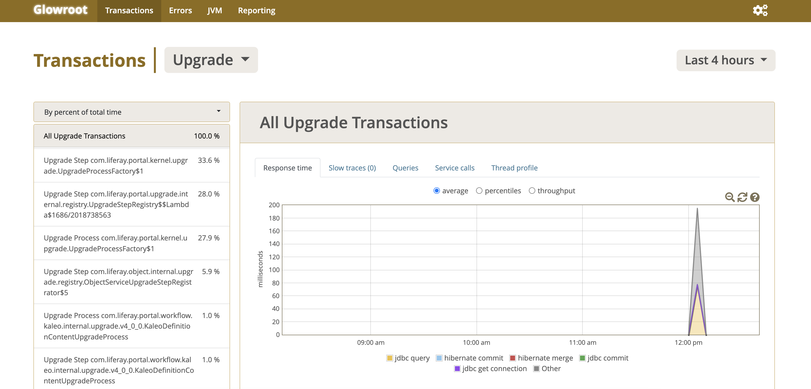

---
toc:
  - ./using-glowroot-with-liferay/troubleshooting-jvm-issues-with-glowroot.md
  - ./using-glowroot-with-liferay/troubleshooting-liferay-performance-issues-with-glowroot.md
  - ./using-glowroot-with-liferay/troubleshooting-templates-with-glowroot-freemarker-plugin.md
  - ./using-glowroot-with-liferay/liferay-performance-use-cases-with-glowroot.md
uuid: 699aecdd-490f-4386-9a95-1168eff8f1c0
---

# Using Glowroot with Liferay

```{toctree}
:maxdepth: 3

using-glowroot-with-liferay/troubleshooting-jvm-issues-with-glowroot.md
using-glowroot-with-liferay/troubleshooting-liferay-performance-issues-with-glowroot.md
using-glowroot-with-liferay/troubleshooting-templates-with-glowroot-freemarker-plugin.md
using-glowroot-with-liferay/liferay-performance-use-cases-with-glowroot.md
```

{bdg-secondary}`Liferay DXP 2023.Q4+/Portal 7.4 GA100+`

Liferay bundles [Glowroot](https://glowroot.org/), the open source Java application monitoring tool. The tool displays helpful statistics about your system (e.g. server requests, errors, etc.) with minimal overhead. Use Glowroot to troubleshoot issues and analyze performance issues.

## Enabling Glowroot

Enable Glowroot with the `GLOWROOT_ENABLED` environment variable set to `true`. For example,

`docker run -e GLOWROOT_ENABLED=true -it -m 8g -p 8080:8080 liferay/dxp:latest`

If using a Tomcat bundle, run Glowroot from the command line. Navigate to your bundle's `$CATALINA_HOME/bin` folder. Then execute `./catalina.sh glowroot run`.

## Accessing Glowroot

To access Glowroot, first log in to your Liferay instance with [your administrator account](../getting-started/introduction-to-the-admin-account.md#accessing-liferay-dxp-as-the-admin-user). Glowroot can only be accessed by users with an administrator role.

Navigate to `http://localhost:8080/o/glowroot` to access the dashboard.


## Configure a Central Collector

By default, Glowroot is configured with an embedded collector that does not preserve data in the event of a JVM crash. Configure a central collector by creating a `glowroot.properties` file in your `$LIFERAY_HOME/glowroot` folder:

```properties
collector.address=http://<collector_host>:8181
agent.id=liferay
```

Or [set up the central collector in docker](https://github.com/glowroot/glowroot/wiki/Central-Collector-Installation#option-3-running-in-a-docker-container).

## Deploying Custom Plugins

[Different custom plugins](https://github.com/glowroot/glowroot/tree/main/agent/plugins) are available for Glowroot. To deploy a custom plugin, drop it into your `$LIFERAY_HOME/glowroot/plugins` folder. Make sure to use the package `com.liferay.glowroot.plugin.<plugin name>` when creating a new plugin.

Note, if your plugin needs any custom packages, declare them in your `portal-ext.properties` file under the `module.framework.properties.org.osgi.framework.bootdelegation` property. For example,

```properties
module.framework.properties.org.osgi.framework.bootdelegation=\
  __redirected,\
  com.liferay.expando.kernel.model,\
  com.liferay.glowroot.plugin.*,\
  com.liferay.portal.servlet.delegate,\
  com.liferay.portal.servlet.delegate*,\
  com.sun.ccpp,\
  com.sun.ccpp.*,\
  com.sun.crypto.*,\
  com.sun.image.*,\
  com.sun.imageio.plugins.*,\
  com.sun.jmx.*,\
  com.sun.jndi.*,\
  com.sun.mail.*,\
  com.sun.management.*,\
  com.sun.media.*,\
  com.sun.msv.*,\
  com.sun.org.*,\
  com.sun.tools.*,\
  com.sun.xml.*,\
  com.yourkit.*,\
  jdk.*,\
  org.glowroot.agent,\
  org.glowroot.agent.*,\
  sun.*,\
  weblogic.jndi,\
  weblogic.jndi.*
```

Once deployed, in Glowroot, navigate to _Configuration_ &rarr; _Plugins_ to see your plugins.

## Monitoring Upgrades with Glowroot

Glowroot can be configured to monitor Liferay upgrades. Create a `config.json` file and place it in your `$LIFERAY_HOME/glowroot/` folder. Copy and paste the sample configuration below into the JSON file.

```json
{
	"transactions": {
		"slowThresholdMillis": 2000,
		"profilingIntervalMillis": 1000,
		"captureThreadStats": true
	},
	"jvm": {
		"maskSystemProperties": [
			"*password*"
		],
		"maskMBeanAttributes": [
			"*password*"
		]
	},
	"uiDefaults": {
		"defaultTransactionType": "Web",
		"defaultPercentiles": [
			50.0,
			95.0,
			99.0
		],
		"defaultGaugeNames": [
			"java.lang:type=Memory:HeapMemoryUsage.used"
		]
	},
	"advanced": {
		"immediatePartialStoreThresholdSeconds": 60,
		"maxTransactionAggregates": 500,
		"maxQueryAggregates": 500,
		"maxServiceCallAggregates": 500,
		"maxTraceEntriesPerTransaction": 2000,
		"maxProfileSamplesPerTransaction": 50000,
		"mbeanGaugeNotFoundDelaySeconds": 60
	},
	"gauges": [
		{
			"mbeanObjectName": "java.lang:type=Memory",
			"mbeanAttributes": [
				{
					"name": "HeapMemoryUsage.used"
				}
			]
		},
		{
			"mbeanObjectName": "java.lang:type=GarbageCollector,name=*",
			"mbeanAttributes": [
				{
					"name": "CollectionCount",
					"counter": true
				},
				{
					"name": "CollectionTime",
					"counter": true
				}
			]
		},
		{
			"mbeanObjectName": "java.lang:type=MemoryPool,name=*",
			"mbeanAttributes": [
				{
					"name": "Usage.used"
				}
			]
		},
		{
			"mbeanObjectName": "java.lang:type=OperatingSystem",
			"mbeanAttributes": [
				{
					"name": "FreePhysicalMemorySize"
				},
				{
					"name": "ProcessCpuLoad"
				},
				{
					"name": "SystemCpuLoad"
				}
			]
		}
	],
	"plugins": [
		{
			"id": "cassandra",
			"properties": {
				"stackTraceThresholdMillis": 1000.0
			}
		},
		{
			"id": "elasticsearch",
			"properties": {
				"stackTraceThresholdMillis": 1000.0
			}
		},
		{
			"id": "java-http-server",
			"properties": {
				"captureRequestHeaders": [],
				"maskRequestHeaders": [
					"Authorization"
				],
				"captureRequestRemoteAddr": false,
				"captureRequestRemoteHost": false,
				"captureResponseHeaders": [],
				"traceErrorOn4xxResponseCode": false
			}
		},
		{
			"id": "jaxrs",
			"properties": {
				"useAltTransactionNaming": false
			}
		},
		{
			"id": "jdbc",
			"properties": {
				"captureBindParametersIncludes": [
					".*"
				],
				"captureBindParametersExcludes": [],
				"captureResultSetNavigate": true,
				"captureResultSetGet": false,
				"captureConnectionPoolLeaks": false,
				"captureConnectionPoolLeakDetails": false,
				"captureGetConnection": true,
				"captureConnectionClose": false,
				"capturePreparedStatementCreation": false,
				"captureStatementClose": false,
				"captureTransactionLifecycleTraceEntries": false,
				"captureConnectionLifecycleTraceEntries": false,
				"stackTraceThresholdMillis": 1000.0
			}
		},
		{
			"id": "liferay-freemarker-templates-plugin",
			"properties": {
				"instrumentationLevel": "INFO"
			}
		},
		{
			"id": "logger",
			"properties": {
				"traceErrorOnErrorWithThrowable": true,
				"traceErrorOnErrorWithoutThrowable": false,
				"traceErrorOnWarningWithThrowable": false,
				"traceErrorOnWarningWithoutThrowable": false
			}
		},
		{
			"id": "mongodb",
			"properties": {
				"stackTraceThresholdMillis": 1000.0
			}
		},
		{
			"id": "play",
			"properties": {
				"useAltTransactionNaming": false
			}
		},
		{
			"id": "servlet",
			"properties": {
				"sessionUserAttribute": "",
				"captureSessionAttributes": [],
				"captureRequestParameters": [
					"*"
				],
				"maskRequestParameters": [
					"*password*"
				],
				"captureRequestHeaders": [],
				"captureResponseHeaders": [],
				"traceErrorOn4xxResponseCode": false,
				"captureRequestRemoteAddr": false,
				"captureRequestRemoteHostname": false,
				"captureRequestRemotePort": false,
				"captureRequestLocalAddr": false,
				"captureRequestLocalHostname": false,
				"captureRequestLocalPort": false,
				"captureRequestServerHostname": false,
				"captureRequestServerPort": false
			}
		},
		{
			"id": "spring",
			"properties": {
				"useAltTransactionNaming": false
			}
		}
	],
	"instrumentation": [
		{
			"className": "com.liferay.portal.kernel.upgrade.UpgradeStep",
			"methodName": "upgrade",
			"methodParameterTypes": [],
			"order": 0,
			"captureKind": "transaction",
			"transactionType": "Upgrade",
			"transactionNameTemplate": "Upgrade Step {{this.class.name}}",
			"alreadyInTransactionBehavior": "capture-new-transaction",
			"traceEntryMessageTemplate": "Upgrade Step {{this.class.name}}",
			"timerName": "Upgrade Step Timer"
		},
		{
			"className": "com.liferay.portal.kernel.upgrade.UpgradeProcess",
			"methodName": "upgrade",
			"methodParameterTypes": [],
			"order": 0,
			"captureKind": "transaction",
			"transactionType": "Upgrade",
			"transactionNameTemplate": "Upgrade Process {{this.class.name}}",
			"alreadyInTransactionBehavior": "capture-new-transaction",
			"traceEntryMessageTemplate": "Upgrade Process {{this.class.name}}",
			"timerName": "Upgrade Process Timer"
		}
	]
}
```

Note that this configuration is needed for Glowroot to start when Liferay starts to monitor the upgrade. Trigger a Liferay upgrade with the [auto upgrade feature](../installation-and-upgrades/upgrading-liferay/upgrade-basics/upgrading-via-auto-upgrade.md).

Once the upgrade is complete, in Glowroot, a new transaction type called upgrade appears in the drop-down menu. Select `Upgrade` from the drop-down menu to view the dashboard.



## Next Steps

- [Troubleshooting JVM Issues with Glowroot](./using-glowroot-with-liferay/troubleshooting-jvm-issues-with-glowroot.md)
- [Troubleshooting Liferay Performance Issues with Glowroot](./using-glowroot-with-liferay/troubleshooting-liferay-performance-issues-with-glowroot.md)
- [Troubleshooting Templates with Glowroot Freemarker Plugin](./using-glowroot-with-liferay/troubleshooting-templates-with-glowroot-freemarker-plugin.md)
- [Liferay Performance Use Cases with Glowroot](./using-glowroot-with-liferay/liferay-performance-use-cases-with-glowroot.md)
