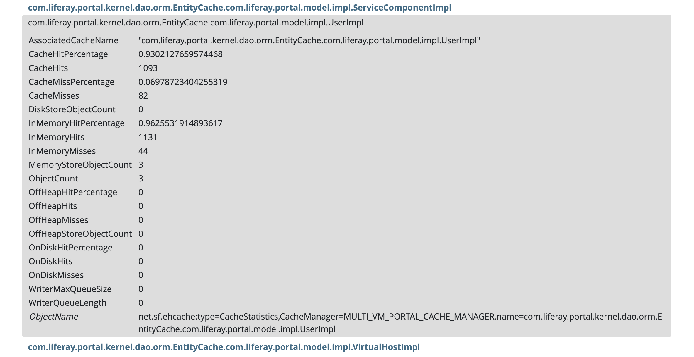
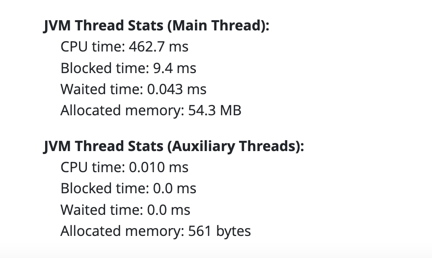
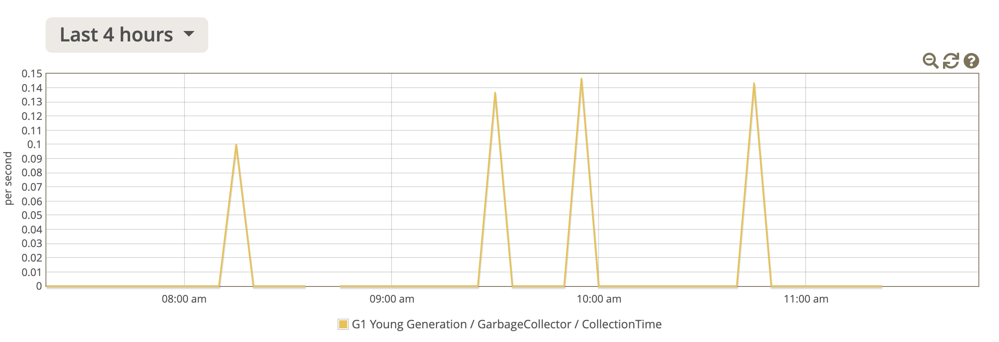
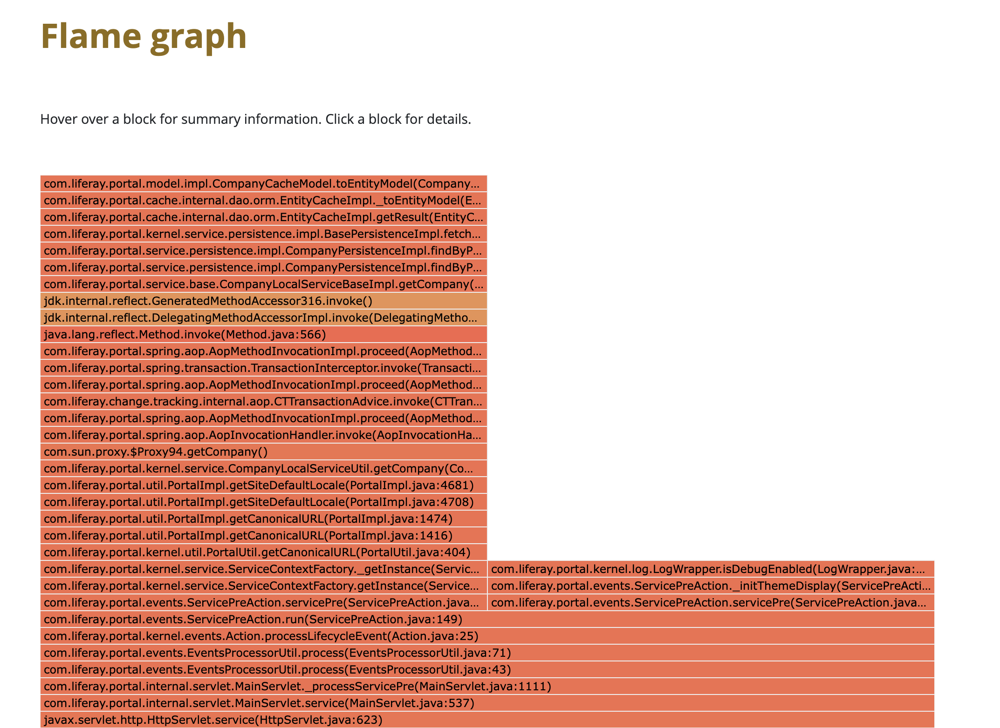

# Troubleshooting Liferay Performance Issues with Glowroot

{bdg-secondary}`Liferay DXP 2023.Q4+/Portal 7.4 GA100+`

Use Glowroot to identify and diagnose performance issues in your Liferay installation. The following topics are some common issues to diagnose.

## Expensive SQL Queries

Expensive SQL queries can have slow response times and place excessive loads against your database. Click the _Transactions_ tab to monitor the various queries your system is processing. Under the Transactions panel, click _Queries_. In the table, click _Total time (ms)_ to identify the queries that take the most time.

Expensive SQL queries might also cause a backup of other threads waiting for a connection. To add the Hikari connection pool to the gauges dashboard, navigate to _Configuration_ &rarr; _Gauges_. Click _Add new_ and search for `com.zaxxer.hikari:type=Pool (HikariPool-1)`. Select all the Mbean attributes and click _Add_.

Click the _JVM_ tab and then _Gauges_ in the left menu. The Hikari connection pool can now be monitored in the Gauges dashboard.

## Cache Size Issues

Liferay uses [Ehcache](https://www.ehcache.org/) to cache most of its entities. Use the Mbean tree to inspect the configuration and utilization of specific entities. For example, inspect the entity cache for `UserImpl`.

1. Click the _JVM_ tab. Click _Mbean tree_ in the left navigation.

1. Scroll down (or text search) to the find the `UserImpl` under the `CacheConfiguration` section. See the current cache configuration for the entity.

   

1. Scroll down (or text search) to find the `UserImpl` under the `CacheStatistics` section. See the current cache utilization for the entity.

   

Based on your inspection of the entity, make necessary changes to your [cache configuration](../../liferay-development/building-applications/data-frameworks/cache.md).

It is also possible to clear the cache. In Liferay, navigate to _Control Panel_ &rarr; _Server Administration_. Cache clearing is available under the Resources tab.

## Custom SQL Queries

As custom queries are not cached, they can sometimes require long transaction times. See [expensive SQL queries](#expensive-sql-queries) above to see the impact of custom queries on your system.

## Large Tables

Over time, your Liferay database tables can grow large. This may also cause transaction slowdown. Some examples are

- `Audit_AuditEvent` - table related to auditing events such as login
- `OAuth2Authorization` - table related to authorizations
- `SamlSpAuthRequest`, `SamlSpMessage`, `SamlSpSession` - tables related to SAML authentications
- `UserNotificationEvent` - table related to notifications

Consider [database pruning](../../installation-and-upgrades/upgrading-liferay/upgrade-stability-and-performance/database-pruning-for-faster-upgrades.md) to improve performance.

## Concurrency Issues

If some transactions seems to be slow despite low CPU utilization, it may be a concurrency issue with synchronized resources. Navigate to the _Transactions_ tab in Glowroot. Select a specific transaction in the left menu. Scroll down the dashboard to the JVM thread section to inspect the transaction.

**CPU time**: the time spent computing.

**Blocked time**: the time the thread is blocked and possibly waiting for a synchronization mechanism.

**Waited time**: the time the thread waited to complete the transaction.

Check to see if transactions are blocked or waiting for a long time.

## Backend Service Slowness

It may be that a slow transaction is caused by a slow or unresponsive external backend service. Like the [concurrency issues](#concurrency-issues) above, use the transaction dashboard to inspect your backend service transactions. You may need to make some configuration changes with your services.

## Long Garbage Collection Time

Use the Glowroot gauges to monitor garbage collection and to check for unusually long times. Navigate to the _JVM_ tab and click _Gauges_ in the left menu. Scroll down and select the garbage collector `CollectionTime` attribute to be displayed.

## Metaspace Out of Memory Errors

Metaspace size is set when configuring your application server. A crash can occur when the JVM tries to claim more memory than what is configured. Use the Glowroot gauges to inspect the metaspace usage. Navigate to the _JVM_ tab and click _Gauges_ in the left menu. Scroll down and select the garbage collector `CollectionTime` attribute. Scroll down and select the java `Metaspace` attribute to be displayed.

## Slow or Expensive Code

Use Glowroot to analyze whether certain sections of code are having performance issues. Navigate to the _Transactions_ tab. Select a specific transaction to inspect, and click _Thread profile_ in the transactions panel. The thread profile shows the thread stack of the transaction.

A flame graph can also be rendered from this panel. Click _View flame graph_.

The flame graph shows a visualization of the stack trace. Mouse over elements to see the specifics of each method.

## Configuring Instrumentation

Capture any method call as an individual transaction by configuring instrumentation. To create a new instrumentation,

1. Navigate to _Configuration_ &rarr; _Instrumentation_. Click _Add new_.

1. Enter the class name and method name. Select what to capture and fill in the details based on your specific needs.

1. Click _Add_. The new transaction appears under the _Transactions_ tab.

See [Glowroot instrumentation](https://glowroot.org/instrumentation.html) for more information.

## False Alarms

Slow transactions may be an indication of potential system errors. However, there are some scenarios in which it may be expected. For example, when Liferay first starts up, you might see large SQL queries that take a long time. Slow transactions might also happen after a long idle period in which the cache is empty. JSP requests might also show up as slow transactions. JSPs are compiled at runtime, and a large number of JSP requests may cause a slowdown.
