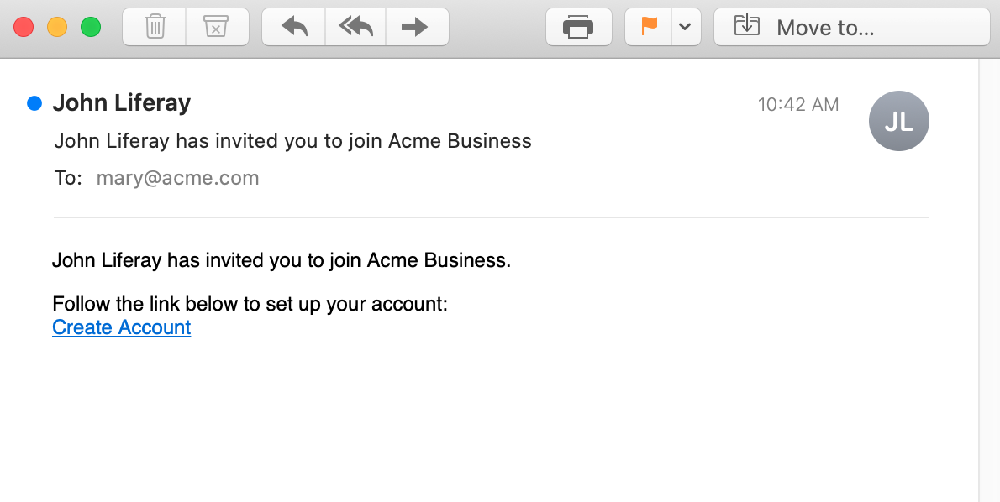
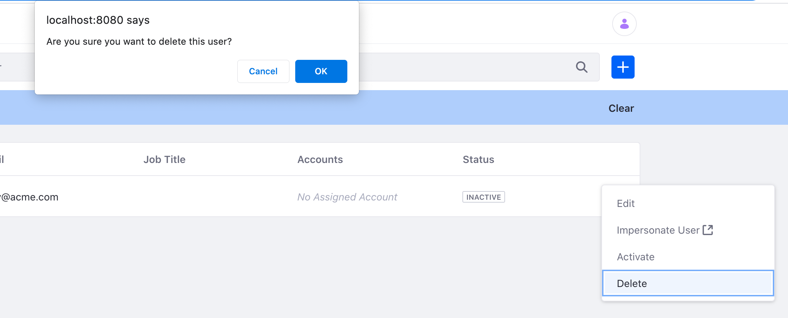

# Account Users

{bdg-secondary}`For Liferay 7.4 U55+/GA55+`

Once you've created an account, you can associate existing users with it manually. Alternatively, you can create and associate users with an account simultaneously using the Account Users application. Here you can also manage all users associated with accounts.

```{note}
For Liferay 7.4 U20/GA20 and earlier versions, you can only create users for accounts via the Account Users application. You cannot associate users created in the Users and Organizations application with accounts.
```

## Adding Account Users

1. Open the *Global Menu* () and go to *Control Panel* &rarr; *Account Users*.

1. Click *Add* ().

1. Select an *account* to associate with user.

1. Fill in the necessary information for this new user.

   

1. Click *Save*.

### Setting a Password for an Account User

When you create a user account, Liferay generates a password and sends it to the user via email using the configured [mail server](../../installation-and-upgrades/setting-up-liferay/configuring-mail.md).

To set user passwords manually,

1. In Account Users, click the *Actions* button () for the desired user and select *Edit*.

1. In the General tab, click *Password*.

1. Enter a password.

1. Determine whether to require password reset.

1. Click *Save*.

### Associating an Existing User to a Business Account

1. Open the *Global Menu* () and go to *Control Panel* &rarr; *Accounts*.

1. Pick an account to edit and click its *Actions* button () &rarr; *Manage Users*.

1. Click *Add* and select a user to assign to the account.

### Associating an Existing User to a Personal Account

1. Open the *Global Menu* () and go to *Control Panel* &rarr; *Accounts*.

1. Pick an account to edit and click its *Actions* button () &rarr; *Edit*.

1. Under the User section, click *Assign* and select a user. Click *Choose*.

## Inviting a New User by Email

{bdg-secondary}`Available 7.4 U55+/GA55+`

You can invite users to an account by email. Liferay sends an automated invitation email to the person you specify to create a new user and be associated with an account.

1. Make sure you have already [configured mail](../../installation-and-upgrades/setting-up-liferay/configuring-mail.md) for your Liferay instance.

1. Open the *Global Menu* () and go to *Control Panel* &rarr; *Accounts*.

1. Select the *account* you want to invite users to and go to the *Users* tab.

1. Click *Add* () and select *Invite Users*.

1. Enter the email address of the person you want to invite and press enter. If desired, you can add multiple addresses.

1. (Optional) Enter and select the account roles you want to assign to the user (e.g., Account Administrator, Buyer, Order Manager, etc.).

   ```{tip}
   Liferay applies selected roles to all emails in the invite entry. If desired, you can click *Add Entry* to create additional invite entries for assigning different roles to emails.
   ```

1. Click *Invite*.

   

Liferay sends an invitation to the included email addresses. Each recipient can click Create Account in the email to register for a new user on the Liferay instance. Upon creation, the user is associated with the account and has the assigned account role.



## Editing an Account User

1. In Account Users, pick a user and click its *Actions* button (). 

1. Click *Edit*.

The following options are available:

| General Tab | Description |
| :--- | :--- |
| Information | Edit or change the user's personal information. |
| Accounts | View or modify the user's associated accounts. |
| Password | Add or change the user's password. |

| Contact Tab | Description |
| :--- | :--- |
| Addresses | Add or change the user's addresses. |
| Contact Information | Add or change the user's contact information |

| Preferences Tab | Description |
| :--- | :--- |
| Alert and Announcements Delivery | Change the user's notification settings. |
| Display Settings | Change the user's time zone and greeting settings. |

## Deactivating and Deleting an Account User

Deleting an account user is a two-step process that involves deactivating the user and then deleting it. This is because you may want to deactivate a user and still have time to review its data before deletion (e.g., due to [legal requirements](../managing-user-data.md)).

### Deactivating an Account User

Deactivating prevents the account user from logging in, but preserves the user's data and information.

1. In Account Users, pick a user and click its *Actions* button (). 

1. Click *Deactivate* and click *OK* to confirm your change.

The account user is now deactivated.

To see a deactivated user, click the *Filter and Order* drop-down menu and select *Inactive* under Filter by Status. You can click a user's *Actions* button () and click *Activate* to reactivate it.

### Deleting an Account User

1. In Account Users, click the *Filter and Order* drop-down menu and click *Inactive* under Filter by Status.

1. Click the inactive user's *Actions* button () and select *Delete*

   

1. Click *OK* on the pop-up form to confirm your decision. The account user is now deleted.

## Impersonating an Account User

You can impersonate account users to view the system as they would see it. This can be used to diagnose permission issues an administrator can't see, such as making sure a user doesn't have access to restricted data. Only users with this permission can impersonate a different user.

1. In Account Users, click the user's *Actions* button ().

1. Select *Impersonate User*.

A new window opens with you logged in as the selected account user.

## Related Topics

* [Accounts](../accounts.md)
* [Account Roles](./account-roles.md)
* [Understanding Users](../users/understanding-users.md)
