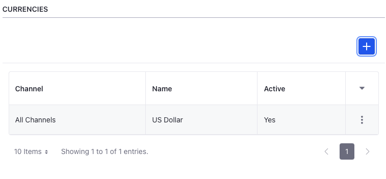
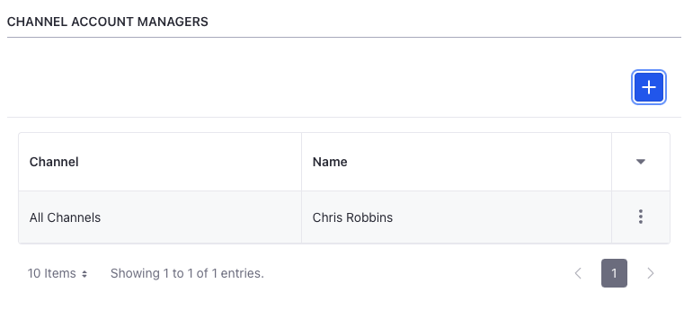
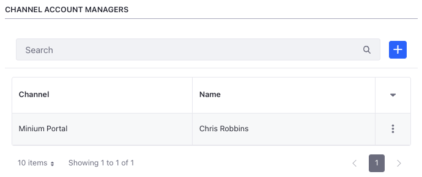

# Setting Channel Defaults

{bdg-secondary}`Liferay 7.4 U49+/GA49+`

Users with the necessary account management permissions can set channel defaults for business accounts.
<!-- Link to Channel Defaults Permission Guide when published -->

1. Open the *Global Menu* (  ) and navigate to *Control Panel* &rarr; *Accounts*.

1. Select a business account and go to the *Channel Defaults* tab.

Here you can set the following defaults.

```{note}
If you set defaults for individual channels and all other channels, the individual defaults takes priority if eligible.
```

## Default Billing and Shipping Addresses

1. Click *Add* (  ) under Billing Addresses or Shipping Addresses.

1. Select *All Channels* or an individual channel.

1. Select an address.

1. Click *Save*.

   

```{note}
Only users with account management permissions can manage channel defaults. However, account users can set their default billing and shipping addresses for all channels via the Account Details tab.
```

## Default Terms and Conditions

1. Click *Add* (  ) under Delivery Terms and Conditions or Payment Terms and Conditions.

1. Select *All Channels* or an individual channel.

1. (Optional) Enable the *Override Eligibility* toggle to override eligibility set for the terms and conditions.

   ```{important}
   Payment terms are linked to a payment method and delivery terms are linked to a shipping option. When there are multiple eligible terms and conditions for a payment method or shipping option, overriding eligibility sets the selected terms and conditions as the default, regardless of eligibility. See [Understanding Eligibility and Channel Defaults](../channel-defaults.md#understanding-eligibility-and-channel-defaults) to learn more.
   ```

1. Select a *term*.

1. Click *Save*.

   

## Default Shipping Options

The default shipping value is determined by existing priority settings for the channel. If other shipping options are available, you can select one of them as the default:

1. Go to *Shipping Options* and click *Edit* for the desired channel.

1. Select a shipping option.

1. Click *Save*.

   

## Default Price Lists and Discounts

1. Click *Add* (  ) under Price Lists or Discounts.

1. Select *All Channels* or an individual channel.

1. (Optional) Enable the *Override Eligibility* toggle to override existing eligibility criteria configured for price lists.

1. Select a *price list* or *discount*.

1. Click *Save*.

   

## Default Currencies

1. Click *Add* (  ) under Currencies.

1. Select *All Channels* or an individual channel.

1. Select a *currency*.

   ```{important}
   This sets the default channel currency for the account during navigation only. Product pages and the catalog use the currency set here. The currency set for the channel at the time of creation is not modified.
   ```

1. Click *Save*.

   

## Default Payment Methods

The default payment method is determined by existing priority settings for the channel. If other payment methods are available, you can select one of them as the default:

1. Go to *Payment Methods* and click *Edit* for the desired channel.

1. Select a payment method.

1. Click *Save*.

   

## Default Channel Account Managers

1. Click *Add* (  ) under Channel Account Managers.

1. Select *All Channels* or an individual channel.

   ```{tip}
   You can assign multiple channel account managers to the same channel.
   ```

1. Select a user.

   All users with a regular role having the `Accounts > Account Entry: Manage Available Accounts via User Channel Rel` permission appear in the channel account manager drop-down. See [Understanding Channel Account Managers](#understanding-channel-account-managers) for more information.

1. Click *Save*.

   

### Understanding Channel Account Managers

When selecting default Channel Account Managers, only users with a regular role that have the `Accounts > Account Entry: Manage Available Accounts via User Channel Rel` permission appear. You can use this permission to grant users access to accounts without requiring them to be account members or organization account managers.



By itself, this permission does not grant access to the Accounts application, or to view and update individual accounts. It also does not grant allow managing orders or setting channel defaults for price lists and other Commerce entities. If you want Channel Account Managers to perform these administrative actions, you must grant them the necessary permissions for each application (e.g., Accounts, Orders, Price Lists). See [Channel Defaults Permissions Reference](./channel-defaults-permissions-reference.md) for more information.

```{note}
If you use [organizations](../../organizations/understanding-organizations.md), users can continue to manage the organization accounts they have permission to manage along with accounts for which they are default Channel Account Managers.
```

## Related Topics

* [Channel Defaults](../channel-defaults.md)
* [Channel Defaults Permissions Reference](./channel-defaults-permissions-reference.md)
* [Introduction to Channels](https://learn.liferay.com/web/guest/w/commerce/store-management/channels/introduction-to-channels)