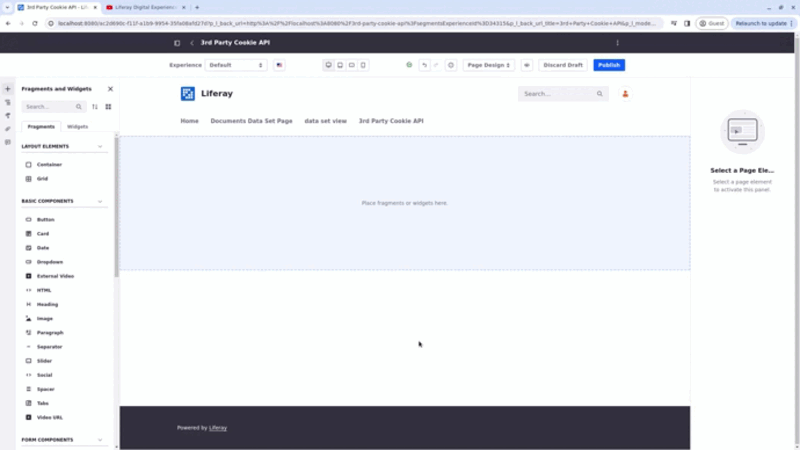

# Managing Third-Party Cookies

{bdg-secondary}`Liferay DXP 2024.Q1+/Portal 7.4 GA112+`

Third-party cookies are generated by domains different from the one a user is currently visiting. These cookies are often used by external services or content embedded within your site. Here are some scenarios where you may need to use third-party content in your Liferay site:

- While using out-of-the-box integration features (e.g. YouTube and Google Maps).
- While using third-party custom developments (e.g. OSGI-based modules or client extensions).
- While using the [Iframe widget](../../site-building/displaying-content/additional-content-display-options/using-the-iframe-widget.md) to embed and display content from a web page.
- While publishing content containing snippets served by third-party sites or services that are accessed or rendered in a page.

To manage third-party cookies, ensure compliance with user consent requirements, and enhance privacy protection, Liferay provides a low-level contract in the form of an API.

With this feature, developers flag external content and categorize it as one of four [types of cookies](./enabling-gdpr-compliance-for-cookies.md#consent-panel-options) that are identified within Liferay. If the content is flagged and the user has not given consent to that type of cookie, Liferay blocks the third-party cookie, maintaining compliance.

!!! important
    This API must be implemented in any feature that generates HTML markup (e.g. rich text editing, web content, and blogs).

## Using the Third-Party Cookie API

To use the third-party cookie API, you need to modify the HTML attributes of an element in two steps:

1. In the HTML markup, define the cookie consent type using the `data-third-party-cookie="{value}"` attribute:

   | Cookie Type     | Value                          |
   |:----------------|:-------------------------------|
   | Functional      | `CONSENT_TYPE_FUNCTIONAL`      |
   | Necessary       | `CONSENT_TYPE_NECESSARY`       |
   | Performance     | `CONSENT_TYPE_PERFORMANCE`     |
   | Personalization | `CONSENT_TYPE_PERSONALIZATION` |

1. Replace or add the HTML element's attribute:

   | Element    | Add Attribute             | Remove Attribute     |
   |:-----------|:--------------------------|:---------------------|
   | `<script>` | `type="text/plain"`       |                      |
   | `<link>`   | `data-href="{YOUR_HREF}"` | `href="{YOUR_HREF}"` |
   | ``    | `data-src="{YOUR_SRC}"`   | `src="{YOUR_SRC}"`   |
   | `<embed>`  | `data-src="{YOUR_SRC}"`   | `src="{YOUR_SRC}"`   |
   | `<iframe>` | `data-src="{YOUR_SRC}"`   | `src="{YOUR_SRC}"`   |

   !!! note
       If you are trying to preview your content, remove the `data-` prefix from the attribute and add it back before saving it to ensure the third-party cookie API is used.

The third-party cookie API scans the Document Object Model (DOM) regularly looking for elements that require user consent via the `data-third-party-cookie` attribute. If users consented to the corresponding cookie type, the API allows the associated content/script to execute or blocks it otherwise.

So, if you are using an Iframe widget `<iframe src="..." />` to display a video on a page, alter the HTML element like this:

```html
<iframe
	data-src="https://www.youtube.com/embed/lMprg3wqgbE?si=JSEoloWxaMXP-wkr"
	data-third-party-cookie="CONSENT_TYPE_FUNCTIONAL"
></iframe>
```



If you are adding an image to a page, alter the HTML element like this:

```html

```

## Related Topics

- [Enabling GDPR Compliance for Cookies](./enabling-gdpr-compliance-for-cookies.md)
- [Managing User Data](../managing-user-data.md)