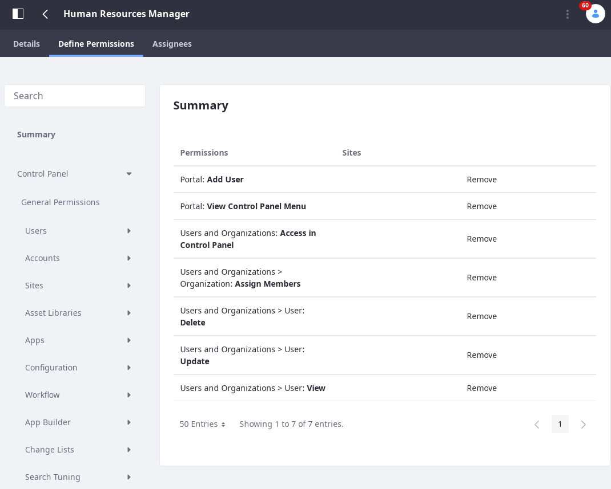
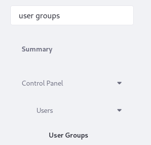
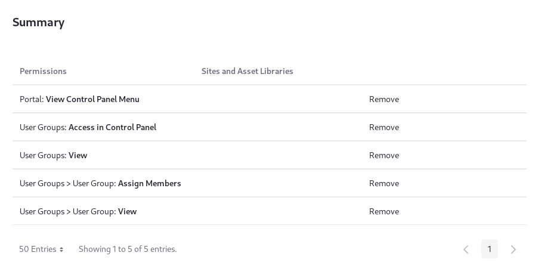

# Defining Role Permissions

Roles collect permissions, so when users are given a role, they inherit all its permissions.

If you create a role with permission to access something in the Control Panel, the *View Control Panel Menu* permission is automatically granted.

To determine the permissions to carry out an action within Liferay, iteration is necessary. Add one or two permissions, then test the role to ensure the behavior you the expected behavior. Creating more roles can help you better understand how to combine permissions to accomplish a given task.

!!! tip
    Assigning a user to the role and then [impersonating the user](./../users/adding-and-managing-users.md#impersonating-users) is a good way to see what permissions the user has inherited from the role.

To define permissions for any role in Liferay,

1. Open the *Global Menu* () and navigate to *Control Panel* &rarr; *Roles*.

1. Go to Regular, Site, Organization, Asset Library, or Account to manage the existing roles. Otherwise, click *New* to [create a new one](./creating-and-managing-roles.md).

1. Go to the *Define Permissions* tab.

1. Use the checkboxes to define permissions for the role.

1. Click *Save*.

Use the search bar to find the permissions you need.

!!! note
    The Roles application in the Global Menu is the main place to configure permissions for a role. But you can also configure permissions on a resource at a more granular level. For example, you can configure permissions on a particular widget from its Permissions menu. Permissions granted or removed in the Control Panel override permissions defined at the more granular level.

## Example: Defining a User Group Manager

You can create a role called user group manager to manage user groups in a virtual instance. After creating the role, you must define its permissions. The assigned [role users](./assigning-users-to-roles.md) can act on all user groups in a virtual instance:

- Add users to any user group.
- Remove users from any user group.

After creating a regular role titled *User Group Manager*, go to *Define Permissions*.

1. Drill down in the menu on the left to *Control Panel* &rarr; *Users* &rarr; *User Groups*.

   Alternatively, filter the permissions menu by entering *user groups* in the search bar.

   

1. Under the *General Permissions* heading, flag *Access in Control Panel* and *View*. This lets user group managers access the user groups control panel portlet and view existing user groups.

1. As you want to enable user group managers to view user groups and assign members to them, check the *Assign Members* and *View* permissions under the *Resource Permissions* &rarr; *User Group* heading.

1. Click *Save*.

Now the user group manager role has all the permissions necessary for adding users to user groups. User group managers can view user groups, assign members, and access user groups from the Global Menu. The permission to view users in the control panel is necessary because you must view users to assign them as members of a role. Without this permission, user group managers see an empty list if they try to add users to a role.

## Permissions Overview

There are several categories of permissions:

**Control Panel:** Portal administrators can access the entire control panel section from the Global Menu. Control Panel permissions affect whether and how the control panel appears to different role users. For example, you can fine-tune whether a role grants view access to various applications in the control panel or get more granular and only grant access to an application's configuration actions.

**Commerce:** Commerce permissions affect whether and how the Commerce menu appears to different role users when they open the Global Menu. For example, a supplier can only access channels and catalogs when they access the Commerce section from the Global Menu whereas an administrator can view all the options.

**Applications Menu:** The Applications Menu permissions affect whether and how the Applications menu appears to different role users when they open the Global Menu.

{bdg-secondary}`Liferay DXP 2024.Q3+/Portal 7.4 GA132+` **Objects:**__** After creating and publishing a custom object, it appears under the Objects section. You can then set both resource and application permissions related to the object for the role user by selecting it from the left menu. Only objects without a parent and a set panel link appear under the Objects section. If you've chosen a panel link, the object appears under the corresponding section.

**Site and Asset Library Administration:** Site administrators can access the site administration tools belonging to the site administration category. The permissions in the Site and Asset Library Administration &rarr; Applications categories govern the content that can be created by applications such as the wiki and message boards. If you pick one of the applications from this list, you see options for defining permissions on its content. For example, if you pick message boards, you see permissions for creating categories and threads or deleting and moving topics.

Site application permissions affect the application as a whole, throughout the scope of the role (e.g., all sites in the virtual instance for regular roles). For example, granting message boards application permissions to add the message boards widget to a page for an organization role means that organization users with this role can take the action on any page in any site owned by the [organization](../organizations/understanding-organizations.md).

**User:** By default, users inherit the user role, and can manage their user accounts via the permissions belonging to the user category. These permissions can be used to define a new role for users, to provide fewer permissions on the users' accounts than the default user role. You can then use the [default associations](./assigning-users-to-roles.md#default-user-associations) configuration to replace the original user role with your more restrictive role (perhaps named *Restricted User* or *Custom User* to differentiate it).

When defining a custom role you can mix and match permissions from all of these categories. You may find that a certain permission grants more or less access than what you expected---always test your permissions configurations! 

## Troubleshooting: Site Roles May Require Global View Permissions

A site role cannot, by definition, define permissions to act on entities outside the site scope. This can be problematic when defining administrative type permissions for a custom role. For example, if you try to duplicate the default site administrator role for a custom site administrator role, you'll find that adding all the *Site and Asset Library Permissions* &rarr; *People* &rarr; *Membership* permissions isn't enough to assign new members to the site. Users that aren't already site members are not visible to the custom site administrator. To grant proper permissions, you need a regular role on top of the site role. To give the regular role view permission on the user resource, go to *Define Permissions*, then *Control Panel* &rarr; *Users* &rarr; *Users and Organizations*. Users with the site role and the regular role can now see the users in the system and add them to the site.

!!! note
    The built-in site administrator role automatically grants permission to view users.
