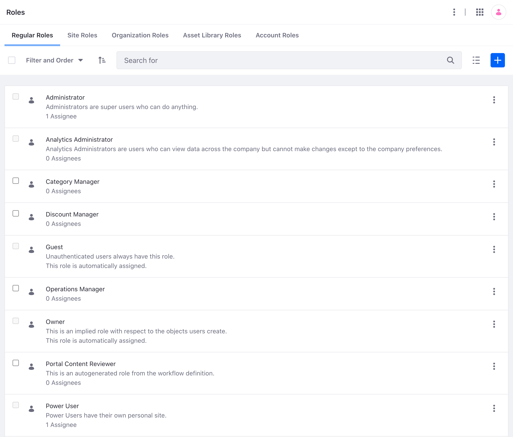

# Understanding Roles and Permissions

To get things done in Liferay DXP, [Users](../users.md) must have the proper permissions. Roles join users with permissions. Most administrative work for roles and permissions is done in *Control Panel* &rarr; *Users* &rarr; *Roles*.

To skip straight to creating roles and assigning users, see

- [Role Creation and Management](./creating-and-managing-roles.md)
- [Defining Role Permissions](./defining-role-permissions.md)
- [Assigning Users to Roles](./assigning-users-to-roles.md)

!!! note
    [Site Teams](../../site-building/sites/site-membership/creating-teams-for-sites.md) have a dedicated permissions management User Interface.

## Roles and Scope

To give users the necessary permissions to perform their intended function within Liferay DXP, you must first associate the set of permissions with a role.

Using a *Message Boards Admin* role and a user *Jane Slaughter* as an example, here are the steps you might follow:

1. Determine the function needed: *Manage Message Boards in Liferay DXP.*
1. Determine the scope: *Throughout the Virtual Instance (globally).*
1. Create the properly scoped role, assigning the permissions that power the function: *Message Boards Admin (Regular Role).*
1. Create the user collection: *a User Group called Message Boards Administrators.*
1. Assign the role to the user collection: *Message Boards Administrators &rarr; Message Boards Admin Role.*
1. Assign users to the user collection: *Jane Slaughter &rarr; Message Boards Administrators.*

The conceptual diagram below shows how the user inherits the necessary permissions in Liferay DXP's roles and permissions system. Only one fully-wired role assignment is displayed here (for the user who becomes a Message Boards Administrator), but you can see how drawing new arrows would link the user with permissions via other user collections and role assignments.

Roles have scope, so they apply at different levels.

| Permission Scope                         | Role Type     | Where is it assigned to users?                                                                             | Available Assignments                                                             |
| :--------------------------------------- | :------------ | :--------------------------------------------------------------------------------------------------------- | :-------------------------------------------------------------------------------- |
| Throughout the Virtual Instance (global) | Regular       | Control Panel &rarr; Users &rarr; Roles (Click on the Role) &rarr; Assignees                               | User groups  Organizations  Sites  Segments  Individual users |
| A single organization                    | Organization  | Control Panel &rarr; Users &rarr; Users and Organizations &rarr; Organizations (Organization actions menu) | Individual users                                                                  |
| A single Site                            | Site          | Site Administration &rarr; People &rarr; Memberships                                                       | User groups  Organizations  Segments  Individual site members      |
| A single Asset Library                   | Asset Library | Site/Library Administration of Asset Library &rarr; People &rarr; Memberships                              | Organizations  User groups   Individual users                           |

<!-- ripped out row from above table as per LRODCS-8188: | A single Account | Account   | Control Panel &rarr; Accounts &rarr; Accounts (Select Account) &rarr; Roles | Individual Account Members -->

Individual [users](./../users.md) can be manually assigned to roles. This method is less efficient than using collections of users. Users can also be [automatically](../../system-administration/configuring-liferay/virtual-instances.md) assigned to roles of all scopes through a virtual instance setting called *Default User Associations*.

### Regular Roles

Instance scoped roles are called regular roles. These roles grant permissions globally, or throughout the [virtual instance](../../system-administration/configuring-liferay/virtual-instances.md).

Several user collections can be assigned to regular roles:

- [Organizations](./../organizations/understanding-organizations.md) hold users of a shared hierarchical level.
- [User Groups](./../user-groups/creating-and-managing-user-groups.md) hold users performing the same function.
- [Sites](./../../site-building/sites/site-membership/adding-members-to-sites.md) hold users (as site members) that may perform a certain action.
- [Segments](./../../site-building/personalizing-site-experience/segmentation/creating-and-managing-user-segments.md) hold users of a site that match certain conditions.

### Organization Roles

Organization scoped roles are called organization roles. Permissions for organization roles are defined at the global level and are applied to one specific [organization](../../users-and-permissions/organizations/understanding-organizations.md). users are added to organizations individually and are assigned to organization roles individually.

### Site Roles

Site scoped roles are called site roles. Permissions for site roles are defined at the global level and are applied to one specific [Site](../../site-building/getting-started-with-site-building.md). You can use individual users, organizations, and user groups to control site membership and assign site roles.

## Permissions

Permissions are created by developers of applications. They define actions users can perform or how much access a user has to a particular asset.

### Application Scoped Permissions

Permissions can be granted on each widget instance that's placed on a page in Liferay DXP, and each administrative application in the Site Menu &rarr; Content and Data section. See [Widget Permissions](../../site-building/creating-pages/page-fragments-and-widgets/using-widgets/configuring-widgets/setting-widget-permissions.md) for details.

### Asset Scoped Permissions

Asset-level permissions (for instance, permission to edit an individual blog post, or view a folder in the Documents and Media library) are managed from the individual asset, not the Control Panel. See [Widget Permissions](../../site-building/creating-pages/page-fragments-and-widgets/using-widgets/configuring-widgets/setting-widget-permissions.md) for details.

## Related Topics

- [Role Creation and Management](./creating-and-managing-roles.md)
- [Defining Role Permissions](./defining-role-permissions.md)
- [Assigning Users to Roles](./assigning-users-to-roles.md)