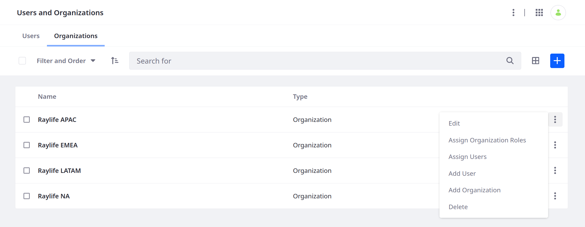

---
toc:
  - ./users/adding-and-managing-users.md
  - ./users/updating-user-profile-pictures.md
uuid: 1deb0a93-059a-4371-9bd1-06630dc6e6d6
taxonomy-category-names:
- Security
- User, Organization, and Account Management
- Liferay Self-Hosted
- Liferay SaaS
- Liferay PaaS
---
# Users

Every person who accesses a Liferay site is considered a user. Unauthenticated users are considered *Guest* users. Liferay ships out-of-the-box with a default admin user who has complete control of and access to the system. [Roles and permissions](./roles-and-permissions.md) govern what users are able to see and do on a site.

Users break down into three general categories:

| User                                                                        | Default Access                                                                                                              | Notes                                                                                                |
|:----------------------------------------------------------------------------|:----------------------------------------------------------------------------------------------------------------------------|:-----------------------------------------------------------------------------------------------------|
| [Administrator](../getting-started/introduction-to-the-admin-account.md) | Liferay Admin with full system access.                                                                                      | We *strongly* recommend that users change the password for this account promptly after installation. |
| Guest                                                                       | Unauthenticated user with view access to publicly accessible pages as well as limited ability to create and add content.    | By default, Guest users can create an account on a Liferay site to view and interact with sites.     |
| User                                                                        | Authenticated user able to view restricted pages and create content.                                                        | Users get defined default permissions and can be elevated to organization or site administrators.    |

## Managing Users

To add and manage users, open the *Global Menu* () and go to *Control Panel* &rarr; *Users and Organizations*..

Here, you can manage each user's metadata (name, department, etc.), permissions, pages, and activation status.

You can also filter, sort, search, and change the view layout for users using the controls available.

When filtering users, you can select *All*, *Inactive*, or *Active* users. There's also an option to *FILTER BY DOMAIN* where you can choose between users that belong to an account or organization.

{bdg-secondary}`Liferay DXP 2024.Q1+/Portal 7.4 GA112+` There's a new option under the *FILTER BY DOMAIN* section to filter *Unassociated Users*. These are users that don't belong to an account or organization.

## Adding Users

Administrators can add users through the Users and Organizations section of the Control Panel or [through the API](./developer-guide/user-account-api-basics.md). New users can be created by administrators, can register themselves if open registration is configured, or can be synced from an LDAP server. See [Adding and Managing Users](users/adding-and-managing-users.md) for more information.

## Managing User Access

User access is controlled by roles and permissions. Permissions define what a user can and cannot do. Roles are groupings of permissions. Permissions are configured by defining permissions for a role and assigning users to pre-set roles. To learn more about managing access for users, see [Roles and Permissions](./roles-and-permissions.md).

## Organizing Users

Liferay has several tools to help you organize and administer users.

[Organizations](./organizations/understanding-organizations.md) can group users in a distributed hierarchy. Practically, this means that large organizations can empower and delegate users to administer their organizations.

[User groups](./user-groups/creating-and-managing-user-groups.md) are another way to group users to simplify administration and assigning roles. User groups are simple lists of users that can have roles assigned to them.

## Related Topics

- [Adding and Managing Users](./users/adding-and-managing-users.md)
- [Organizations](./organizations/understanding-organizations.md)
- [User Groups](./user-groups/creating-and-managing-user-groups.md)