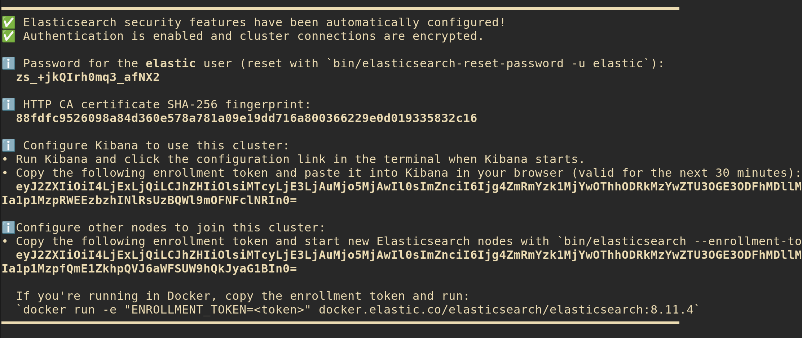
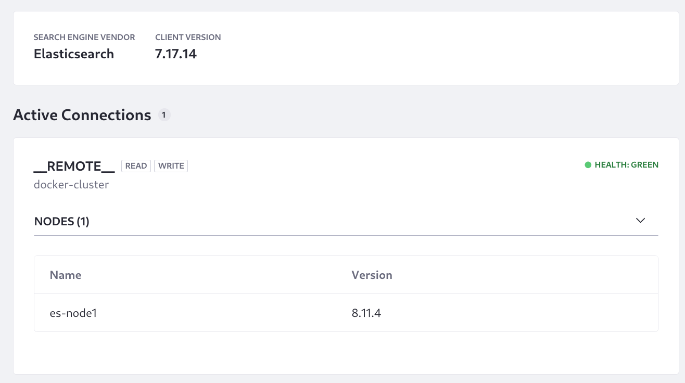

# Exercise: Run Liferay and Elasticsearch Using Docker

{bdg-secondary}`7.3+`

Here you can walk through a minimal Liferay-Elasticsearch setup on your local machine to see how a secure [REST Client](https://www.elastic.co/guide/en/elasticsearch/client/java-rest/7.x/java-rest-high.html) connection between Elasticsearch and Liferay is configured. The example uses two Docker containers: one Elasticsearch container and one Liferay container. For more conceptual and production-like information see [Installing Elasticsearch](./getting-started-with-elasticsearch.md).

## Create Local Folders for Bind Mounting to the Docker Containers

Create local folders that can be bind mounted to the Elasticsearch and Liferay containers' system folders for providing plugins and configuration files. Since Elasticsearch must write to the mounted folder, the `-m a+w` modifier is given to the following `mkdir` command. You must understand and apply the proper permissions applicable to your system:

```bash
mkdir -p test-es-install/dxp/files/osgi/configs && mkdir -p test-es-install/elasticsearch -m a+w && cd test-es-install
```

!!! tip
    The `cd test-es-install` command at the end puts you in the `test-es-install` folder. Make sure you run the remaining commands for both Elasticsearch and Liferay from this folder.

## Install Elasticsearch

1. Configure and start an Elasticsearch container named `elasticsearch`:

   ```bash
   docker run -it --name elasticsearch -m 1g -p 9200:9200 -e "discovery.type=single-node" -e "node.name=es-node1" -v $(pwd)/elasticsearch:/usr/share/elasticsearch/data docker.elastic.co/elasticsearch/elasticsearch:8.11.4
   ```

   Once started, log messages with important security information are printed:

   

1. Copy the password for the elastic user locally.

1. Obtain the keystore password. Open a new terminal window, then open an interactive shell on the new container:

   ```bash
   docker exec -it elasticsearch /bin/bash
   ```

1. Use `./bin/elasticsearch-keystore` to print the password to the command line:

   ```bash
   ./bin/elasticsearch-keystore show xpack.security.http.ssl.keystore.secure_password
   ```

   Copy the keystore password locally.

1. Install the required Elasticsearch plugins:

   ```bash
   ./bin/elasticsearch-plugin install analysis-icu && /usr/share/elasticsearch/bin/elasticsearch-plugin install analysis-kuromoji && /usr/share/elasticsearch/bin/elasticsearch-plugin install analysis-smartcn && /usr/share/elasticsearch/bin/elasticsearch-plugin install analysis-stempel
   ```

1. When the plugins are installed, exit the shell by typing `exit`.

1. Restart the Elasticsearch container to register the plugins. CTRL+C stops the container. Start it again by running 

   ```bash
   docker start -i elasticsearch
   ```

1. On first startup, Elasticsearch created a security certificate you need for encrypting the HTTP connection with Liferay. Copy the `certs` folder from the running container to the `test-es-install/dxp/files/` folder:

   ```bash
   docker cp elasticsearch:/usr/share/elasticsearch/config/certs/ dxp/files/
   ```

1. Docker must copy these into the Liferay container, and Liferay must read from these files, so make sure the file permissions are appropriate:

   ```bash
   chmod -R a+rwx dxp/files/certs/
   ```

   This is for local testing only. You must understand and ensure the permissions are appropriate for your system. 

1. Get the `elasticsearch` container's IPv4 address so it can be added to Liferay's `docker run` command:

   ```bash
   docker network inspect bridge
   ```

   Copy the IPv4 address locally.

## Install Liferay

Specify the properties Liferay needs to connect with Elasticsearch; then run the Liferay container.

1. First populate the Elasticsearch 7 configuration file. Create the file `com.liferay.portal.search.elasticsearch7.configuration.ElasticsearchConfiguration.config`:

   ```bash
   touch dxp/files/osgi/configs/com.liferay.portal.search.elasticsearch7.configuration.ElasticsearchConfiguration.config
   ```

1. Open the file and give it these contents, replacing the `password` and `truststorePassword` with those you copied from Elasticsearch, and inserting the IPv4 of the `elasticsearch` container in the `networkHostAddresses` property if it's different: 

   ```properties
   password="[ELASTIC_PASS]"
   truststorePassword="[KEYSTORE_PASS]"
   networkHostAddresses="https://172.17.0.2:9200"

   authenticationEnabled=B"true"
   httpSSLEnabled=B"true"
   logExceptionsOnly="false"
   productionModeEnabled=B"true"
   truststorePath="/opt/liferay/certs/http.p12"
   truststoreType="pkcs12"
   username="elastic"
   ```

   Save and exit the file.

1. Now the security certificate files and the configuration file are in place. They've been added to folders on the host system that the Liferay Docker container can read from (`test-es-install/dxp/files`). Start the Liferay container:

   ```bash
   docker run -it --memory 9g --name liferay --publish 8080:8080 --volume $(pwd)/dxp:/mnt/liferay [$LIFERAY_LEARN_PORTAL_DOCKER_IMAGE$]
   ```

   If you're using Liferay 7.3, replace the version in the command above.

1. **Checkpoint:** Verify that the Elasticsearch connection is active in Control Panel &rarr; Configuration &rarr; Search.

   

Re-index your search and spell check indexes. Both re-index actions are carried out from the Index Actions tab of Control Panel &rarr; Configuration &rarr; Search.

## Cleaning Up Exercise Files

To clean up all the items created for this exercise, first stop the containers, then

1. Remove the docker containers:

   ```bash
   docker container rm elasticsearch liferay
   ```

1. Remove the folder structure. First make sure you're in the parent of the test installation folder (i.e., `../test-es-install`)., then run

   ```bash
   rm -fr test-es-install
   ```

This leaves you with just the Docker images you used to create the containers. If desired, you can remove those with the `docker image rm [image-name]` command.

## Related Topics

* [Securing Elasticsearch](./securing-elasticsearch.md)
* [Liferay Enterprise Search](../../liferay-enterprise-search.md)
* [Search Pages](../../search-pages-and-widgets/working-with-search-pages/search-pages.md)
* [Search Administration](../../search-administration-and-tuning/search-administration.md)
* [Elasticsearch Connector Settings](./elasticsearch-connector-configuration-reference.md)
