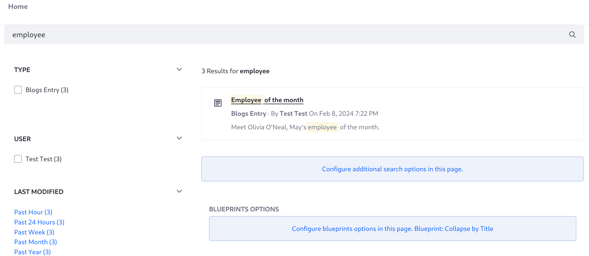

---
taxonomy-category-names:
- Search
- Liferay Enterprise Search
- Search Experiences and Blueprints
- Liferay Self-Hosted
- Liferay PaaS
- Liferay SaaS
uuid: 46e00046-f0b0-4700-b73f-6d75d914800d
---

# Collapsing Search Results

{bdg-secondary}`Liferay DXP 2023.Q4+`

You can collapse search results that have identical keyword field values. For example, an internal blog titled "Employee of the Month" produces multiple, identically titled search results. To show only the best matching result, use the `collapse` configuration. See Elasticsearch's [Collapse Search Results](https://www.elastic.co/guide/en/elasticsearch/reference/current/collapse-search-results.html) for details on how the feature works.


By default, collapsing results causes inaccurate result counts and pagination, because the total hits in the search response does not account for collapsing. For example, imagine a search query that returns 100 results over 5 pages, where 90 results have identical titles. Collapsing these results by the title field results in this situation on Liferay's search page:

1. The search user sees one page of results with 11 results: the top scoring collapsed result and the 10 remaining unique results.
1. The displayed results count is 100.
1. The displayed pages count is 5.


You can fix this with a [Search Blueprint](./creating-and-managing-search-blueprints.md).

## Example: Collapse Results by Localized Title

1. Open _Site Menu_ () &rarr; _Content & Data_ &rarr; _Blogs_, and create three blogs with these field values:

   Blog 1, Title:

   ```
   Employee of the month
   ```

   Blog 1, Content:

   ```
   Meet Rex Randle, employee of the month for March.
   ```


   Blog 2, Title:

   ```
   Employee of the Month
   ```

   Blog 2, Content:

   ```
   Meet Olivia O'Neal, employee of the month for April.
   ```

   Blog 3, Title:

   ```
   Employee Of The Month
   ```

   Blog 3, Content:

   ```
   Meet Preston Palmer, employee of the month for May.
   ```

1. [Create a blueprint](./creating-and-managing-search-blueprints.md). Open _Global Menu_ () &rarr; _Applications_ &rarr; _Blueprints (Search Experiences)_.

1. Click _New_, enter the title _Collapse by localized title_, and click _Create_.

1. Open the [preview window](./creating-and-managing-search-blueprints.md#testing-a-blueprint-with-the-preview-sidebar) and search for `employee`. Three results appear.

1. Open _Configuration_ and enter this in the Advanced Configuration field:

   ```json
   {
      "collapse": {
         "field": "localized_title_${context.language_id}_sortable.keyword_lowercase"
      }
   }
   ```
1. In the preview window, search for _employee_ again. A single result appears.

1. If you're using the blueprint on a search page, save it and [apply it to the search page](./using-a-search-blueprint-on-a-search-page.md).



## Related Topics

- [Creating and Managing Search Blueprints](./creating-and-managing-search-blueprints.md)
- [Working with Search Pages](../../../search-pages-and-widgets/working-with-search-pages.md)
- [Search Results](../../../search-pages-and-widgets/search-results.md)
