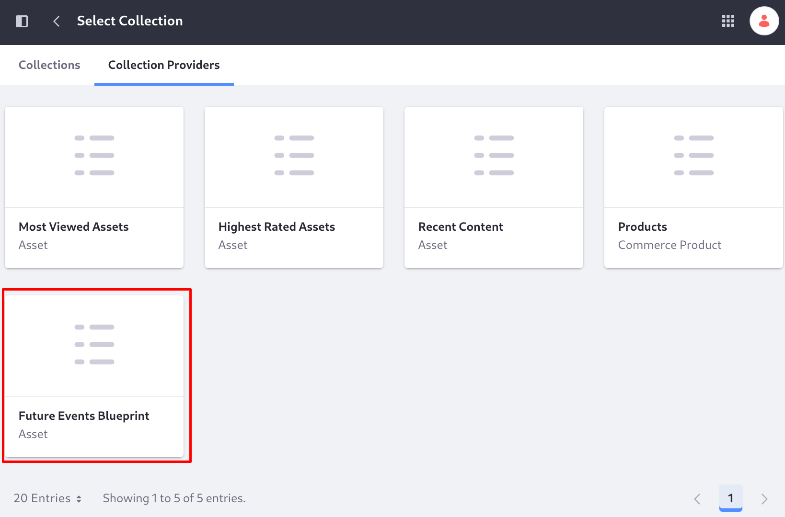
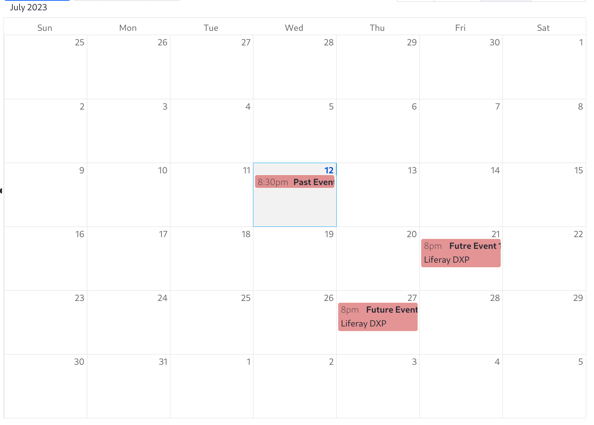

---
taxonomy-category-names:
- Search
- Liferay Enterprise Search
- Search Experiences and Blueprints
- Collections
- Liferay Self-Hosted
- Liferay PaaS
- Liferay SaaS
uuid: f70fbde9-da00-4de9-b63c-524720b4222c
---

# Collections with Search Blueprints

{bdg-secondary}`7.4 U88+`
{bdg-link-primary}`[Beta Feature](../../../../system-administration/configuring-liferay/feature-flags.md)`

When you create a search blueprint, a [collection provider](../../../../site-building/displaying-content/collections-and-collection-pages/collection-providers.md) is registered automatically. Assets matching the blueprint's query and configuration are added to the collection.

```{important}
Only content registered with Liferay's [Asset Framework](../../../../building-applications/data-frameworks/asset-framework.md) is returned by the blueprints collection provider.
```



To use a search blueprint's collection provider,

1. Enable the [beta feature flag](../../../../system-administration/configuring-liferay/feature-flags.md) for LPS-129412.

   A blueprint's collection provider is registered only when Liferay starts or the blueprint is published. If you have existing blueprints when you enable the feature flag, you must edit each blueprint and save it to register its collection provider.

1. [Create a blueprint](./creating-and-managing-search-blueprints.md).

1. In a content page's editor, add the Collection Display fragment.

   You can also use the collection provider when adding collection pages.

1. Choose the blueprint's collection provider in the Collection Provider field.

As with other collections, you can filter the blueprint-driven collection by keywords or categories with a [collection filter](../../../../site-building/displaying-content/additional-content-display-options/filtering-collections-on-a-page.md).

## Example: Showing Future Events

Create calendar events and configure a blueprint to return only events that happen in the future. Display the events on a content page using the collection display fragment:

1. Enable the [beta feature flag](../../../../system-administration/configuring-liferay/feature-flags.md) for LPS-129412.

1. Create a page and add the Calendar widget to it.

1. Create three calendar events: 

   * Past Event: configure it to happen in the next five minutes and last 15 minutes (or less).
   * Future Event 1: Make an event that starts in the future.
   * Future Event 2: Make another event that occurs in the future.

   

1. From the Applications menu (), open _Blueprints_. 

1. In the Elements tab, add a new custom element with this JSON:

   ```json
   {
      "description_i18n": {
         "en_US": "Limit results to only future events, using the endTime field."
      },
      "elementDefinition": {
         "category": "filter",
         "configuration": {
            "queryConfiguration": {
               "queryEntries": [
                  {
                     "clauses": [
                        {
                           "context": "query",
                           "occur": "filter",
                           "query": {
                              "range": {
                                 "endTime": {
                                    "gt": "${time.current_date|date_format=timestamp}"
                                 }
                              }
                           }
                        }
                     ]
                  }
               ]
            }
         },
         "icon": "filter",
         "uiConfiguration": {}
      },
      "title_i18n": {
         "en_US": "Limit Results to Future Events."
      },
      "type": 0
   }
   ```

1. In the Blueprints tab, build a blueprint to match only calendar events that are in the future:

   * Title: Enter _Future Calendar Events Provider_.
   * Query Settings: select _Calendar Events_ in Searchable Types.
   * Query Elements: add the _Limit Results to Future Events_ element.

1. Save the blueprint.

1. From the site menu (), add a content page called Upcoming Events.

1. Add the Collection Display fragment to the page and select the _Future Calendar Events Provider_ Collection Provider.

   Configure the collection display fragment to show a bullet list.

1. Publish the page, and the future calendar events appear.


Leverage blueprints to return your results dynamically, and reap the benefits of the fragments toolbox to lay out the page.
