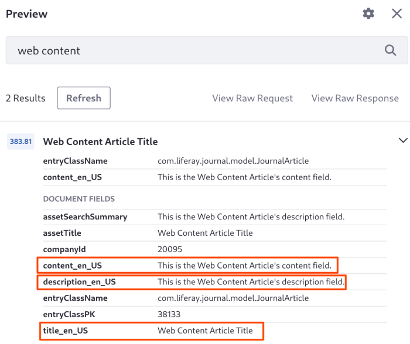

# Filtering by Stored Fields to Limit the Response Size

By default, Liferay requests all [stored fields](https://www.elastic.co/guide/en/elasticsearch/reference/7.x/mapping-store.html) from Elasticsearch. Stored fields are specified in the mappings:

```json
"userId": {
   "store": true,
   "type": "keyword"
},
```

Usually, returning all stored fields is innocuous, but in rare cases an overly large response can result in ERROR messages from Elasticsearch:

```bash
ERROR [http-nio-8080-exec-335][ElasticsearchIndexSearcher:165] java.lang.RuntimeException: java.io.IOException: entity content is too long [117672846] for the configured buffer limit [104857600]
```

If too many large documents are returned in the response, the response size can become larger than Elasticsearch's maximum allowed response size.

To reduce the response size of searches and improve performance generally, you can filter the stored fields. For this you must [create a Search Blueprint](./creating-and-managing-search-blueprints.md) with JSON like the following in the [Advanced Configuration](search-blueprints-configuration-reference.md#advanced-configuration) field:

```json
{
   "source": {
      "fetchSource": false
   },
   "stored_fields": [
      "userId"
   ]
}
```

This configuration communicates two things:

1. Do not include the source field in the response.
1. Return  just the `userId` field.

!!! note
   If you inspect the response or use the _View Results in Document Form_ setting in the Search Results widget, you can see that more fields are returned than those declared in `stored_fields`. Liferay's search framework automatically adds certain fields needed for Liferay to function properly, such as `entryClassName`, `entryClassPK`, and `companyId`.


## Returning Fields for Summaries in the Search Results Widget

The Search Results widget requires certain fields in the response for generating [result summaries](../../../search-pages-and-widgets/search-results/search-results-behavior.md#result-summaries). The summary fields are asset-specific, but many assets require at least the localized version of the title, content, and description fields. 


Your use case determines the fields you should return in the response.

Fields available for display in the Search Results summaries are defined by the Search Results widget's display logic ([`SearchResultsSummaryDisplayBuilder`](https://github.com/liferay/liferay-portal/blob/[$LIFERAY_LEARN_PORTAL_GIT_TAG$]/modules/apps/portal-search/portal-search-web/src/main/java/com/liferay/portal/search/web/internal/result/display/context/builder/SearchResultSummaryDisplayContextBuilder.java) and [`SearchResultsSummaryDisplayContext`](https://github.com/liferay/liferay-portal/blob/[$LIFERAY_LEARN_PORTAL_GIT_TAG$]/modules/apps/portal-search/portal-search-web/src/main/java/com/liferay/portal/search/web/internal/result/display/context/SearchResultSummaryDisplayContext.java)).

## Example: Limiting the Fields Returned in the Search Response

Although uncommon, if you have a system with lots of translated content, your search response could become too large, resulting in errors from Elasticsearch. One workaround is to disable unneeded locales in Liferay, to avoid returning more translated fields than necessary. Another approach is limiting the fields returned in the response with a search blueprint, as described here:

1. First add a web content article. Open the Site menu () and go to *Content & Data* &rarr; *Web Content*.

1. Click *Add* () &rarr; *Basic Web Content* and give it this content:

   - **Title:** Web Content Article Title
   - **Description:** Web Content Article Description
   - **Content:** Web Content Article Content


1. Open the Global Menu () &rarr; Applications &rarr; Blueprints (Search Experiences).

1. Click _Add_ ().

1. Name the blueprint _Filter Stored Fields_.

1. Open the blueprint's [_Preview_](./creating-and-managing-search-blueprints.md#testing-a-blueprint-with-the-preview-sidebar) screen, and search for _web content_.

1. Expand the document preview for the web content you created and observe that the document contains many fields:

   

1. Click _Configuration_.

1. Replace the contents of the Advanced Configuration field with this:

   ```json
   {
      "source": {
         "fetchSource": false
      },
      "stored_fields": [
         "content_${context.language_id}",
         "description_${context.language_id}",
         "title_${context.language_id}"
      ]
   }
   ```

   This configuration specifies that only the content, description, and title fields of the current session language should be returned in the response.

1. Open the blueprint's [_Preview_](./creating-and-managing-search-blueprints.md#testing-a-blueprint-with-the-preview-sidebar) screen, and search for _web content_ again.

1. Expand the document preview for the Test Test user and observe that the document contains only the fields you specified and a few added by Liferay's search framework:

   

Filtering the stored fields is rarely needed, but can be helpful if you're encountering Elasticsearch error messages about the response being too large.


## Related Topics

- [Creating Blueprints](./creating-and-managing-search-blueprints.md)
- [Search Blueprints Configuration Reference](./search-blueprints-configuration-reference.md)
- [Troubleshooting Elasticsearch Installation](../../../installing-and-upgrading-a-search-engine/elasticsearch/troubleshooting-elasticsearch-installation.md)
