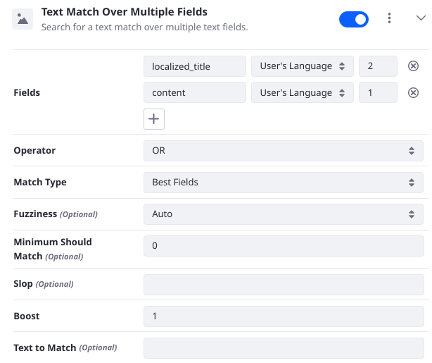
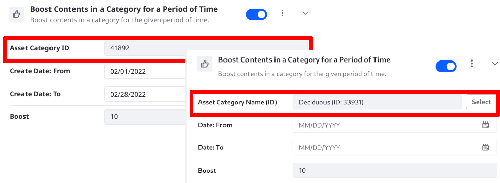
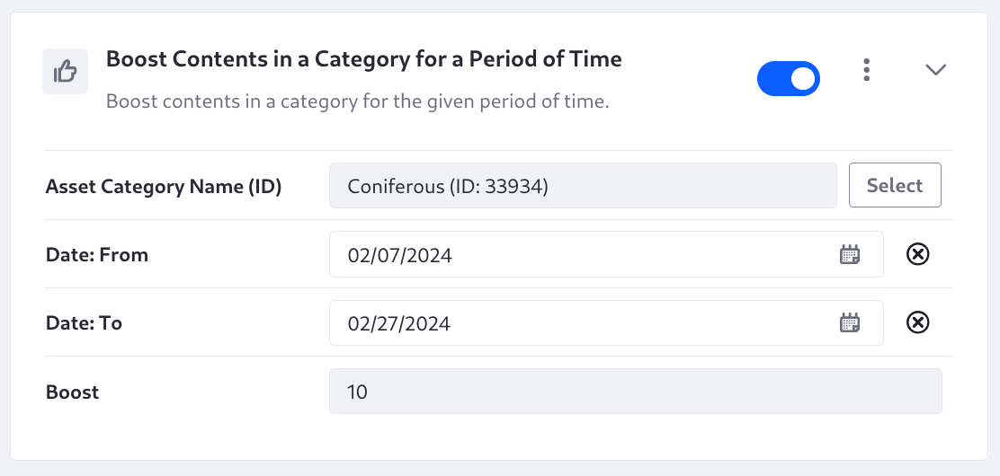
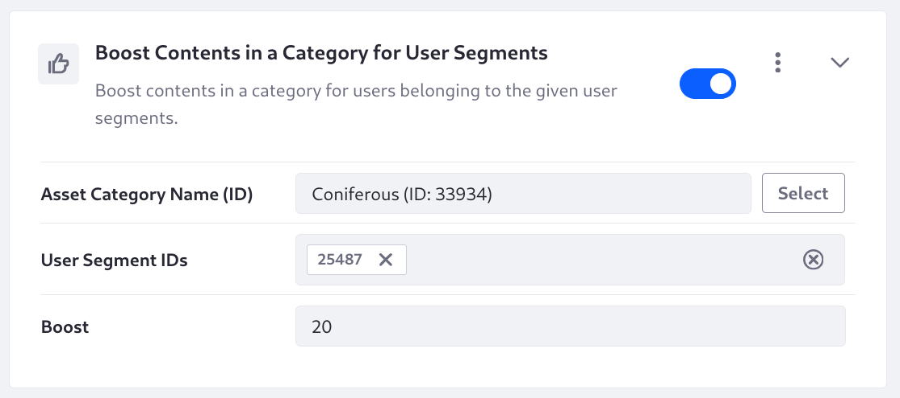
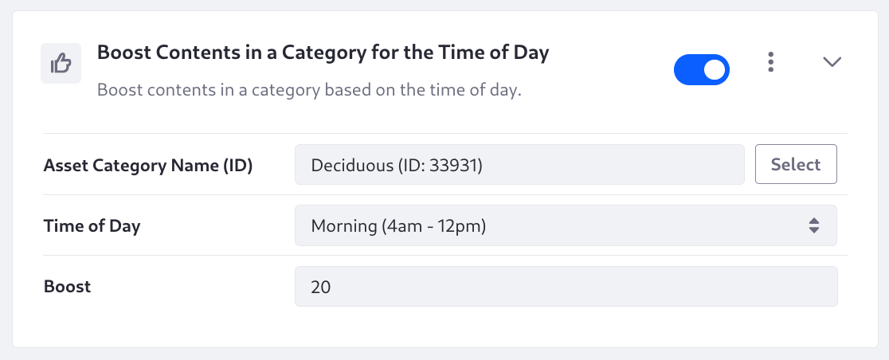
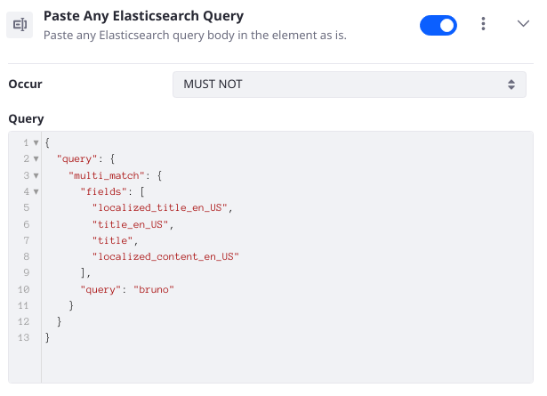

---
taxonomy-category-names:
- Search
- Liferay Enterprise Search
- Search Experiences and Blueprints
- Reference
- Liferay Self-Hosted
- Liferay PaaS
- Liferay SaaS
uuid: 0c38a48d-209a-428e-9d6c-72b0d8a52646
---
# Search Blueprints Elements Reference

Elements are one of the fundamental building blocks of a [Search Blueprint](understanding-search-blueprints.md#what-is-a-blueprint). To explore all the available Elements, navigate to the Global Menu () &rarr; Applications &rarr; Blueprints. Open the Elements tab, find an Element of interest, and click on it. You'll see the full JSON representation of the Element.

To add the Element to a Blueprint, [create a Blueprint](./creating-and-managing-search-blueprints.md) and use its Query Builder &rarr; Query Elements sidebar to search and add Elements.

To see the query configuration JSON for any Element while working in the Blueprints &rarr; Query Elements screen, click the Actions icon () &rarr; View Element JSON.

Each Element can be disabled or enabled in the Blueprint using the toggle switch in the Title Bar of the Blueprint. For a streamlined view of the Elements in the Blueprint, you can collapse the contents of an Element using the Down Arrow Icon () in the Title Bar of the Element.

Each Element has configuration options, many of which directly correspond to attributes of the query as defined in the Elasticsearch [Query DSL documentation](https://www.elastic.co/guide/en/elasticsearch/reference/8.13/query-dsl.html). Links to specific query types are provided below as appropriate.

Beginning in Liferay 2024.Q1, elements using asset categories and sites provide a selector instead of a requiring an ID in a basic text field. Retrieving numeric IDs is no longer necessary, but you can continue entering IDs manually if desired.

## Boost Some Results

A `boost` configured on an [Elasticsearch](https://www.elastic.co/guide/en/elasticsearch/reference/8.13/query-dsl-term-query.html#term-field-params) query adjusts the relevance score of matching results. Values over 1.0 increase the score, while values between 0 and 1.0 decrease it.

When boosting certain results, the boost value will need tuning to meet your specific needs. Use the [Preview Sidebar](creating-and-managing-search-blueprints.md#testing-a-blueprint-with-the-preview-sidebar)  to inspect how the documents are being scored and to fine-tune your boost values.

### Boost All Keywords Match

Use a Multi-match query to boost results if the search keywords match in the given fields. You can boost the Element's Multi-match query clause as a whole, and you can boost a match to each individual field. The _Text to Match_ configuration field is optional: if left blank, the search user's keywords are passed into the query.

- Field: choose which fields to search and whether to boost them individually.
- Match Type: specify the way the query is handled internally by Elasticsearch: _Most Fields_ is probably the most fundamental, as it creates a Match query for each specified field and combines the scores.
- Boost: adjust the relevance score of matching results. Because the default value is 1.0, Values over 1.0 increase the score, while values between 0 and 1.0 decrease it.
- Text to Match: match hardcoded keywords or leave blank to match the user's search keywords.

_External Reference_: See the Elasticsearch [Multi-match](https://www.elastic.co/guide/en/elasticsearch/reference/8.13/query-dsl-multi-match-query.html) query documentation.

### Boost Asset Type

Boost the given asset type. Select the Asset Type (required) from a list of registered [Assets](../../../../liferay-development/building-applications/data-frameworks/asset-framework.md) and configure the boost value.

### Boost Contents for the Current Language

Boost Pages and Web Content having with a default language matching the current session language, as stored in the `context.language_id` field. Configure the boost value.

### Boost Contents in a Category by Keyword Match

Boost contents in a category if the user's search keywords contain any of the configured keywords. The Keywords and Asset Category Name (ID) are required.

### Boost Contents in a Category for a Period of Time

Boost contents in a category for the given period of time. The Asset Category Name (ID), the start time, and the end time are all required. This Element is conditional: if the current date is outside of the configured date range, the query and its boost is not executed.

### Boost Contents in a Category for a User Segment

Boost contents in a category for users belonging to the given [User Segments](../../../../site-building/personalizing-site-experience/segmentation/creating-and-managing-user-segments.md). If entering more than one User Segment ID, enter a comma into the text box to begin entering the next ID. The Asset Category Name (ID) and the User Segment IDs are required fields. This is a conditional Element: the query is executed and boosted only if the `user.active_segment_entry_ids` contains the given Segment IDs.

### Boost Contents in a Category for Guest Users

Boost contents in a category if a user is not logged in. The Asset Category Name (ID) is required. This is a conditional Element, in that its query is only executed and boosted if the `user.is_signed_in` parameter is `false`.

### Boost Contents in a Category for New User Accounts

Boost contents in a category for user accounts created within the given time. The Asset Category Name (ID) and the Time range (in number of days) are required. An account created within the given number of days is considered a new account, and certain results are boosted for these users. This is a conditional Element: the query is executed and boosted only if the `user.create_date` parameter has a value within the given Time range.

### Boost Contents in a Category for the Time of Day

Boost contents in a category based on the time of day. Select one of these time ranges:

- Morning: 4AM-12PM
- Afternoon: 12PM-5PM
- Evening: 5PM-8PM
- Night: 8PM-4AM

### Boost Contents in a Category

Boost and promote contents in a given category. The Asset Category Name (ID) is required.

### Boost Contents on My Sites

Boost contents on sites the user is a member of. There are no required fields in this Element; as with other boosting Elements, configure the Boost value as desired. The Search Context contains a parameter `user.group_ids` to track the current user's groups, and if the current site's ID is part of that list, the query matches and the boost is applied.

### Boost Contents With More Versions

Boost results that have more versions. This Element executes a Function score query using a `field_value_factor` function on the `versionCount_sortable` keyword field. The Factor and the Modifier are required and are configurable in the Element. The combination of the factor, modifier, version count, and boost determine how a result is boosted.

- Factor: Set the factor to multiply the field value by; defaults to 1.2.
- Modifier: Use a modifier to apply to the field value; defaults to Square Root. Other options include None, log, log1p, log2p, ln, ln1p, ln2p, Square, or Reciprocal.
- Boost: Set the initial boost value; defaults to 10. The boost value is multiplied by the function score to get the final score adjustment.

_Example:_ If the version count for a document was `8`, and the default values were used in the Element, the score for the document is calculated as 

`10 * (sqrt (1.2 * 8))`

Therefore this document will have a score of about `30` added to it because of this Element.

_External Reference:_ See the Elasticsearch [Function score query](https://www.elastic.co/guide/en/elasticsearch/reference/8.13/query-dsl-function-score-query.html) documentation.

### Boost Freshness

Boost contents modified recently using a Gaussian function.

The Gaussian function used to score documents by their freshness might need to be adjusted. You can adjust the Decay, Scale, Offset, and Boost in the Boost Freshness Element configuration:

- Decay defines the factor by which to reduce the boost value when the freshness of the asset is equal to the sum of the Scale and Offset values.
- Offset is the number of days (in the past) from now, above which the relevance of results should begin to deteriorate as calculated by the decay function.
- Scale is added to Offset to determine the number of days (in the past) from now when the relevance of results will equal the Decay parameter.
- Boost is the beginning numeric value to boost results that are within the defined scale.

_External Reference:_ See the Elasticsearch [Function Score Query](https://www.elastic.co/guide/en/elasticsearch/reference/8.13/query-dsl-function-score-query.html) documentation for more details.

### Boost Longer Contents

Using a Function Score Query's Field Value Factor, boost results with longer content field data in the user's current language.

The `${context.language_id}` parameter is used to get the `content_${context.language_id}_length_sortable` field's value, a numeric field. Using a function (the natural logarithm by default) with the numeric field value, a modification to the score of the document is calculated.

You can adjust the Boost, Factor, and Modifier in the Element configuration:

- Boost is the numeric value to boost results after they've been scored by the function.
- Factor is the value to multiply the field value by.
- Modifier defines the function to use when modifying the field value.

_External Reference:_ See the Elasticsearch [Function Score Query](https://www.elastic.co/guide/en/elasticsearch/reference/8.13/query-dsl-function-score-query.html) documentation for more details.

### Boost Proximity

Boost contents in closer proximity to the search user with a Gaussian function.

The Boost Proximity element uses the [ipstack](https://ipstack.com) service to boost search results closer to a user's location, as marked by a [geopoint](https://www.elastic.co/guide/en/elasticsearch/reference/8.13/geo-point.html) field in the document.

A search document must have a [geopoint field](https://www.elastic.co/guide/en/elasticsearch/reference/8.13/geo-point.html) to work with the ipstack service and the Boost Proximity Element. Liferay includes compatible Geolocation fields that you can add as a Custom Field to existing assets.

See [Personalizing the Search Experience](./personalizing-the-search-experience.md) for details on setting up the ipstack service, using a custom geolocation field, and adding the Boost Proximity element to a Blueprint.

### Boost Tagged Contents

Boost contents having at least one of the given tags. Enter multiple tag names using a comma-separated list.

### Boost Tags Match

Boost contents with an exact keyword match to a tag. The search user's keywords are compared with the `assetTagNames.raw` field content (this makes a keyword field out of the `assetTagNames` text field), and if the term query matches in a document, its score is boosted by the configured value.

_External Reference:_ See the Elasticsearch [Term query](https://www.elastic.co/guide/en/elasticsearch/reference/8.13/query-dsl-term-query.html) documentation.

### Boost Web Contents by Keyword Match

Boost certain Web Content if the user's search keywords contain the given keywords. Configure the Article IDs and the Keywords to match.

## Filter Results

When you filter search results, you are asking a yes or no question: does the document's fields match the query? In this case you're not concerned about the relevance (i.e., how well does it match?). Several filtering Elements are provided to help narrow the scope of what's returned in the Search Results. They all contribute queries to the `filter` block of the main [search request](./understanding-search-blueprints.md#understanding-the-search-request).

### Filter by Exact Terms Match

Filter results by matching (using a Terms query) one or multiple terms to a field value. At least one must match for the filter to be applied.

_External Reference:_ See the [Elasticsearch Terms query](https://www.elastic.co/guide/en/elasticsearch/reference/8.13/query-dsl-terms-query.html) documentation.

### Limit Search to Contents Created Within a Period of Time

Filter results using a Range query. Configure the time range.

_External Reference:_ See the [Elasticsearch Range query](https://www.elastic.co/guide/en/elasticsearch/reference/8.13/query-dsl-range-query.html) documentation.

### Limit Search to HEAD Version

Limit the search to return only the latest version of Web Content articles. This Element duplicates the functionality of a Liferay Search Framework query clause and is most useful for advanced use cases. For example, if you've disabled Liferay's search framework from contributing its default search clauses, you can use this Element to restore part of the lost functionality.

### Limit Search to My Contents

Limit the search to contents the user is an owner of. This Element filters results by a Term query on the `userId` field, matching it to the `user.id` context parameter.

### Limit Search to My Sites

Limit the search scope to the sites that the user is a member of. This Element filters results by a Terms query on the `scopeGroupId` field, matching it to the `user.group_ids` context parameter.

### Limit Search to PDF files

Limit the search to PDF files. This Element filters results by a Term query on the `mimeType` field, matching its value with the hardcoded query value `application_pdf`.

### Limit Search to Published Contents

Limit the search to contents that are published. This Element duplicates the functionality of a Liferay Search Framework query clause and is most useful for advanced use cases. For example, if you've disabled Liferay's search framework from contributing its default search clauses, you can use this Element to restore part of the lost functionality.

This Element filters results using a Term query on the `status` field, matching its value to the hardcoded value of `0`, which represents published contents in [Liferay's Workflow system](../../../../process-automation/workflow/introduction-to-workflow.md#understanding-workflow-status).

### Limit Search to the Current Site

Limit the search to the current site. This Element filters results using a Term query on the `scopeGroupId` field, matching its value with the context parameter `context.scope_groupId`.

This Element's functionality overlaps with the [Search Bar's](../../../getting-started/searching-for-content.md#configuring-the-search-bar) Scope configuration option.

### Limit Search to These Sites

Limit the search scope to the given sites. Filter results using a Terms query on the `scopeGroupId` field, matching its value with the configured Group IDs.

The ID for a site is displayed in its Site Settings &rarr; Site Configuration screen.

This Element's functionality overlaps with the [Search Bar's](../../../getting-started/searching-for-content.md#configuring-the-search-bar) Scope configuration option. You must set the Search Bar scope to _Everything_ for this Element to work.

## Hide Some Results

By wrapping a query in a Boolean query with a Must Not occurrence clause, results can be hidden if they match the query.

_External Reference:_ See the [Elasticsearch Boolean query](https://www.elastic.co/guide/en/elasticsearch/reference/8.13/query-dsl-bool-query.html) documentation.

### Hide by Exact Term Match

Hide contents with an exact term match on the given field. When you choose a localized text field, localization options appear in the configuration.

### Hide Comments

Do not search for comments. This Element looks for documents with a `discussion` field. If the field exists and its content is anything but `false`, the document is not included in the search results.

### Hide Contents in a Category for Guest Users

Hide results in a category if the user is not logged in. This is a conditional Element: if the `user.is_signed_in` context parameter is `false`, results with the `assetCategoryIds` field matching the configured Asset Category Name (ID) are not returned.

### Hide Contents in a Category

Hide results with the given category. A term query is executed on the `assetCategoryIds` field. If the configured Asset Category Name (ID) matches, the document is not returned in the search results.

### Hide Hidden Contents

Hide assets which are marked not searchable. This Element duplicates the functionality of a Liferay Search Framework query clause and is most useful for advanced use cases. For example, if you've disabled Liferay's search framework from contributing its default search clauses, you can use this Element to restore part of the lost functionality.

This Element specifies that returned results must not have the field `hidden` or if they do, its value must be `false`.

### Hide Tagged Contents

Hide results with a given tag. A term query is executed on the `assetTagNames.raw` field (the raw field makes a keyword field out of the `assetTagNames` text field). If the configured Asset Tag matches, the document is not returned in the search results.

## Other Elements

### Paste Any Elasticsearch Query

Paste any Elasticsearch DSL query body into the element as-is. Specify the occur clause. The Element takes the JSON string you provide and creates a Wrapper query out of it in the background.

For example, to make sure no documents are returned if the title matches the query keyword "bruno", add a Multi-match query on three common title fields and specify a Must Not occur clause:

_External Reference:_ See the [Elasticsearch Wrapper query](https://www.elastic.co/guide/en/elasticsearch/reference/8.13/query-dsl-wrapper-query.html) documentation.

### Scheduling Aware

Show only contents with a display date that's not in the future, and do not show expired contents. This Element duplicates the functionality of a Liferay Search Framework query clause and is most useful for advanced use cases. For example, if you've disabled Liferay's search framework from contributing its default search clauses, you can use this Element to restore part of the lost functionality.

### Search with the Lucene Syntax

Use Query String query syntax to match one or more fields. Specify the default boolean operator (OR or AND) to use in determining whether all search keywords must match (AND) or only one must match (OR). This Element allows the user to enter more advanced search keyword strings, using boolean operators, wildcards, and more.

_External Reference:_ See the [Elasticsearch Query String query](https://www.elastic.co/guide/en/elasticsearch/reference/8.13/query-dsl-query-string-query.html#query-string-syntax) documentation.

### Staging Aware

Show only published contents on live sites. Show published and staged contents on staging sites. This Element duplicates the functionality of a Liferay Search Framework query clause and is most useful for advanced use cases. For example, if you've disabled Liferay's search framework from contributing its default search clauses, you can use this Element to restore part of the lost functionality.

### Text Match Over Multiple Fields

Search for a text match over multiple text fields. Match either the search user's keywords or the configured Text to Match from the Element configuration. This is the [Swiss Army Knife](https://en.wikipedia.org/wiki/Swiss_Army_knife#Cultural_impact) of Elements, as it adds a highly configurable full text query on multiple fields:

- Use the Fields configuration to chose which fields to search. Only choose analyzed text fields.
- The Operator determines if all the analyzed search keywords should appear in each field (AND) or if only one must appear in each field (OR). The exact behavior is influenced by the Match Type.
- Match Type determines the way the query is handled internally by Elasticsearch: _Most Fields_ is probably the most fundamental, as it creates a Match query for each specified field and combines the scores.
- Fuzziness sets the behavior around imprecise matching. Setting 0, 1, or 2 directly specifies the [Levenshtein edit distance](https://en.wikipedia.org/wiki/Levenshtein_distance) that's allowed for the query to return a match. AUTO generates the edit distance based on the length of the term being searched. See the [Elasticsearch fuzziness documentation](https://www.elastic.co/guide/en/elasticsearch/reference/8.13/common-options.html#fuzziness) for more information.
- Minimum Should Match sets the minimum number of clauses that must match for the document to be returned by the search. See [Elasticsearch's minimum_should_match](https://www.elastic.co/guide/en/elasticsearch/reference/8.13/query-dsl-minimum-should-match.html) documentation for more information.
- Slop is used by the Phrase and Phrase Prefix Match Types. It allows for inexact phrase matching by specifying the number of words that the phrase can be off by and still match. For example, using the Phrase type and a slop of 1, searching for "liferay blogs" could still match a field that contained "liferay dxp blogs".
- Set the Boost to boost any document that matches the clauses provided by this Element.
- Se the Text to Match if you want to hardcode the value the query clauses should be matched with. Leave this blank if you just want to search by the user's keywords.

_External Reference:_ See the [Elasticsearch Multi-match query](https://www.elastic.co/guide/en/elasticsearch/reference/8.13/query-dsl-multi-match-query.html) documentation.

## Related Topics

- [Creating and Managing Search Blueprints](./creating-and-managing-search-blueprints.md)
- [Personalizing the Search Experience](./personalizing-the-search-experience.md)
- [Search Results](../../../search-pages-and-widgets/search-results.md)
